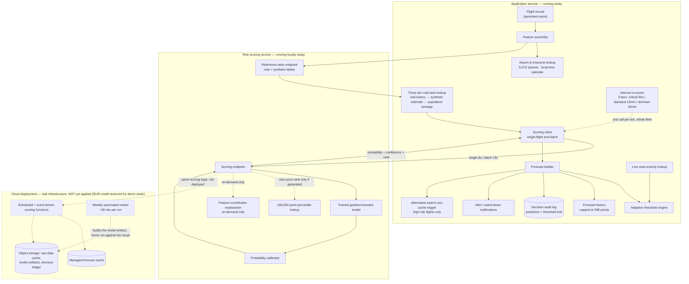
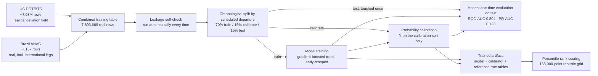
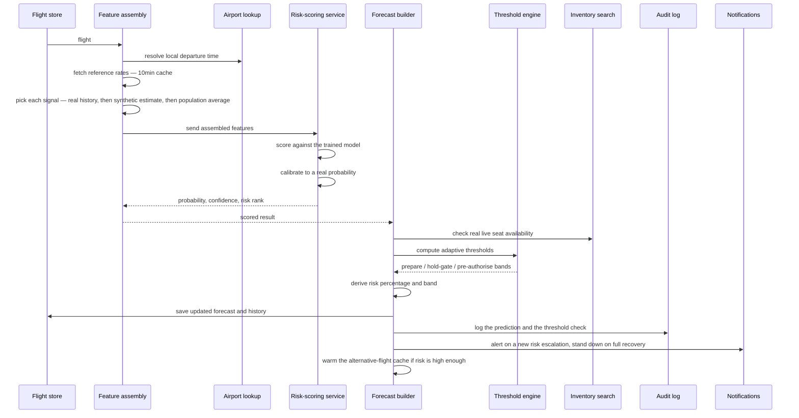
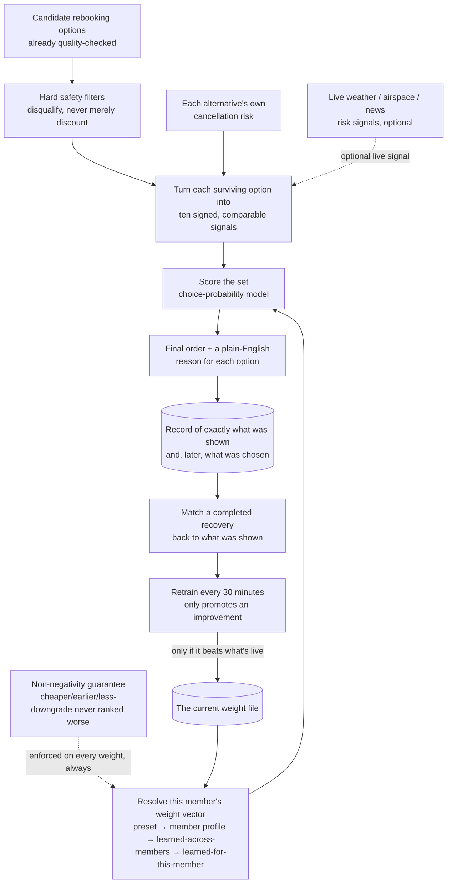
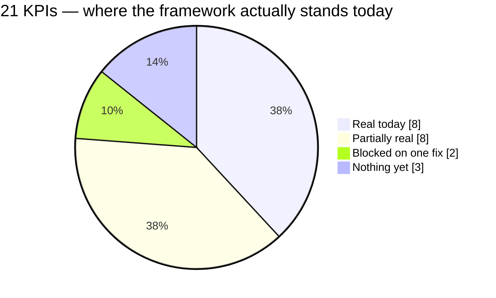

# ZKD Concierge — Solution

**American Express / Codestreet 2026, Team ZKD, IIT Madras**

Compiled from six documents, each independently verified directly against the running system on 2026-08-23/24 — not written from memory or from an earlier design pass. The two literal data artifacts backing the numbers below:

- **The Monte Carlo simulation** — [`iropssim.py`](iropssim.py) → [`iropssim-output.json`](iropssim-output.json), fixed seed, reproducible. See also [`documentation/design/10-monte-carlo-revision-2026-08.md`](documentation/design/10-monte-carlo-revision-2026-08.md) for how the simulation's own prediction-lead parameter was derived from the risk model's real decile lift table.
- **The trained cancellation-risk model's real metrics** — [`zkd-risk-model/reports/model_metrics.json`](zkd-risk-model/reports/model_metrics.json) (ROC-AUC 0.804, trained on 7,893,669 real US DOT/BTS + Brazil ANAC flight records) and [`zkd-risk-model/MODEL_CARD.md`](zkd-risk-model/MODEL_CARD.md).

This document is a compilation, not a rewrite — each section below is a source file in full, with only its heading levels demoted to nest under this one.

---

## ZKD Concierge — Proposed System Design & System Architecture

This document outlines the end-to-end system design and architectural specifications for the **ZKD Concierge** (American Express / Codestreet 2026) autonomous travel-disruption concierge platform.

---

### 1. Executive Summary & Core Mission

ZKD Concierge is an autonomous, end-to-end travel-disruption resolution system designed for high-net-worth cardmembers. When an aviation irregularity (IRROPS) occurs, the system:
1. **Predicts or Detects** the cancellation/delay using self-trained ML risk models and multi-lane ingestion.
2. **Re-accommodates** the member across flight, hotel, and ground transport within a unified workflow.
3. **Claims Duty of Care** from carriers and manages refund/FX honesty.
4. **Stops Safely** when unroutable, enforcing strict authorization and consent gates.

---

### 2. Core Architectural Principles

#### A. Separation of Concerns (Cognition vs. Execution)
The architecture physically separates planning from execution to guarantee safety:
*   **Layer A (Planning & Negotiation)**: Owns cognition only (context assembly, option generation, entitlement parsing, portfolio ranking, and explanation). **Zero execution authority and zero spend authority.** Tool clients are read-only search/reshop APIs.
*   **Layer B (Durable Execution Plane)**: Owns side effects touching inventory or money (retries, backoffs, timeouts). Executes strictly what the control and consent layer authorizes.
*   **Control/Policy Plane (`server/policy/`)**: Default-deny decision gateway sitting between planning and execution.

#### B. The Seven-Phase Lifecycle
Every recovery walks through a strict sequential lifecycle:
1. **WATCH**: Disruption detected via webhook, poller, or member report.
2. **WARM**: Context assembled; per-route coordinator runs a single reshop for affected groups; portfolio built and priced.
3. **ASK**: Conditional consent captured against outcomes (never raw flight numbers).
4. **WAIT**: Bundles kept continuously refreshed against supplier offer expiry. **Nothing is held.**
5. **ACT**: Min-cost allocation across portfolio → consent/policy validation → execution saga.
6. **VERIFY**: Onward segments checked intact after original disposal to prevent no-show cancellation traps.
7. **CLAIM**: Duty of care claimed from the carrier; uncovered remainder settled.

#### C. The WAIT Gate & Safety Guarantees
*   **Nothing irreversible happens left of the WAIT gate.** Speculative seat holds are strictly avoided to prevent duplicate bookings and carrier cancellations.
*   **Money-Flow Invariant (§10)**: Every spend and refund routes through the member's Amex card. 
*   **Notification Delivery Guarantee**: Rung-3 pending spend notifications require delivery confirmation (`DispatchResult.delivered`). Undelivered alerts trigger a 5-minute grace retry, failing safely to a human operator (`handed-over`) rather than booking blind.

---

### 3. High-Level System Architecture Diagram

```
┌────────────────────────────────────────────────────────────────────────┐
│                        INGESTION & DETECTION                           │
│   [Duffel Webhooks]   [AviationStack Poller]   [Member Reports]        │
└───────────────────────────────────┬────────────────────────────────────┘
                                    │
                                    ▼
┌────────────────────────────────────────────────────────────────────────┐
│                   PLANNING & COGNITION (Layer A)                       │
│  - Per-Route Coordinator (Request Coalescing / -66% API calls)         │
│  - Risk Prediction (XGBoost) + Weather/NOTAM/GDELT Feeds               │
│  - Discrete-Choice Ranker (Learned Weights + MyCa Warm Start)          │
│  - Reversible Bundle Composition (Flight + Hotel + Ground)             │
└───────────────────────────────────┬────────────────────────────────────>
                                    │ WAIT GATE
                                    ▼ (Member Consent / Autopilot)
┌────────────────────────────────────────────────────────────────────────┐
│                   DURABLE EXECUTION & SAGA (Layer B)                   │
│  - Payment Reservation (Virtual Account Number / VAN)                  │
│  - Supplier Booking: Duffel (Flights) | LiteAPI (Hotels) | Uber (Cab)  │
│  - LIFO Compensation Chain (Rollback on failure)                       │
│  - Terminal Disposal of Original Itinerary                             │
└───────────────────────────────────┬────────────────────────────────────┘
                                    │
                                    ▼
┌────────────────────────────────────────────────────────────────────────┐
│                  NOTIFICATION & RECONCILIATION                         │
│  - 4-Rung Notification Ladder (WhatsApp / Push / SMS)                  │
│  - Offline Continual Learning & Decision Ledger Reconciliation         │
└────────────────────────────────────────────────────────────────────────┘
```

---

### 4. Component Deep-Dive

#### A. Per-Route Coordinator & Request Coalescing
*   Groups affected trips by disrupted route; executes **one reshop** for the entire affected passenger group.
*   Jittered backoff and request coalescing reduce supplier API calls by **66%** (300 → 102 calls for 100 members), protecting rate limits while ensuring every passenger receives an individual confirmed ticket.

#### B. Portfolio Generation & Min-Cost Assignment
*   **Breadth**: Searches and evaluates more than one alternative (+26.31 points recovery improvement).
*   **Allocation**: Runs min-cost assignment across passengers × seats, scaling recovery efficiency (+7.20 to +12.32 pts).

#### C. Storage & State Management Layer
*   **PostgreSQL Store (`server/domain/store.ts`)**: Durable persistence for bookings, passenger profiles, recovery tasks, pre-authorizations, journey preferences, pipeline runs (`pipeline_runs` table), and decision audit logs.
*   **In-Memory Hot Path with DB Mirroring**: High-performance in-memory maps for active pipeline execution mirrored asynchronously to Postgres for fault tolerance across process restarts.

#### D. Security & Access Control
*   **Operator Authentication**: Separate HMAC-signed operator session credentials (`opsSession.ts`) guarding `/api/disruptions` and operator mutation endpoints.
*   Profile-level ownership validation on warm searches and recovery actions.
*   Built-in rate limiting and CSRF defense across mutating and search routes.

---

### 5. Non-Functional Specifications & Scale

*   **Concurrency & Throughput**: Designed to absorb peak aviation disruption bursts (e.g., IndiGo event scale: ~1.16 events/sec) backed by PostgreSQL connection pooling and optimized indexing.
*   **Resilience**: Graceful fallback on external supplier failures (fallback mock data and static fx rates) ensuring the UI never crashes or exposes raw upstream stack traces.
*   **Compliance**: Built in alignment with DPDP Act 2023 data privacy standards and multi-jurisdiction aviation compensation rules (IN-DGCA, EU261, UK261, US-DOT).


---

## ZKD Concierge — Technical Pipeline Architecture & Data Flow

This document provides the exhaustive technical breakdown of all core pipelines powering the ZKD Concierge (American Express / Codestreet 2026) autonomous travel-disruption concierge platform.

---

### 1. Disruption Detection Pipeline

#### Overview
Responsible for identifying flight delays, cancellations, or schedule irregularities across three independent ingestion lanes before routing passengers into recovery.

#### Data Sources & APIs
*   **Webhook Lane (`server/webhooks/`)**: Push webhooks from primary carrier/supplier feeds (Duffel, AeroDataBox, and OAG stubs).
*   **Poller Lane (`server/engine/statusPoller.ts`)**: Pull-based fallback polling via **AviationStack API** (respecting the 100-calls/month tier ceiling).
*   **Member Report Lane (`server/engine/memberReports.ts`)**: Passenger-driven reporting interface (`/api/flights/[id]/report-cancellation`).

#### Data Used
*   Flight codes, PNRs, scheduled departure/arrival UTC timestamps, live status flags (`cancelled`, `delayed`, `diverted`), and carrier codes.

#### Pipeline Workflow
1. **Ingest & Normalize**: Incoming webhooks or polled status data are received at `server/webhooks/index.ts`.
2. **Edge Deduplication**: Filters out duplicate event deliveries to prevent redundant execution triggers.
3. **Trigger Evaluation**: When a disruption condition is met, `onDisruptionDetected(flightId)` runs, querying `store.getBookingsForFlight(flightId)` to identify all impacted passengers.
4. **State Initialization**: Ensures a state machine run (`journal.ensureRun`) and transitions impacted passengers into `TRIGGERED` state, kicking off planning.

---

### 2. Member Report Cancellation Pipeline

#### Overview
A specialized crowdsourced and direct-reporting detection lane allowing members to flag flight cancellations before supplier feeds update.

#### Data Sources & APIs
*   Client API route: `POST /api/flights/[id]/report-cancellation` backed by `server/engine/memberReports.ts`.

#### Data Used
*   `flightId`, `passengerId`, reported disruption timestamp, optional user notes/photos.

#### Pipeline Workflow
1. **Individual Reporting**: When a member submits a cancellation report, the backend instantly creates a priority recovery task for that specific reporter.
2. **Corroboration Threshold**: The engine tracks independent reports per flight. 
3. **System-Wide Escalation**: Upon reaching **3 independent reports** (or verification from an operator console / carrier feed), the engine automatically fires a system-wide `onDisruptionDetected` event for all remaining passengers booked on that flight.

---

### 3. Risk Prediction & Environmental Pipeline

#### Overview
Computes real-time cancellation risk probabilities per flight and blends live meteorological and geopolitical data to provide proactive advisories.

#### Data Sources & APIs
*   **Self-Trained Cancellation Model (`zkd-risk-model/`)**: XGBoost classifier trained on 7.9M rows of historical US DOT/Brazil ANAC data (ROC-AUC 0.804).
*   **Live Weather Feeds (`server/risk/weatherRisk.ts`)**: NOAA / Open-Meteo API (10s timeout guard).
*   **NOTAM & Geopolitical Feeds (`server/risk/notam.ts`, `gdelt.ts`)**: Real-time airspace restrictions and geopolitical disruption signals.

#### Data Used
*   Historical delay distributions, route congestion metrics, airport coordinates (lat/lon), active weather advisories, and NOTAM text.

#### Pipeline Workflow
1. **Batch Resolution (`riskInputFor`)**: Gathers unique airports and carriers touched by candidate alternatives during planning.
2. **Signal Fetching (`resolveRiskMaps`)**: Fetches weather and advisory maps concurrently with robust `AbortSignal.timeout` guards.
3. **Inference (`inference.py` / `riskModel.ts`)**: Evaluates the flight through the self-trained XGBoost model to yield a cancellation probability score (`source: 'internal-ml'`).
4. **Threshold Adaptation**: Compares risk probabilities against dynamic thresholds (`zkd-app/config/risk-thresholds.json`) to trigger early preparation (`prepare`, `holdGate`, `preAuthorise`).

---

### 4. Rebooking & Planning Pipeline (Left of Gate)

#### Overview
Reversible planning engine that builds optimal multi-modal recovery bundles (flight + hotel + ground) without locking inventory or spending money.

#### Data Sources & APIs
*   **Flight Search**: Duffel Flights API & OAG schedules (`server/oag.ts`).
*   **Hotel Search**: LiteAPI & Duffel Stays (`server/hotels/`).
*   **Ground Transfer**: Uber Sandbox API (`server/ground/`).
*   **Member Profile**: MyCa API (`server/myca.ts`) for cabin entitlements, preferred carriers, and payment currencies.

#### Data Used
*   PNR details, party size, cabin entitlement, fare class ceilings, temporary per-journey preference overrides (earliest departure, latest arrival), and out-of-pocket budget caps.

#### Pipeline Workflow
1. **Search & Refresh (`refreshAltsNow`)**: Fetches fresh flight alternatives from suppliers.
2. **Connection Composition (`composeConnections`)**: Automatically composes multi-leg journeys through hub airports when direct options are exhausted (-66% API call collapse via request coalescing).
3. **Hard-Rule Filtering (`applyHardRules`)**: Filters out alternatives violating hard constraints (cabin limits, forbidden airlines, journey time windows).
4. **Scoring & Ranking (`ranker/`)**: Scores eligible alternatives using the discrete-choice ranking model.
5. **Overnight & Ground Arrangement (`arrangeOvernight`)**: When delay or overnight thresholds are crossed, searches accommodation and ground transfers, applying market affordability vetoes (`affordabilityVeto`).
6. **Parking at WAIT Gate**: Parks the run at `HOLD_PENDING`, waiting for member consent or automated autopilot rules.

---

### 5. Notification & Consent Ladder Pipeline

#### Overview
Manages member communications, consent collection, and delivery safety guarantees before entering financial commitment.

#### Data Sources & APIs
*   **WhatsApp**: Meta-approved templates & Twilio WhatsApp API (`server/notify/whatsapp.ts`).
*   **Push**: Expo Push Notifications API (`server/notify/push.ts`).
*   **SMS**: Fast2SMS gateway (`server/notify/sms.ts`).

#### Data Used
*   Passenger phone numbers, Expo device tokens, risk gauge probabilities, offer expiry timestamps, pricing deltas, and refund calculations (`server/domain/refund.ts`).

#### Pipeline Workflow
*   **4-Rung Notification Ladder (`server/notify/templates.ts`)**:
    1. *Rung 1 (Risk Crossed)*: Alerts member when cancellation probability crosses warning thresholds.
    2. *Rung 2 (Cancelled)*: Immediate notification upon confirmed flight cancellation.
    3. *Rung 3 (Pending Spend)*: States exact cost delta after statutory refund and gives a time-bound decision window (*"About to spend ₹N after refund, you have M minutes to stop us"*).
    4. *Rung 4 (Booked)*: Final confirmation with itinerary and ticket details.
*   **Delivery Verification Safety Net (`settleExpired`)**:
    *   Awaits rung-3 delivery confirmation (`DispatchResult.delivered`).
    *   Grants one fixed 5-minute grace retry on transient provider failures (`undeliveredGraceUsed`).
    *   **Safety Halt**: If delivery still cannot be confirmed, halts the task to a human operator (`handed-over`) rather than booking blind on unconfirmed member awareness.

---

### 6. Ranking & Continual Learning Pipeline

#### Overview
Ranks flight alternatives using a discrete-choice model that learns member preferences over time without breaking determinism.

#### Data Sources & APIs
*   Persistent decision logs (`server/pipeline/ranker/decisionLog.ts`, Postgres database migration `0007_ranker_decision_log.sql`).

#### Data Used
*   Historical feature vectors (fare, arrival time, duration, airline preference, cancellation risk), shown sets, and actual member choices.

#### Pipeline Workflow
1. **Discrete-Choice Scoring (`model.ts`)**: Applies a conditional logit model (`Utility = V + ε`) subtracting set max utility before exponentiation to prevent NaN poisoning.
2. **Smart Initialization (`weights.ts`)**: Blends strategy priors, MyCa warm-starts, and learned global/member weights via empirical-Bayes shrinkage.
3. **Monotonicity & Safety Clipping**: Ensures cheaper/earlier alternatives are never ranked worse; bookability enters as a fixed log-offset.
4. **Offline Continual Learning (`train.ts`, `reconcile.ts`, `schedule.ts`)**:
    *   Logs shown sets live (`decisionLog.ts`).
    *   Reconciles resolved recovery tasks against shown-set logs offline (`reconcile.ts`).
    *   Retrains weights periodically via background scheduler (`schedule.ts`, 30-minute interval) and hot-reloads model artifacts into memory.


---

## Prediction & Risk Model

> Part of the ZKD Concierge rebooking pipeline — how the system estimates, ahead of time, how
> likely a specific scheduled flight is to be cancelled.

> Every number, methodology detail, and architectural claim in this document was verified directly
> against the running system on 2026-08-23. Nothing here is asserted from memory — where an earlier
> design note disagreed with what the system actually does, this document follows what the system
> actually does.

---

### What this component does

Estimates the probability that a specific scheduled flight will be cancelled, ahead of time, so the
rest of the pipeline can act before the carrier files. It spans two cooperating services: an
application-side client that assembles everything known about a live flight into a feature vector
and turns a probability into a member-facing risk band, and a separate, purpose-built risk-scoring
service that holds the actual trained model and returns a calibrated probability plus a
feature-by-feature explanation of why.

There is no mock fallback on the live path: if the risk-scoring service cannot be reached, the
caller reports the forecast as genuinely unavailable rather than fabricating a number.

### System architecture



The dashed box is deliberate: it is real, reviewed infrastructure — not a diagram of aspiration —
but it has not been switched on. Everything solid-bordered above it is running today.

### How the two services communicate

The application never touches the risk model's internals directly — the only contact is a network
call, so either side can be down without crashing the other.

- **A reference-rates request** pulls the full set of historical-rate tables (by carrier, by
  origin airport, by destination airport, by route, by origin-and-month, plus a schedule-congestion
  table and the population-wide baseline rate), with a synthetic Indian-market estimate table riding
  alongside under its own clearly separate key. This is cached in memory for ten minutes, with a
  five-second timeout — a failure resolves to "unavailable," never a partial or stale-forever answer.
- **A scoring request** carries either one flight's feature set (the on-demand path, an eight-second
  timeout, full explanation included) or an array of many (the scheduled batch path, a
  fifteen-second timeout, explanation omitted to keep it fast). The batch response is
  order-preserving and fault-isolated: one flight's scoring failure is reported in its own slot
  without failing the rest of the batch.
- Every response carries: a calibrated cancellation probability, a confidence score, a version
  marker identifying exactly which trained model produced it, and — when available — a 0–100
  risk-percentile rank and a feature-by-feature explanation.

**What happens if either side is unreachable**: if the scoring service is down, the application
side never invents a number — it reports the forecast as unavailable and retries on a bounded
schedule until the service returns. The scoring service, in the other direction, never reaches out
to the network on its own; it only ever scores whatever feature set it is handed, so assembling
those features is exclusively the application's responsibility, which avoids keeping two divergent
copies of that logic in two languages. Malformed or oversized requests are rejected with a clear
error on either side rather than crashing a process.

### How it works

#### The model itself

**Training data**: real historical flight data only, no synthetic rows in the trained table.
- US DOT/BTS On-Time Performance data, roughly twelve months of coverage.
- Brazil's civil aviation authority (ANAC) monthly flight extracts, which also contribute real
  international legs (e.g. Rio–Miami).
- **7,079,061 real US rows + 814,608 real Brazilian rows = 7,893,669 real historical flights**
  feeding the training table. After a strict chronological split: roughly 5.53 million rows to
  train the trees, 1.18 million to calibrate the probabilities, 1.18 million held back and touched
  exactly once for the reported evaluation numbers.
- **No Indian per-flight historical dataset exists publicly in bulk anywhere** — a known, permanent
  data-availability gap, not something implied to be solved. This is the single most important
  caveat to carry into any presentation of this model: the training rows are 100% American and
  Brazilian flights. Nothing in the training table is Indian.



**What the model actually looks at**: five smoothed historical cancellation-rate signals (by
carrier, by route, by origin airport, by destination airport, and by origin-airport-and-month
seasonality), the month, day of week, and hour of the scheduled departure, whether it's a red-eye or
a weekend departure, the route's distance and scheduled flight time, how congested the origin
airport is at that hour, whether the same aircraft's previous leg was itself cancelled, and whether
the route is international.

**Deliberately excluded — leakage**: anything only known after a flight resolves (the reasons given
for an actual delay, for instance) is never used as an input, because that information does not
exist at prediction time. An automatic self-check runs on every training pass specifically to catch
an accidental leak of "the answer" into a feature.

**One real feature is deliberately turned off during training, and it matters enough to explain
plainly.** Whether the aircraft's immediately preceding leg was itself cancelled is a genuinely
strong signal — on its own it would be roughly fifteen times more predictive than everything else
combined — but the live product has no way to know this for a real flight today (the data source
that would supply it is not available on the current access tier). Training the model on a signal
it will never receive live would make its offline score dishonest, so that input is switched off for
every training row before the model ever sees it. This was measured, not assumed: allowing the model
to use it produces a headline discrimination score of 0.873; forcing it off (i.e., simulating exactly
what a live prediction actually receives) drops that to 0.805 — and retraining with it off from the
start lands at the same place the model reports today, 0.804. The fact that both paths land on the
same number is itself the evidence that today's honest number is real, not an artifact of a bad
training run.

**Calibration**: a probability isn't useful if "20%" doesn't actually mean 20% of similar flights
cancel. A separate calibration step, fit only on the held-out calibration slice (never the training
rows, never the test rows), corrects the model's raw output onto the real probability scale the
member-facing risk bands act on.

**Evaluation, exactly as measured on data touched only once**:

| Metric | Value | What it actually measures |
|---|---|---|
| **ROC-AUC** | **0.804** | Discrimination — the probability a random cancelled flight is ranked riskier than a random flight that didn't cancel. **Not accuracy.** |
| **PR-AUC** | **0.123** | Precision/recall trade-off at this base rate — the honest metric when only about 1% of flights actually cancel, since ROC-AUC alone flatters a rare-event problem. |
| **Brier score** | **0.0097** | Calibration error — how close predicted probabilities land to real observed frequencies. Lower is better; this is well-calibrated on the scale the risk bands act on. |
| **Log loss** | **0.049** | Calibration error on a log scale — heavily penalizes a confident wrong prediction. |
| Real cancellation rate (train / test) | 1.89% / 1.05% | The genuine, un-resampled rate — this is exactly *why* discrimination alone isn't the whole story. |

**Nothing above stands alone — it's benchmarked against two honest baselines from the same run:**

| Approach | ROC-AUC | PR-AUC | Brier |
|---|---|---|---|
| Always guess the population average rate | 0.500 | 0.010 | 0.010 |
| A simple linear model on the same inputs | 0.742 | 0.104 | *(not directly comparable — uncalibrated)* |
| **The trained model** | **0.804** | **0.123** | **0.0097** |

The trained model's precision/recall score beats the simple linear baseline by about 19% relative,
and beats blind guessing by roughly 12x.

**Lift, the plainest-English number of all**: flights the model places in its riskiest 10% cancel
**5.25x** more often than the overall base rate — a real, computed figure, not a rounder number that
might circulate informally.

**A real, disclosed weak spot, not hidden**: the model performs meaningfully better on the Brazilian
data (real cancellation rate 4.4%, precision/recall score 0.215) than on the American data (real
cancellation rate 0.6%, precision/recall score 0.016) — expected at a much rarer event rate, and
stated here rather than smoothed over by the headline number.

**What the model actually weighs most, ranked by real measured contribution:**

| Rank | Signal | Weight |
|---|---|---|
| 1 | Seasonal risk at the origin airport, this month | Dominant by a wide margin |
| 2 | This route's own history | High |
| 3 | This carrier's own history | High |
| 4 | Month | Moderate |
| 5 | Hour of day | Moderate — this is why getting local time right (not UTC) matters |
| 6 | Day of week | Moderate |
| 7 | Scheduled flight time | Moderate |
| 8 | Destination airport history | Lower |
| 9 | Red-eye departure | Lower |
| 10 | Origin airport history | Lower |
| 11 | Route distance | Lower |
| 12 | Weekend departure | Lower |
| 13 | Origin schedule density | Lowest |
| 14 | International route | Lowest |
| — | Aircraft's previous leg cancelled | Switched off during training — see above |

**The 0–100 risk-percentile rank** (a separate, complementary number to the calibrated probability
itself) comes from scoring 168,000 realistic live-flight scenarios and ranking a real flight against
that distribution. Measured on that grid, the model's real calibrated probability ranges from about
**1.6% at the low end to about 10.3% at the extreme high end**, with a median around 3.2% — this
model's real output never drifts into the alarmist range a raw "risk score" name might suggest; it
stays a genuinely rare-event probability throughout.

**The confidence score attached to every prediction is a real, disclosed proxy — not a formal
statistical uncertainty estimate.** In plain terms: confidence is high when a flight's route and
carrier have a historical cancellation rate that differs meaningfully from the population average
(real, differentiated evidence to act on), and sits near its floor when a route or carrier has never
been seen before and both rates sit exactly at the population baseline. It is not an ensemble
variance or a formal prediction interval — it is a legible, honest signal for "how much real
evidence does this specific flight have behind it," and it directly widens or narrows the
member-facing action thresholds: a lower-confidence forecast has to cross a *higher* raw probability
before the system treats it as actionable.

**Every response also carries a short explanation**: which signals pushed the probability up, which
pulled it down, and by how much, expressed as a share of the total movement away from the baseline —
so "why does this flight look risky" always has a real, traceable answer rather than a scripted
sentence. A response is also stamped with a short version marker identifying exactly which trained
model produced it, so a later audit can tell a genuine model update apart from an ordinary
probability swing on the same model.

#### Serving path



1. **Feature assembly**: the application resolves the flight's origin and destination, and —
   critically — computes the departure's calendar position (month, day, hour) in the **origin
   airport's own local time**, not a universal clock time, because the training data's time fields
   are all local wall-clock values. Getting this wrong is a constant, silent skew on two of the
   model's highest-weighted signals for any airport not on the reference time zone — a 5.5-hour
   skew for every Indian flight if it were computed the naive way.
2. Every live carrier and airport is tagged as coming from the live product, not the training data —
   by construction this guarantees a live Indian or international entity never accidentally matches
   a real trained history it was never actually part of.
3. **A three-tier lookup runs per historical-rate signal**: this entity's own real trained history if
   it happens to exist (it never does today, by the design above); otherwise a clearly-labeled
   synthetic Indian-market estimate if one has been built; otherwise the honest population-wide
   average. Which tier answered is recorded alongside every feature, so the on-screen explanation can
   label a number honestly instead of implying real per-carrier evidence where none exists.
4. **The scoring call** happens either for one flight on demand, or batched for many flights on a
   schedule, as described above.
5. The forecast builder then combines the scored probability with a **real, live seat count** (the
   most constrained reading — filtered to the largest party actually booked on that flight) to
   compute the adaptive action thresholds, derives the risk percentage and its band, appends one
   point to the flight's history (capped at roughly 24 hours of points at the default interval),
   saves everything back to durable storage, logs both the prediction and the threshold check for
   audit, and fires any alert, stand-down, or alternative-search pre-cache that the new score
   warrants.

**Freshness**: reference rates refresh from a ten-minute cache. A forecast is considered current for
ten minutes unless it's a presenter-pinned demo value, which never expires until explicitly reset.
Simultaneous viewers of the same flight share one in-flight refresh rather than each triggering a
separate call.

#### Adaptive thresholds

The three action thresholds — an early "prepare" heads-up, a "hold-gate" where backup options are
held ready, and a "pre-authorise" point where the member may be asked to approve spend — are not
fixed cutoffs. Each one moves with:

- **How scarce seats are**: fewer seats left (checked against the largest party actually booked on
  the flight) pushes every threshold to fire earlier; the effect flattens out once seats are
  comfortably plentiful.
- **How close departure is**: closer to departure means acting on less certainty; the effect
  flattens out for flights that are still comfortably far out.
- **Whether the booking has a hard downstream constraint** (an onward connection, for instance) —
  this pushes every threshold to fire earlier.
- **How confident the forecast is** — a lower-confidence prediction (see the confidence explanation
  above) has to clear a *higher* raw probability before the same threshold fires, because the system
  demands more certainty when it trusts the number less.

The hold-gate threshold's floor is deliberately set slightly above its own base value, so these
multiplying factors can only ever push it later toward that floor, never earlier past it — a
deliberate, empirically-checked safety margin, not an accident of the math.

Crossing a threshold is what gates everything downstream: the earliest band triggers no spend at
all; the top two bands both switch the flight onto a much tighter re-scoring cadence and — once the
flight's risk-percentile rank (not the raw probability) crosses a set level — separately trigger a
warm pre-cache of alternative flights, hotel, and ground transport, so those options are already
searched and ready the moment they might actually be needed.

**Re-scoring cadence** — every flight is automatically re-scored on one of three tiers, and migrates
between them automatically as departure approaches or its risk band changes:

| Tier | Cadence | Applies to |
|---|---|---|
| Critical | every 90 seconds | already at hold-gate or pre-authorise, or within 3 hours of departure |
| Standard | every 10 minutes | everything not critical or dormant |
| Dormant | every 30 minutes | still quiet and more than 24 hours from departure |

Each tier scores its whole batch of flights in one call regardless of how many flights are in it, so
tightening a tier's cadence is a scheduling-cost change, not a per-flight cost multiplier.

### Demo-safe seeded forecasts, and why that is honest

Every booked flight shown in a walkthrough starts with a fixed baseline risk score chosen **inside
the model's own real observed range** (the same roughly 1.6%–10.3% range measured above, never a
dramatized number no live prediction has ever actually produced). This baseline is tagged exactly
the way a presenter's manual override is tagged, which means it is automatically invisible to every
automatic re-scoring pass until an actual disruption trigger fires or the baseline is explicitly
reset.

**Why this exists**: without a seeded baseline, a fresh session shows every flight sitting on
whatever single score the model happened to compute the moment it booted, and the prediction-history
chart would show only that one point — never the trend line the product is built to show. So each
seeded flight also gets a believable, deterministic eight-hour trajectory ending exactly at its
seeded score — the same shape every time a demo resets, not a fresh random one.

**The honesty mechanism, precisely**: nothing about this pretends to be a live model read, and the
on-screen audit view never claims a pinned score is a live inference. The moment a real disruption
trigger fires — or the demo is deliberately reset — the flight unpins, and every subsequent score
comes from the real trained model over the exact same real path described above. Nothing about how
scoring works is different for a flight that started out seeded.

### The prediction-history chart, precisely

The audit chart's vertical axis plots the **risk-percentile rank** (0–100, against the realistic
scoring distribution above) — not the raw calibrated probability, which still drives the main gauge
and every member-facing banner elsewhere. The rank is used here specifically because it has a
stable, self-scaling 0–100 range that reads clearly over time, while the raw probability's real
range (roughly 1.6%–10.3%) would compress to a nearly flat line on a plain axis.

The line's **color**, however, still encodes the real probability-based risk band — green while
comfortably below the first action threshold, amber once past it, red at or past the top threshold —
so severity still reads directly off the line's color even though its height is the percentile rank.
The chart windows to the last eight hours, never fabricates or interpolates a point that wasn't
actually recorded, and shows an honest "still collecting history" state rather than a misleading
sparse line when too little history exists yet.

### What triggers a score, and what a score triggers

**A new score is computed** when a member or operator views a flight and its last score has gone
stale, on each tier's own automatic schedule, immediately when a real external status feed reports
an actual disruption-classified change (debounced so a flapping status feed can't trigger a scoring
storm), on an explicit "reverify" audit action that forces an immediate fresh score and reports
whether anything material changed since the last one, or through a presenter's manual override,
which bypasses the model entirely and is honestly tagged as such.

**A score, once computed, triggers**: a real live seat-availability check to compute the adaptive
thresholds; the risk band and percentage shown to the member; an entry appended to that flight's
history; an audit-log entry recording both the prediction and the threshold check behind it; an
alert on a genuine risk escalation or a stand-down message once a flight has fully recovered; and, if
the risk-percentile rank is high enough, an early warm-up of the alternative-flight, hotel, and
ground-transport search — so those options are already ready before they're actually needed, without
paying that search cost on every single flight regardless of risk.

A closely related, entirely separate model — one that learns member preference and ranks
*alternative* flights once a disruption is underway — genuinely does retrain live, automatically,
every 30 minutes. That is a different system with a different job; nothing in this document's
numbers describes it, and its "30 minutes" should never be conflated with this model's own weekly
retrain cadence.

A further, separate live-signal layer (real weather, airspace advisories, and news signals) also
exists purely to help rank *alternative* flights once a disruption is already underway. It plays no
part in predicting the original flight's own cancellation probability and contributes none of the
numbers in this document.

### What state persists vs. resets

- A short-lived, in-memory cache holds the reference-rate tables (refreshed every ten minutes) and a
  couple of live weather-signal lookups used only by the separate ranking system — all of it resets
  on a process restart and is cheap to rebuild.
- A flight's forecast and its rolling history (capped at roughly 24 hours of points) are genuinely
  **durably persisted**, not recomputed from scratch on every read and not lost on a restart.
- A small amount of short-lived, in-memory bookkeeping (which flight was rescored most recently, and
  which flights currently have a request in flight) exists purely to avoid duplicate work within one
  running process and is not meant to survive a restart.
- On the scoring-service side: the trained model, its calibrator, the reference-rate tables, and the
  percentile-rank lookup are all loaded once into memory and held there — refreshed only by a new
  retrain and restart, never mutated mid-request. Today that refresh is a manual, reproducible step
  (the same step behind every number in this document), not yet an automated schedule — see the
  infrastructure caveat directly below.

### Real vs. simulated vs. mocked

- **Real, trained**: the model itself, trained on 7,079,061 real US rows plus 814,608 real
  Brazilian rows; the calibration step; every evaluation number reported above; the live scoring
  path; the feature-contribution explanation; the confidence heuristic.
- **Real signal, honest cold-start**: any live carrier, airport, or route signal that has no real
  trained history falls back to the real, trained population-average rate — a real number, computed
  from real data, just not differentiated for that specific entity — and is labeled as a population
  average rather than implied to be real per-carrier evidence. This is the honest status of **every
  Indian flight this model has ever scored**: a real inference from a real trained model, with the
  entity-specific inputs honestly cold-started.
- **Fabricated but clearly labeled**: a separate synthetic Indian-market reference-rate table exists
  precisely to be more useful than a flat population average for Indian carriers, built from
  invented (not real) rows, never merged into the real trained history, and labeled
  "synthetic market estimate" everywhere it's used — visually distinguishable on screen from real
  per-entity evidence, not just noted in fine print.
- **Hardcoded/demo-only, but honestly tagged**: a presenter's manual override control and the
  seeded walkthrough baselines described above both write a forecast without calling the model at
  all, and both are tagged the same honest way so no automatic re-scoring pass can silently
  overwrite or be confused with a real score. These are the only two places anywhere in this system
  that write a forecast without actually calling the model.
- **Explicitly absent, never guessed**: the single strongest engineered signal (the aircraft's prior
  leg) is always unknown for a live flight, for the access-tier reason explained above; airspace
  advisory data has real US-airport coverage with no Indian equivalent yet; weather is not a trained
  model input at all today — a stated, known gap, not a hidden one.
- **Built but not applied — the single most important infrastructure caveat**: the entire cloud
  serving-and-retrain path is real, reviewed infrastructure-as-code, fully validated, and has
  **never actually been switched on** — the cloud budget is a $140 credit reserved specifically for
  the week before the final presentation. What is real and running today is the scoring service,
  locally. The trained model behind every number in this document was produced by one real,
  reproducible, manually-triggered training run on **2026-08-15**, not by an automated weekly
  schedule that has actually fired yet.
- **The continual-learning loop is not yet built**: folding real, accumulated live outcomes back
  into the training data — so a live Indian carrier's real observed history eventually replaces its
  population-average cold-start — is a clearly-scoped next step, not something already happening.
  Today's retrain, once switched on, would still train only against the US and Brazilian data above.

### Failure modes & resilience

- **The scoring service is down or unreachable**: every caller catches this and reports the forecast
  as genuinely unavailable — there is no fabricated fallback probability anywhere on this path. A
  fresh session retries a bounded number of times a short interval apart before settling into its
  normal schedule, and will keep quietly failing (logged, never surfaced as a fake number) until the
  service returns.
- **One flight's feature assembly fails** (a malformed record, for instance): caught and skipped for
  that flight alone, never aborting an entire scoring batch.
- **One flight fails inside the scorer during a batch run**: reported in that flight's own slot
  instead of failing the whole batch; the caller skips just that one entry and keeps the rest.
- **A genuinely missing input for a live flight** (an unrecognized airport, or the always-unknown
  prior-leg signal): handled natively by the model itself, exactly as it was trained to handle a
  missing value — never silently guessed or backfilled with a placeholder.
- **The reference-rate lookup is unreachable even though scoring itself would answer**: feature
  assembly can't even start without the rate tables, so a down rate lookup blocks scoring for that
  refresh cycle — there is no partial-feature degraded mode.
- **A presenter-pinned or seeded score could be silently overwritten by the next scheduled
  re-score** — this was a real bug once, fixed by making every automatic re-scoring pass explicitly
  check for and skip a pinned forecast, rather than treating it like any other flight.
- **A time-zone skew bug, fixed and documented**: an earlier version computed the departure's
  calendar position on a universal clock instead of the origin airport's own local time — a
  constant, silent skew (5.5 hours for every Indian flight) on two of the model's highest-weighted
  signals. Fixed by always resolving local time explicitly.
- **A unit-scale bug in the schedule-density signal, fixed and documented**: an earlier live
  reference table measured a different, two-orders-of-magnitude-larger quantity than what the
  trained model actually expects for that signal — caught during a dedicated pre-presentation
  technical audit, not left to surface live.
- **A source dataset is missing at training time**: the training pipeline refuses to proceed
  silently on partial data — it stops with an explicit instruction rather than training on an
  incomplete download.

### Test coverage

Automated tests exist for the entire application-side path: feature assembly and the scoring
client, the adaptive-threshold math itself, the tiered re-scoring scheduler, the event-triggered
rescore and its debounce, the risk-based alternative-search trigger, alert and stand-down logic, and
the airport/timezone lookups that feed local-time correctness.

**A real, disclosed gap**: the trained-model code itself — feature engineering, training, and
inference — has no automated test suite in continuous integration. Its correctness instead rests on
the leakage self-check that runs on every training pass and on the honest, out-of-time evaluation
described above, verified by a human re-running training and comparing the reported numbers by eye,
not by an automated check that would catch a regression on its own.


---

## Ranking Engine

> Part of the ZKD Concierge rebooking pipeline — how the system orders a set of already-qualified
> rebooking options for one specific member, and produces the plain-English reason shown under each
> one.

> Every number, methodology detail, and architectural claim in this document was verified directly
> against the running system on 2026-08-23. Nothing here is asserted from memory.

---

### What this component does

Given a set of candidate rebooking alternatives that have already survived a set of hard safety
filters, this component orders them for one member and writes the human-readable sentence shown
under each option explaining why it was placed where it was. Ranking is a genuinely **learned**
discrete-choice model — not a hand-set weighted sum — whose weight vector is resolved fresh for
every request from a chain of increasingly specific evidence: a sensible starting-point preset, a
warm-start personalization from the member's own known preferences, a pattern learned across all
members, and finally a pattern learned from this specific member's own past choices. Its own output
also becomes the training signal for its own future improvement — a closed loop, not a one-shot
model.

### System architecture



A second, separate ranking-style module exists elsewhere in the codebase from an earlier design and
is not wired into any live screen — it is not what any member ever actually sees. Everything in this
document describes the one path every real ranking decision, and every "why we picked this" sentence,
actually travels through.

### How it works

#### Hard rules come before scoring, and can never be outvoted

Six checks run first, over the candidate set, each a **disqualification** with a recorded reason —
never a mere score penalty. A weighted comparison must never be able to talk its way around a rule
the member actually set:

1. **Avoid this airline** — checked against every leg of a connection, not just the first, so a
   blocked carrier can't sneak back in by operating the second half of a journey.
2. **A hard arrival deadline** — an option that lands after it is disqualified outright. An option
   whose arrival time simply isn't published is *not* removed — there's no proof it misses the
   deadline, so it is scored normally instead.
3. **An earliest allowed departure** — the same symmetric treatment, for the same reason.
4. **Party fit** — a travelling party is never split across two flights.
5. **A refused cabin downgrade** — filtered out when the member has said never to drop below a given
   cabin.
6. **The card's own entitlement verdict** — an option the member's card doesn't actually cover is
   filtered here. This is the only thing standing between an out-of-entitlement fare and an automatic
   booking, now that an earlier, cruder spend ceiling has been removed in favor of this and the
   consent ladder documented elsewhere.

Everything that survives moves on to scoring.

#### The discrete-choice model

The ranking model is a **conditional-logit** (discrete-choice) model — the standard statistical
model for "a person picks exactly one option from a presented set," used widely in transportation
and marketing research precisely because it matches this decision shape. Each candidate gets a
single number (a "utility") built from two parts: a weighted combination of its ten signals, plus a
fixed penalty for how likely the option actually is to still be bookable by the time anyone tries to
book it. The probability the member would pick each option is then a softmax over those numbers —
the same function a discrete-choice model, or a classifier's final layer, always uses to turn scores
into probabilities that sum to one.

This was chosen over a simpler pairwise comparison approach deliberately: it uses every real
decision as a genuine training signal (picking the option ranked first is still an observation, not
a non-event), and its fitted weights drop straight back into an inspectable, human-readable file
rather than living inside an opaque model. Its one acknowledged theoretical limitation — two
near-identical options can slightly split each other's apparent preference share — is stated
plainly as a known, accepted trade-off rather than something quietly worked around; a fix for it is
a real future step that needs more data than exists today, not a task on the critical path.

**Ten signals, every one oriented so that "better" is always a larger number**, which is what makes
a single, simple safety guarantee possible (see below):

| Signal | What it captures |
|---|---|
| Arrival | How much later this option lands than the earliest option in the set — earlier is always better |
| Cost | How much more expensive this option is than the cheapest in the set — cheaper is always better |
| Cabin | How far this option's cabin sits below the member's preferred cabin — less of a drop is always better |
| Effort | Extra connections and any overnight stay — fewer is always better |
| Loyalty | Whether the member holds status on the operating carrier, checked across every leg of a connection |
| Red-eye | Whether this is a red-eye departure the member specifically asked to avoid |
| Seats | How much spare capacity this option has for the party, beyond the exact number of seats needed |
| Stability | How likely *this alternative itself* is to later be cancelled, drawn from the same trained cancellation model documented separately — never a live per-option model call, a cheap, already-computed lookup instead |
| Weather risk | Live weather severity at every airport this option actually touches — optional, off unless explicitly enabled |
| Advisory risk | Live airspace-closure and news-driven risk at those same airports or carriers — optional, off unless explicitly enabled, and zeroed entirely when a member has explicitly said "get me there no matter what" |

A member's own known profile is load-bearing at the *signal* level, not only at the weighting level:
cabin preference, carrier loyalty, and red-eye tolerance are all read directly from what the member
has already told the system about themselves, which is why personalization doesn't require any past
choice history to start working on a member's very first recovery.

**How a member's weight vector is actually resolved**, weakest evidence first:

1. **A sensible starting preset** — one of four, matching the plain-language optimization goal a
   member can choose (earliest arrival, stick to a preferred airline, fewest connections, lowest
   cost). Every member starts here.
2. **A warm start from the member's own known profile** — if they hold status with certain
   carriers, dislike red-eyes, or are entitled to a premium cabin, those preferences are added
   directly on top of the preset, immediately, with zero interaction history required. This is
   what makes personalization real from a member's very first recovery, not something that has to
   be learned over time first.
3. **A pattern learned across every member** on the same optimization goal — blended smoothly on top
   of the above once there is enough real, reconciled interaction data behind it to trust; ignored
   entirely below that bar.
4. **A pattern learned from this specific member's own past choices** — blended smoothly on top of
   whatever the previous step produced, gated behind its own, stricter data bar for the same reason.

**One hard guarantee is enforced on every single weight, every time, regardless of what any training
run produced or what a hand-edited configuration might claim**: because every signal above is
oriented so that "better" is a larger number, a weight is never allowed to go negative. In plain
terms — **a cheaper, earlier, or less-downgraded option is never ranked worse than a pricier,
slower, or more-downgraded one**, full stop, and this is asserted as an unconditional rule at the
moment a ranking actually happens, not merely hoped for as a side effect of training.

**Bookability enters as a fixed penalty, not something the model can learn to ignore.** Whether an
option can actually still be booked when the system tries is folded in as a hard-coded adjustment,
never a competing weight the training process could shrink or override — so no volume of "the member
liked the cheap-but-unconfirmable option" evidence could ever teach the model to prefer something
that can't actually be booked. That likelihood itself starts from a sensible, tiered estimate (a
live, currently-valid offer starts around 97% likely bookable; a confirmed offer with no expiry
around 72%; anything else around 45%) and is itself refined over time as real booking-confirmation
outcomes accumulate.

**Exact ties fall back to a deterministic tiebreak** — cheaper first, then earlier, then more spare
seats — so the "never ranked worse" guarantee holds crisply even when two options score identically,
not just when they're strictly different.

**Every option's placement comes with a real, traceable reason, not a canned sentence.** The system
identifies which signal actually contributed most to that specific option's position — cheapest,
soonest, most reliably confirmable, closest to the member's preferred cabin, on a carrier they hold
status with, or least disruptive to get through — and leads the explanation with that one, backed by
the specific detail that supports it. A loyalty-led pick genuinely talks about the airline; a
cost-led pick genuinely talks about the price. The sentence is generated from the same numbers that
produced the ranking, not authored separately from it.

#### Continual learning loop

1. **Every real ranking is logged** — the full set of options shown, their complete signal values,
   and the exact order and probabilities produced, recorded the moment any member is shown a ranked
   list. This runs on every live recovery today, not a subset.
2. **A completed recovery is matched back to what was shown**, offline, after the fact — joining a
   member's eventual resolution (an automatic pick or an explicit approval) to the specific shown
   list it came from. This runs outside the live booking path entirely, deliberately, so learning
   never adds risk or latency to an actual spend decision.
3. **A retraining pass fits an updated weight vector** from every reconciled real choice, per
   optimization goal, with two anti-overfitting safeguards baked into the fit itself: every updated
   weight is pulled back toward the sensible starting preset in proportion to how much real evidence
   actually supports moving it, and the same non-negativity guarantee described above is enforced at
   every single step of the fitting process, not only checked afterward. A fitted update is only
   ever adopted if it demonstrably out-predicts the version already in use, measured on a slice of
   real data the fit itself never saw — the offline equivalent of a live A/B test, without the cost
   of actually showing a worse-ranked option to a real member to find out.
4. **This runs automatically, on a real schedule, already live** — checking for new data immediately
   on startup and **every 30 minutes** thereafter, cheaply skipping the actual fitting work entirely
   on a quiet tick with nothing new to learn from, so the schedule costs nothing when there's nothing
   to do.
5. **An adopted update goes live immediately, with zero downtime** — the moment a retraining pass
   produces an improvement, the very same running process reloads the updated weights into active
   use. There is no separate deploy step and no restart involved.

**What's real and already running today**: the logging, the offline matching, the training math
itself, and the automatic 30-minute schedule are all genuinely wired, running, and covered by
automated tests — this is not a diagram of an intended future state.

**What hasn't happened yet, stated plainly**: no real member interaction data has accumulated to the
point of clearing the data bar needed to actually promote a learned update. Every ranking decision
in the system today runs on the starting preset plus each member's own known-profile warm start —
genuinely personalized from message one, but not yet shaped by any pattern learned from real choices.
The scheduled retraining job has been ticking on time since it was switched on, correctly finding
nothing yet worth promoting — which is the honest, correct behavior at this point, not a sign
anything is broken. The learned layers are fully built, tested, and will engage automatically the
moment enough real interaction volume exists — nothing further needs to be built for that to happen,
only real usage.

#### Deliberate exploration is built but switched off

A mechanism exists to occasionally swap two *adjacent* options whose scores are close enough that
the model already considers them functionally interchangeable — purely to make future offline
evaluation of "was this the right order" statistically cleaner. It is shipped switched off today by
deliberate design: showing a member a flight the system itself doesn't already believe is
essentially as good, purely to see whether they'd take it, has a real cost measured in missed
connections, not a soft engagement metric, and that trade is explicitly rejected for this domain.
Genuine, un-engineered learning does not depend on this being switched on — a member overriding the
model's own top pick is itself a completely natural, real training signal on its own.

### What triggers ranking, and what ranking triggers

**A ranking is computed** whenever a live recovery evaluates its option set, and whenever a
free-text conversational preference is previewed against a member's flight before anything is
actually confirmed. Every screen that shows an ordered list of options is reading the result of one
of these calls — nothing on the display side ever recomputes an order on its own.

**A ranking, once computed, produces**: the final ordered list itself; a plain-English reason under
each option, generated from the same signals that produced the order; a durable record of exactly
what was shown, for later reconciliation into training data; and each option's own bookability and
cancellation-risk read, both pulled from real, already-existing sources — no per-option live network
calls are made purely to rank a set of options.

The alternative's own cancellation-risk signal is a genuine, direct reuse of the trained
cancellation-risk model documented separately: rather than placing a live model call on the critical
path for every single candidate, the ranker reads that model's own committed historical rates
directly — the same real-vs-cold-start honesty tiering described there applies here too, and the
worse of a connection's two legs is used rather than an average, on the reasoning that a connection
is only as reliable as its weakest leg.

### What state persists vs. resets

- **The current weight file** — the starting presets, the warm-start rules, the bookability
  estimates, the anti-overfitting settings, and (once any exist) the actual learned vectors — is the
  one thing the training process writes and everything else only reads. A live process caches it in
  memory and only re-reads it explicitly the moment a retraining pass adopts an update, not on every
  ranking call.
- **The record of what was shown, and any directly logged choice**, is genuinely durably persisted,
  not held only in memory — it was moved off a pair of local files onto a proper shared table
  specifically because a local file is only true for as long as exactly one server instance exists,
  which stops being a safe assumption the moment there's more than one.
- Everything else touched during a single ranking — cached lookups, in-flight computation — is
  cheap, short-lived, per-process bookkeeping with no need to survive a restart.

### Real vs. simulated vs. mocked

Nothing in this component is mocked. Every mechanism described above — turning a candidate into
comparable signals, resolving a member's weight vector, the discrete-choice scoring itself, treating
bookability as a fixed penalty rather than a learnable weight, logging every real shown set, the
offline matching of outcomes back to what was shown, the actual fitting math, and the automatic
30-minute retraining schedule — is fully real, currently running, and exercised directly by automated
tests, not stubbed out for a demo.

**The one honest caveat, stated as plainly as possible**: the shipped starting configuration has
never had anything learned into it from real member data yet. Every ranking decision today runs on
the starting preset plus each member's own known-profile warm start alone — genuinely real
personalization, just not yet the kind that comes from observed behavior. The learned layers will
engage automatically, with no further engineering work required, the moment enough real reconciled
interaction volume exists behind a given optimization goal or a given member — today that threshold
is a couple hundred reconciled decisions per goal, or a few dozen for an individual member, deliberately
conservative numbers chosen so an early, thin trickle of data can't swing real spend-adjacent ranking
on noise.

### Failure modes & resilience

- **A malformed candidate** (a broken price, seat count, or timestamp from a live search) is coerced
  to a neutral value at the exact single point where a candidate becomes numbers, specifically
  because a single broken value left as-is would otherwise poison the shared scoring math for every
  *other* candidate in the same set, not just the broken one.
- **A non-finite score that somehow still slips through** is caught by a second, independent
  safeguard at the scoring step itself — ranked last, clearly logged, and never allowed to corrupt
  the rest of the set.
- **A stale or clearly-fabricated leftover option** from an earlier design is caught at the one
  shared entry point every real decision-making path — not only the member-facing screen — actually
  passes through, closing a real, previously-existing gap where a fabricated option could be hidden
  from the screen while still being live for the system to act on.
- **A broken price is never quietly treated as free** — an invalid fare disqualifies an option
  outright rather than defaulting to zero, specifically because a free-looking broken option would
  otherwise win every price comparison and could get automatically booked. An invalid seat count, by
  contrast, is safely treated as zero seats, since that's already the honest floor for "no
  availability."
- **The shared reference points used to build every option's display (the earliest arrival, the
  cost range)** are protected from the same kind of corruption, with a safe, informative fallback if
  every single candidate in a set were somehow broken at once.
- **The database being unreachable during a scheduled retraining tick** degrades to "nothing to
  learn from this time" rather than crashing the scheduled job — it logs a warning and tries again
  on the next tick.
- **Duplicate retraining timers** under a development hot-reload are prevented by a simple one-time
  guard, so a code change during development can't silently spawn a second competing training loop.
- **A checkout with no trained cancellation-risk tables on disk** falls back to a sensible constant
  cancellation-risk estimate for every option — ranking on every other signal continues completely
  unaffected, it just loses one input.

### Test coverage

Automated tests exist for the hard-rule filters (including the every-leg-not-just-the-first fixes),
the scoring model's non-negativity guarantee under arbitrary weights, day-one personalization from a
member's own known profile, the guarantee that bookability can never be learned away, the
anti-overfitting blending behavior under thin data, and the trainer both correctly recovering a real
signal from clean data and correctly refusing to adopt a fit that's really just noise. Seat and fare
sanitization, and the fabricated-option guard, are also covered directly, including the cases that
must **not** be flagged (a genuine free reissue, a genuinely large aircraft).

**A real, disclosed gap**: the automatic retraining scheduler's own timer and interval mechanics are
not unit-tested in isolation — only the small piece of logic that decides the interval length is
tested on its own — so its real behavior against a live system is exercised implicitly by running,
not verified by a dedicated automated test.


---

## Page 7 Brief — Rebooking & Planning (Stage 04)

> **Note:** this section originated as slide-editing notes for the pitch deck (references to "Page 7", "what to leave off the slide"), not general documentation. Kept in full rather than rewritten — the substance underneath the deck framing is a real, verified walkthrough of the rebooking & planning pipeline.

Source material for redesigning **Page 7** of `ZKD_Concierge_Deck_1.pptx`. This version reflects
the current, real, live implementation — verified directly against the running codebase rather
than design documents or an older, superseded build. Everything below describes what the system
actually does, in plain terms: no file names, module names, or code structure — just the
capabilities, the decision logic, and the real technologies/services behind them.

**Current Page 7 text** (for reference):

> STAGE 04 — Rebooking & Planning (Before Anything Is Booked)
> "A reversible planning engine that builds the best recovery bundle — flight, hotel, and ground —
> without locking in seats or spending a rupee."
> Flight Search · Hotel Search · Ground Transfer · Member Profile
> How it works: 1. Search & Refresh 2. Build Connections 3. Apply Rules 4. Scoring & Ranking
> 5. Overnight & Ground 6. Hold for Consent

⚠️ Item 6, "Hold for Consent," is stale wording — the system never holds inventory (confirmed
below); it re-verifies a parked plan instead. The rest of the six-step outline is directionally
correct and matches the real pipeline closely.

---

### 0. The one fact that must shape this slide

This system runs on real, working decision-making — not a scripted demo. The most impressive
parts are genuinely live:

- **A real, self-learning ranking model** decides which alternative to recommend — not a fixed
  formula. It's trained on the system's own history of what was shown and what members actually
  chose, retrains itself automatically on a schedule, and only promotes a newly trained version
  if it's measurably better than the one it's replacing.
- **A real, self-trained machine-learning model** predicts cancellation risk — trained on millions
  of real historical flight records, not bought from a forecasting vendor. If it can't be reached,
  the system says so rather than inventing a number.
- **Disruptions are detected through four independent channels** — a real-time push feed, a
  scheduled fallback check, member self-reporting with corroboration, and a manual trigger for
  testing — so no single failure point silently misses a disruption.
- **Booking happens through a real, multi-step process with genuine rollback** — if something
  essential fails partway through, everything already done is automatically and safely undone; if
  something non-essential fails (like a ground transfer), the recovery still completes and the
  member is told plainly what didn't happen.

**One honest caveat worth knowing for Q&A**: a more formal, fully audit-logged compliance-check
design — and a more elaborate cross-checked bundling design — exist in the codebase, fully built
and fully tested, but are **not** the versions currently running live. A simpler, faster,
real-time version of each is what's actually enforcing the rules and assembling the plan today.
Both are real and correct; the simpler one just won the wiring race. If asked directly: "we built
a more elaborate version of this and kept it as a tested reference; the version live today is a
leaner one that does the same job faster."

Also worth knowing: in this specific working build, **no vendor API keys are configured**, so
every credentialed external integration described below is running on its own honest fallback
path rather than live vendor data — this is a configuration state of this particular environment,
not a limitation of what's been engineered. The weather signals, the news signal, the currency
feed, and the flight-schedule data (via recorded real samples) are the exceptions — they need no
credentials and are genuinely live wherever this runs. See §5 for the full picture.

---

### 1. INPUT — what enters the rebooking/planning pipeline

| Input | What it actually is |
|---|---|
| Disruption signal | Arrives through one of four channels: a real-time push feed from booking/schedule partners, a scheduled fallback status check, a member's own in-app report (trusted for everyone on that flight once corroborated by other reports or an operations check), or a manual test trigger |
| Cancellation risk score | From a self-trained machine-learning model — used to decide how early to start preparing, before a disruption is even confirmed |
| Live flight alternatives | Pulled fresh from multiple flight-search sources in parallel, including real connecting itineraries the system builds itself when direct options are thin |
| Live hotel & ground alternatives | Pulled together, and only when the disruption genuinely spans an overnight window — hotel and ground are arranged as one decision, not two |
| Live weather & advisory risk | Real aviation-weather, regional-advisory, and news signals for the airports and carriers involved, feeding directly into how alternatives are ranked |
| Member profile & entitlement | Read fresh from the card-member system of record each time — cabin entitlement, preferred carriers, payment instrument. Nothing is duplicated locally, so it can never drift out of date |
| Member preferences | Both structured settings and free-text requests (e.g. "I'd rather not fly through Delhi") — free-text is parsed, validated against real limits, and confirmed back to the member before anything changes; it can only ever *propose* a preference update, never book anything itself |
| Per-flight overrides | A member can set temporary instructions for one specific flight (an earlier departure floor, a later arrival ceiling, a different consent setting) that take priority over their standing profile |
| Consent tier | The member's own standing choice — fully autonomous vs. "ask me first" — with a per-flight override available |
| Standing pre-authorization (optional) | A specific advance approval tied to one exact plan, voided the instant that plan no longer matches what the member actually saw |
| Itinerary & hard constraints | The member's booked flight(s), any connecting legs, and firm limits like "must arrive before X" or "can't depart before Y" |
| Member's live decisions | Approve, browse other options, go back, pick a different option, swap the hotel or ground leg, or hand the case to a human |

---

### 2. FLOW / PIPELINE — step by step

Detection (Stages 01–03 of the deck) hands off a confirmed or high-probability disruption. From
there, every affected passenger moves through the same real sequence:

```
Disruption detected (real-time feed, fallback check, member report, or manual trigger)
        │
        ▼
┌───────────────────────────────────────────┐
│ 1. SEARCH                                  │  Live search across multiple flight sources
│                                             │  in parallel; the system builds its own
│                                             │  connecting itineraries when direct options
│                                             │  are thin
└───────────────────────────────────────────┘
        │
        ▼
┌───────────────────────────────────────────┐
│ 2. FILTER                                  │  Anything that breaks a firm rule is removed
│                                             │  outright — a blocked airline, a missed
│                                             │  deadline, splitting the travel party, an
│                                             │  unauthorized cabin change, anything outside
│                                             │  the member's own card entitlement
└───────────────────────────────────────────┘
        │
        ▼
┌───────────────────────────────────────────┐
│ 3. RANK                                    │  The surviving options are ranked by a real,
│                                             │  self-learning model — cost, timing, comfort,
│                                             │  live weather/advisory risk, and the member's
│                                             │  own past choices all weighed together
└───────────────────────────────────────────┘
        │
        ▼
┌───────────────────────────────────────────┐
│ 4. ADD OVERNIGHT & GROUND                  │  Only if the disruption genuinely spans
│                                             │  overnight — hotel and ground arranged
│                                             │  together, not as separate afterthoughts
└───────────────────────────────────────────┘
        │
        ▼
┌───────────────────────────────────────────┐
│ 5. HOLD — NOTHING SPENT YET                │  The plan is parked. Nothing is booked, held,
│                                             │  or charged at this point                   │
└───────────────────────────────────────────┘
        │
        ▼
┌───────────────────────────────────────────┐
│ 6. CONSENT OR AUTOMATIC ACTION             │  A pre-approved plan, or a fully-autonomous
│    (Stage 05 picks up here)                │  setting, proceeds immediately; otherwise a
│                                             │  time-bound decision window opens and the
│                                             │  member is notified                          │
└───────────────────────────────────────────┘
        │
        ▼
┌───────────────────────────────────────────┐
│ 7. EXECUTE, WITH REAL ROLLBACK             │  Re-verify → pay → book flight → book hotel/
│                                             │  ground → release the old ticket last →
│                                             │  verify onward leg → notify. A failure in
│                                             │  anything essential undoes everything already
│                                             │  done; a failure in anything non-essential
│                                             │  degrades gracefully instead
└───────────────────────────────────────────┘
```

#### What happens on silence
If a member doesn't respond in time, the system used to simply hand the case to a human whenever
money was involved. That's been replaced with a stronger, more capable rule: the system will only
proceed automatically on silence **once it has confirmed the "about to spend this amount" alert
actually reached the member** — with one automatic retry if delivery can't be confirmed right
away, and a hand-off to a human only if delivery genuinely can't be confirmed at all. This means
more cases get resolved automatically, without ever booking something the member didn't
demonstrably see.

---

### 3. APPROACH — the actual decision logic

#### 3.1 Filter first, rank second
Before anything is scored, a firm set of rules removes any option that simply doesn't qualify —
flying a blocked airline, missing a hard deadline, departing before the earliest allowed time,
splitting the travel party, an unauthorized cabin downgrade, or falling outside the member's own
card entitlement. These are eliminations, not penalties — a disqualified option never enters the
ranking at all. Every removal is recorded with its exact reason, so if nothing (or nothing better)
survives, the member gets an honest explanation rather than a vague "no options."

#### 3.2 A real, self-learning ranking model
This is the most technically distinctive piece. Rather than a fixed weighted formula, the ranking
is produced by a genuine discrete-choice model — the same class of model used to predict which
option a person will actually pick from a set. It weighs ten real factors together: arrival time,
cost, cabin, how much effort a connection takes, loyalty status, red-eye avoidance, seat
availability, the option's own cancellation risk, live weather risk, and live advisory risk.

It starts from a sensible default — a role-appropriate starting point plus the member's own card
entitlements — and then genuinely learns: first from everyone's collective shown-and-chosen
history, then, once there's enough of an individual member's own history, personally for them —
always blended conservatively so a handful of early choices can't swing it too far. One outcome is
mathematically guaranteed no matter what the model learns: **a cheaper or earlier option is never
ranked below a pricier, slower one.** The model also learns, per source, how often an
option that looked available at search time is still available when it's time to confirm, and
folds that into the ranking too — so a fantastic-looking option that often turns out to be
unavailable doesn't keep disappointing members.

The model **retrains itself automatically on a fixed schedule**, and a freshly trained version
only goes live if it measurably beats the version it would replace, tested on data it never saw
during training.

#### 3.3 Building connections the system doesn't otherwise have
When direct alternatives are thin, the system constructs its own multi-leg connecting itineraries
from independent real searches — checking the connection window is workable and that cabin and
party size hold across both legs, not just one.

#### 3.4 Overnight only when it's real
Hotel and ground transport are brought into the plan only if the disruption genuinely spans an
overnight window, and are arranged together as one coherent piece, not as two separate searches
bolted together afterward.

#### 3.5 A real, self-trained prediction model — with no fallback guess
Cancellation risk is predicted by a machine-learning model trained on millions of real historical
flight records — not purchased from a third-party forecasting vendor. It deliberately has **no
mock fallback**: if it can't be reached, the system reports that honestly rather than making up a
risk number. This model also feeds one of the ten factors in the ranking model above (an
alternative's own cancellation risk).

#### 3.6 Never holding inventory
Because a passenger can't hold two tickets on the same route, and most carriers cancel duplicate
holds (sometimes cancelling the original ticket too), the system never holds a seat, room, or
ride. It keeps the parked plan current by re-verifying it, and does a final, one-last-check
re-verification of the exact chosen option immediately before anything is actually booked — if
it's gone, the system automatically moves to the next qualifying option.

#### 3.7 Rollback that knows what actually matters
When something has to be booked, the essential parts — the payment step and the flight itself, plus
the hotel when one's involved — are treated as critical: if any of them fails, everything already
done in that attempt is automatically unwound in reverse order. Non-essential parts — ground
transport, a final onward-leg check, releasing the old ticket — are treated differently: a failure
there doesn't undo a confirmed flight and hotel; the recovery still completes, with a clear,
honest note about what didn't happen. Releasing the old ticket happens last and is deliberately
never rolled back, since a cancellation can't be undone.

---

### 4. OUTPUT — what the pipeline produces

- **One ranked, rule-compliant plan per affected passenger** — flight, plus hotel and ground when
  the disruption genuinely spans overnight — parked and ready, nothing yet spent.
- **Immediate automatic action** when a matching plan was already pre-approved, when the member
  has set full autonomy, or when a decision window lapses in silence **and** delivery of the
  "about to spend" alert has been confirmed.
- **A held-for-response state** whenever a live decision window is open and hasn't lapsed yet.
- **A clean, honest outcome for every case** — either a full, confirmed recovery (with any
  non-essential shortfall plainly noted) or a fully rolled-back attempt if something essential
  failed — never a silent partial success.
- **Real-time notifications** across whichever channels are configured, sent in parallel so one
  channel being unavailable never blocks the others, with delivery tracked for every attempt.
- **A durable, timestamped record of every prediction and every decision**, for audit — worth
  noting honestly that actual outcomes aren't yet being logged back into that same record, so
  measuring real-world prediction accuracy end-to-end isn't fully wired up yet.
- **What's actually booked, communicated downstream**: a single-use virtual-card representation of
  the spend (no live payment rails are wired into this build — every transaction is represented,
  not actually charged); the original ticket released only *after* the replacement is confirmed;
  and a clear "was → now" summary for the member.

---

### 5. TECHNOLOGIES & SERVICE PROVIDERS

Every real technology or third-party service touching the pipeline, organized by what it does.
Status is described honestly: **live** (genuinely working right now, no credentials needed),
**real integration, not currently connected** (working, tested client code, simply not configured
with a live vendor account in this specific build), or **deliberate placeholder** (not built yet,
by design, rather than shipped as untested guesswork).

#### Flight sourcing
- **A primary flight marketplace** — real search, price-quote, and booking/cancellation flow.
  *Real integration, not currently connected.*
- **A second flight-search source** — authenticates correctly but has not returned populated
  results in testing even when connected. *Real integration, not currently connected.*
- **A third flight-search source** — notable for reporting genuine per-seat availability, not just
  a price. *Real integration, not currently connected.*
- **A fourth source**, used only to widen the visible market for comparison — explicitly never
  presented as something a member could actually book. *Real integration, not currently
  connected.*
- **A fifth registered source** — currently has no working client behind it and falls back to
  synthetic data when queried.
- **A sixth potential source** — deliberately left unbuilt until a commercial agreement is in
  place, rather than shipping integration code that's never been tested against anything real.
  *Deliberate placeholder.*
- **A synthetic testing source**, used only to exercise the booking and rollback machinery
  internally — explicitly excluded from anything a member is ever shown.

#### Hotel sourcing
- **The same primary marketplace's hotel arm** — one account, one integration, real search →
  hold → book flow. *Real integration, not currently connected.*
- **A second live hotel-search source** — additional real inventory, search-only in this build (no
  booking step wired yet, by design). *Real integration, not currently connected.*
- **A market-rate reference source** — used only as a safety check: if nothing else can price a
  stay and market rates look far outside the member's means, it can withhold a recommendation. It
  never proposes or prices an actual booking itself. *Real integration, not currently connected.*

#### Ground transport
- **A real rideshare-sandbox integration** — full request/cancel flow against real geography,
  including a way to deliberately test failure handling before it matters. *Real integration, not
  currently connected.*
- **A synthetic fallback**, used whenever the live source has nothing to offer — never presented
  to a member as something bookable.

#### Disruption detection
- **A live flight-schedule and identity data feed** — real carrier, flight-number, and timing
  data; also one of the real inputs to the risk-prediction model. Genuinely live via a set of
  recorded real samples that need no live credentials or cost to use; a paid, higher-volume tier
  exists but isn't connected in this build.
- **A live flight-status lookup service** — the fallback safety-net checker; runs on its own
  schedule and automatically steps back whenever the real-time push feed is healthy. *Real
  integration, not currently connected.*
- **Push-based webhook notifications** from booking and schedule partners — the primary, fastest
  detection lane, cryptographically verified on arrival. *Real integration, not currently
  connected* (would require a public callback address to register against).
- **Member self-reporting** — trusted for the whole flight once corroborated by multiple
  independent reports or an operations confirmation.

#### Weather & advisory risk signals
- **A global aviation-weather feed** — real ceiling, visibility, and wind data by airport,
  worldwide. *Live, keyless, no cost.*
- **A global weather-forecast feed**, used as backup wherever the first source has no recent
  reading. *Live, keyless, no cost.*
- **A flight-advisory feed** — real airspace-restriction data, currently limited to one country's
  coverage. *Real integration, not currently connected.*
- **A global news feed**, scanned for unrest, strikes, or other disruption-relevant coverage near
  the relevant airports and carriers. *Live, keyless, no cost.*

*(Note: these live weather/advisory/news signals feed the ranking model, but only when explicitly
switched on — they're off by default in a fresh environment.)*

#### Cancellation risk prediction
- **A self-trained machine-learning model** — trained on millions of real historical flight
  records, not a purchased forecast. Runs as its own service; deliberately has no fallback guess —
  if it can't be reached, the system reports that plainly. In this build it requires that service
  to be separately running to be reachable at all.

#### Ranking & continuous learning
- **A self-learning ranking model**, trained on the system's own shown-and-chosen history,
  retrained automatically on a fixed schedule, with a built-in safety check that only promotes a
  newly trained version if it measurably beats the one it would replace.

#### Notifications
- **WhatsApp** — a real business-messaging integration. *Real integration, not currently
  connected.*
- **SMS** — a real bulk-SMS integration. *Real integration, not currently connected.*
- **Mobile push notifications** — a real push-delivery integration. *Real integration, not
  currently connected* (also needs a member's device to be registered).

All three are attempted in parallel for every alert, so one channel being unavailable never blocks
the others, and every delivery attempt — sent, failed, or skipped — is logged.

#### Member profile, entitlement & payment
- **The card-member system of record** — identity, entitlement, and preferences, read fresh each
  time rather than duplicated locally. *Real integration, not currently connected* (returns a
  realistic stand-in profile when not connected).
- **Payment** — represented via a single-use virtual-card model; no live payment rails are wired
  into this build by design, so nothing is ever actually charged.

#### Preference understanding
- **A natural-language preference assistant** — lets a member state a preference in their own
  words; every extracted change is validated against real limits and confirmed back to the member
  before it's applied. It only ever *proposes* a preference update — it never picks a flight or
  spends anything itself. *Real integration, not currently connected* (degrades to "no change
  understood" rather than guessing).

#### Currency
- **A live, free daily exchange-rate feed**, with a clearly labeled fallback table (and an
  on-screen note to the member) if that feed is ever unreachable. *Live, keyless, no cost.*

#### Security & access
- **Independent, signed session credentials** for members and for operators, so an operator-only
  console can never be reached with an ordinary member login. Fully self-contained, no external
  service involved.
- **Real request rate-limiting**, to prevent any single client from overwhelming the system. Fully
  self-contained, no external service involved.

---

### 6. SLIDE-WORTHY NARRATIVE — Page 7

#### The story in one sentence
*"ZKD doesn't just search for a replacement flight — it learns which one you'd actually pick,
checks it against real weather, risk, and airline data, assembles flight, hotel, and ground as one
plan, and holds it ready — never booked, never spent — until you say go."*

#### Why this is the differentiator
1. **A model that learns, not a fixed formula.** Rankings come from a real, self-learning model
   that studies what members actually choose and retrains itself automatically — with a hard
   mathematical guarantee that a cheaper or earlier option is never ranked below a worse one.
2. **A real, self-trained risk model — not a purchased forecast.** Trained on millions of real
   historical flights, and honest enough to say "not available" rather than guess when it can't be
   reached.
3. **Four independent ways to catch a disruption.** A real-time feed, a fallback check, member
   reports, and a manual channel — so no single point of failure means a member is left stranded.
4. **Real rollback that knows what actually matters.** A failure in something essential undoes
   everything cleanly; a failure in something minor never cancels a confirmed flight and hotel
   over it.
5. **Reversible by design.** Nothing is ever held or spent until the member says go — the plan is
   kept fresh and re-verified instead.

#### Suggested slide structure (inputs → processing → outputs)

**Left column — INPUT**
- Disruption signal (four detection channels)
- Live flight, hotel & ground alternatives
- Real weather, advisory & risk signals
- Member profile, preferences & entitlement

**Center — PROCESSING / DECISION FLOW**
1. Search & build connections
2. Filter out anything that breaks a rule
3. Rank with a self-learning model
4. Add overnight & ground, only if needed
5. Hold — nothing spent yet

**Right column — OUTPUT**
- One ranked, compliant plan per passenger
- Nothing booked, nothing spent, nothing held
- Automatic only when it's pre-approved, autonomous, or silently confirmed as delivered
- Real rollback if anything essential fails

#### What to leave out (avoid clutter)
- The exact number of firm rules, or their individual names — say "a strict rule check."
- The ten-factor breakdown of the ranking model — say "learns from real choices, weighs cost,
  time, comfort, and risk together."
- Which specific vendor names are or aren't connected in this particular build — that's a
  configuration detail, not a design one; the slide should speak to capability, not to today's
  demo environment.
- Any specific machine-learning terminology (discrete-choice model, gradient-boosted trees) —
  say "a real, self-learning model," not the underlying technique.

#### Suggested visual
A simple three-zone horizontal diagram: **Inputs** (disruption signal, live alternatives, risk
signals, member profile) → **Processing** (a short numbered pipeline of 4–5 steps, visually
distinct as "the engine," perhaps with a small "learns over time" badge on the ranking step) →
**Output** (one plan card showing flight+hotel+ground with a "ready — nothing spent yet" badge).
This keeps the existing deck's visual language while correcting "Hold for Consent" to something
like "Ready — Not Yet Spent."


---

## Experience KPIs — how this project measures itself

**How this project is measured.** Not the headline numbers on a slide — the granular, mechanical
signals underneath them that compose into whether a disrupted member had a good time or a bad one.

> Every status below was re-checked directly against the running system on 2026-08-24, not carried
> forward from an earlier pass. Several statuses changed since this framework was first written —
> most for the better, since detection, notifications, and preference capture have all moved from
> designed to real in the meantime. Where something is still missing, this document says exactly
> what and why, in the same voice either way.

---

### The objective, stated once

**Customer experience is the only thing this system optimises for.** Not incremental spend, not
attachment rate, not commercial upside. No KPI in this framework is a revenue proxy, and none may be
added later — a metric that improves when the member spends more is disqualified here on principle,
however it is dressed up. Running cost is tracked separately as a constraint the design has to fit
inside, never a goal, and never something that trades against the member.

### How this relates to the numbers on the pitch deck

Worth being precise about, because the two are easy to conflate and a sharp question will find the
gap if it isn't addressed first. The deck's headline figures — the same-day recovery rate, the model
evaluation numbers, the API-call reduction — come from a **fixed-seed, reproducible simulation** and
from **held-out model evaluation**. Both are honest, both are real computations, and neither is what
this document is about.

**This framework measures something harder and slower to earn: what actually happens to a real
member, in a real recovery, over real usage.** A simulation can tell you what the design *should*
do under a modelled distribution of disruptions. It cannot tell you whether a real member found the
consent window confusing, whether they trusted the system enough to stop checking it manually, or
whether they'd let it handle their next trip unsupervised. Those are the questions this document
exists to eventually answer — and it says plainly, KPI by KPI, which of those answers exist today
and which don't yet.

### Why granular

"Member satisfaction" isn't measurable at the moment it's produced, and by the time a survey comes
back the recovery is weeks gone. What *is* measurable, in the moment, are the small things that make
a recovery feel handled or feel like a fight: how long the member waited, how much work they had to
do themselves, how often they had to correct the system, whether they trusted it enough to come
back. So the KPIs below are deliberately small and mechanical, each one laddering into satisfaction,
each one naming exactly what would have to be instrumented to produce it.

### Reading the status column

| Status | Meaning |
|---|---|
| **Exists** | Real data is produced today, on the branch this prototype actually ships from. |
| **Partial** | Some of the signal is real; the specific gap is stated, not glossed over. |
| **Blocked** | Cannot be computed yet, for one concrete, fixable reason. |
| **Absent** | Nothing in the system produces this today. |

Statuses are stated against what actually runs, never against an idea, a branch that hasn't merged,
or a plan. **A KPI that's only measurable on somebody's laptop is not measurable.** Every number
carries this project's standard evidence tiers — verified, calculated, simulated, assumed, budgeted,
or carried from an earlier submission. **This document deliberately sets no target values.** A
target is only meaningful once a real baseline exists; inventing one first is exactly how a KPI
turns into decoration.

### The scorecard, at a glance



**Sixteen of twenty-one KPIs already have at least a partial, real signal behind them.** That's not
the headline a hackathon team usually leads with — most would rather show a clean wall of green — but
it's the honest number, and it's a genuinely strong one for the time this was built in: the majority
of the hard instrumentation work is either done or started, and every remaining gap has a named,
concrete fix rather than a vague "future work" note.

---

### A. Speed — how long the member was actually in trouble

| # | KPI | Definition | Status |
|---|---|---|---|
| A1 | **Detection lead time** | Minutes between a disruption becoming knowable and the system knowing it. Negative when the system knew before the member did. | Absent |
| A2 | **Time to plan ready** | Detection to a ranked, checked plan waiting for consent. | Exists |
| A3 | **Time to confirmed** | Consent to everything booked and verified. | Exists |
| A4 | **Pre-emptive share** | Share of recoveries where preparation genuinely ran before the disruption was confirmed, not after. | Partial |

**A1 remains the single most important metric this framework doesn't have — but the reason has
changed, and it's worth being precise about which.** Detection used to depend entirely on a human
manually triggering it; that's no longer true. Three independent, automated detection paths are real
and running today: a live push-based feed, a scheduled backup status check, and a member's own
in-app report — each one stamps the exact moment the system itself learned about a disruption. What's
still genuinely missing is the *other* half of the subtraction: an independent, authoritative record
of the moment the disruption actually became knowable in the world, to measure the system's lead or
lag against. That's a harder problem than it looks — it needs a ground truth this system doesn't
control — and it's the honest reason A1 stays unmeasured rather than a gap in effort.

**A2 and A3** come from real elapsed time recorded in each recovery's own execution record — not the
budgeted constants shown alongside them on screen, the actual measured duration of that specific run.

**A4** is the "last-minute versus prepared-in-advance" measure. The preparation path itself is real —
context assembly, pre-authorization, and a risk-gated pre-cache of alternatives all run ahead of
confirmation — but nothing yet records, per recovery, whether that preparation had actually finished
by the time the disruption landed. The natural place to derive it already holds the raw timing data;
it just isn't rolled up into this specific share yet.

### B. Member effort — how much work the system made them do

| # | KPI | Definition | Status |
|---|---|---|---|
| B1 | **Baseline call-handling time** | Average minutes a member spends on the phone resolving a disruption under today's existing process. | Absent — external |
| B2 | **Hand-off rate** | Share of recoveries the member took over rather than letting the system finish. | Exists |
| B3 | **Decisions required** | Count of real choices put to the member per recovery. | Partial |
| B4 | **Member effort minutes** | Wall-clock time the member actually spent interacting, in-app. | Partial |

**B1 and B2 are deliberately two separate KPIs, answering two different questions, and must never be
merged into one.**

B1 is the **external baseline** — the number this whole project exists to reduce, and it belongs to
the current human-agent process, not to this system. No amount of instrumentation on this side can
produce it; it has to be supplied from outside. Writing a plausible-looking number here in its place
would be inventing this project's own success criterion, which defeats the entire point of having a
baseline at all.

B2 is the real, **in-product signal**: every time a member explicitly says "I'll take it from here,"
or the system stops itself safely and hands back, that's recorded, fully measurable today. Its real
value shows up when paired with each run's own execution record — that pairing is what reveals
*which specific step* actually lost the member, not just that one was lost.

B3 and B4 are partial for the same underlying reason: the consent step and the option-browsing screen
are both instrumented for their *outcome* (what was chosen, when it resolved) but not yet for
*interaction count* — how many taps it took, or how long a member actually sat on the choosing
screen before deciding, isn't recorded yet.

### C. Outcome quality — was the plan actually any good

| # | KPI | Definition | Status |
|---|---|---|---|
| C1 | **Plan acceptance rate** | Recoveries resolved as approved or fully autonomous, over every resolved recovery. | Exists |
| C2 | **Refinement rate** | Share of recoveries where the member had to tell the system, in their own words, what they actually needed. | Partial |
| C3 | **Options rejected before acceptance** | How many alternatives the member said no to before accepting one. | Exists |
| C4 | **Excluded-by-own-policy rate** | Options removed by the member's own standing rules, distinct from options removed by real unavailability. | Partial |
| C5 | **Party kept together** | Share of recoveries where an entire travelling party moved together on one alternative. | Exists |
| C6 | **Member out of pocket** | What the member actually ended up paying, per recovery. | Exists |

**C2 is the most direct dissatisfaction signal in this entire framework.** A refinement is the member
saying, unprompted and in their own words, that the system's first ranked list didn't fit their real
life. A rising refinement rate is a direct signal that the standing preference model is wrong — and
because it's free text, it also says exactly *how* it's wrong, not just that it is.

**C2 and C4 have genuinely moved since this framework was first drafted.** Both were originally
planned around a specific unmerged branch's exact mechanism, which still hasn't landed as originally
scoped. But a related, real, shipped capability now exists in its place: a free-text preference chat
that lets a member restate what they need mid-recovery, backed by durable storage of the resulting
override. That's enough today to answer a real, if simplified, version of C2 — "did this member ever
have to correct us at all" — even though the richer version (how many times, and what exactly changed
each time) isn't wired up yet. Both are marked **Partial** rather than **Blocked** for exactly this
reason: real signal exists, it's just not the full picture yet.

**C4 matters because it separates two failures that look identical to a member**: "there was
genuinely nothing available" versus "your own settings excluded everything." The system has always
computed which of the member's own rules removed which option; what's still missing is keeping that
list attached to the run and actually showing it to the member. Once that's wired through, a member
who keeps emptying their own option set becomes visible and fixable — usually just by asking them to
relax one rule they may not remember setting.

**C6 is an experience metric, not a cost metric — the distinction matters.** It measures what the
member was asked to bear, which is the opposite of a revenue measure, and lower is strictly better.
It's also structurally bounded: no member preference can ever push what they owe above what their own
card would actually authorize.

### D. Trust in the forecast — was the system right to warn them

| # | KPI | Definition | Status |
|---|---|---|---|
| D1 | **Prediction accuracy** | Calibration of the predicted cancellation probability against what actually happened. | Blocked |
| D2 | **False-alarm rate** | Share of warned flights that went on to operate completely normally. | Blocked |
| D3 | **Threshold-crossing precision** | Of the flights that crossed a warning band, the share that were genuinely disrupted. | Partial |

**D1 and D2 are blocked for one concrete, narrow reason, and it hasn't moved since last checked.**
Every real forecast is already written to a durable prediction log the moment it's produced. The
matching step — recording what actually happened once a flight resolves — exists as real, exported
code, and has **zero callers anywhere in the running system**. Predictions accumulate; outcomes
never do; the two can never be joined as things stand. Nothing structural stands in the way — the
log already has an outcomes slot built and waiting for exactly this. Wiring one real call, fired the
moment a flight resolves (cancelled, delayed, or operated normally), unblocks both KPIs at once.

Reconciling accuracy against those outcomes is deliberately kept out of the live application by
design — the right place for it is the model's own retrain pipeline, not a runtime code path — and
that split is sound. It just only pays off once the outcome side is actually being written at all.

**Until that one call exists, prediction accuracy is genuinely unmeasured, and no accuracy claim
about the live, running model should be made from this system's own data.** The evaluation numbers
the deck quotes are real, but they come from held-out model evaluation on historical data, not from
this system's own live track record — that distinction is worth having ready if asked directly.

**D3** is partial in a more forgiving way: every threshold crossing is already logged, so the
decision side of this KPI is fully recoverable the moment outcomes exist — it's waiting on the exact
same one fix as D1 and D2, not a separate gap of its own.

### E. Loyalty — did they come back

| # | KPI | Definition | Status |
|---|---|---|---|
| E1 | **Repeat usage** | How often a member lets the system handle a disruption, across all of that member's disruptions. | Partial |
| E2 | **Autopilot opt-in rate** | Share of members standing on full autonomy rather than ask-me-first. | Exists |
| E3 | **Preference-set rate** | Share of members who have actually chosen what to optimise for. | Partial |
| E4 | **Post-recovery satisfaction** | A direct satisfaction rating captured after a recovery closes. | Absent |

**E1 is partial rather than absent**: each recovery's resolution is recorded, and a member's own
history already carries an outcome and a marker for it — but that history exists today as something
shaped for rendering one member's own screen, not as a durable event log built for counting across
many members over time. The real data underneath it exists; it just isn't in event-log shape yet.

**E2 and E3 are the strongest revealed-preference signals this framework has, and both are already
cheap and real.** A member who moves to full autonomy is telling the system, in the strongest way
available, that they trust it unsupervised — a stronger statement than any survey answer could be. A
member who deliberately sets an optimisation strategy is telling the system they expect to use it
again. E3 is marked partial for the same reason as C2/C4 above: the field that would hold this exists
in the real member profile schema today, but a genuine "has this member deliberately set one, versus
never touched it" distinction isn't cleanly rolled up into a share yet.

**E4 is absent entirely, and stated as plainly as every other gap in this document.** Nothing in the
system today collects direct member feedback — no rating, no survey, no complaint channel. Every
other KPI in this framework is inferred from real behaviour rather than asked for directly, which is
defensible on its own (behavioural signals are often more honest than a survey answer anyway) — but
it means there is currently no way for a member to say, in their own words, "that was handled badly,"
except by handing over control (B2) or by refining what they asked for (C2).

---

### What to instrument first

Ordered by how much each single change actually unlocks, not by how much effort it takes:

1. **Wire the one missing outcome-logging call.** A single call site, fired when a flight resolves.
   Unblocks D1, D2, and most of D3 in one move, and turns the risk model from evaluated-in-training
   to genuinely, continuously validated against real, live outcomes.
2. **Add one real reference timestamp for "when a disruption became knowable."** Defines A1
   properly, and turns A2 through A4 into measurements against a real external clock instead of an
   internal one. This is a data-sourcing decision before it's a code change.
3. **Promote resolution history from a display projection into a durable, cross-member event log.**
   The data underneath already exists; this makes E1 genuinely countable over time and across every
   member, not just legible on one member's own screen.
4. **Add interaction counters at the two places a member actually acts** — the consent step and the
   options screen. Cheap, and completes B3 and B4 outright.
5. **Add one feedback prompt after a recovery closes.** The only real route to E4, and the only
   place a member gets to speak in their own words outside of a hand-off or a refinement.

### What this framework deliberately does not do

- **No target values.** Every target here would have to be invented, because no real baseline exists
  yet for a single KPI in this set. Targets follow the first real month of measurement, not the
  other way around.
- **No composite score.** Rolling all of this into one "experience index" would hide exactly the
  granularity the whole approach exists to preserve, and would let one good number quietly mask a bad
  one sitting right underneath it.
- **No revenue-adjacent metric of any kind** — including ones that could plausibly be argued as
  experience proxies, like attachment rate, ancillary uptake, or spend per recovery. Excluded on
  principle, not by oversight.


---
