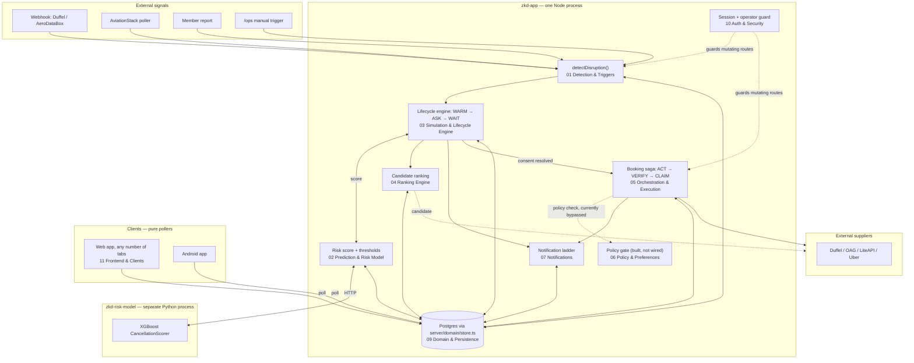
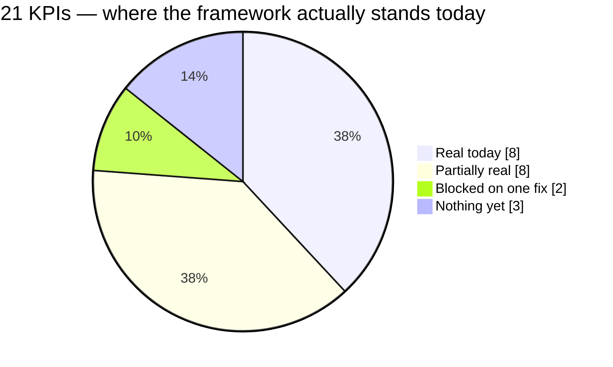

# ZKD Concierge — Solution

**American Express / Codestreet 2026, Team ZKD, IIT Madras**

The core of this document (System Overview through Frontend & Clients) is `documentation/components/` — twelve component docs generated directly from the running code, each independently verified against the checkout it describes, not carried forward from an earlier design pass. Two appendices follow: a rebooking/planning walkthrough originally written as pitch-deck source material, and the Experience KPI framework (granular, mechanical signals — not the headline simulation numbers).

The two literal data artifacts backing the numbers in this document:

- **The Monte Carlo simulation** — [`iropssim.py`](iropssim.py) → [`iropssim-output.json`](iropssim-output.json), fixed seed, reproducible (`python3 iropssim.py | diff - iropssim-output.json` is empty). See also [`documentation/design/10-monte-carlo-revision-2026-08.md`](documentation/design/10-monte-carlo-revision-2026-08.md).
- **The trained cancellation-risk model's real metrics** — [`zkd-risk-model/reports/model_metrics.json`](zkd-risk-model/reports/model_metrics.json) (ROC-AUC 0.804, trained on 7,893,669 real US DOT/BTS + Brazil ANAC flight records) and [`zkd-risk-model/MODEL_CARD.md`](zkd-risk-model/MODEL_CARD.md).

---

## System Overview — how the pieces fit together

**ZKD Concierge · Codestreet 2026 / American Express · Team ZKD, IIT Madras**

This folder documents the rebooking pipeline one component at a time. This file is the map: what
"distributed" actually means here, which process a piece of logic runs in, and how a disruption
moves end to end through the eleven components documented alongside it. Read this first; read a
component doc when you need to know how one piece actually works.

This describes the `demo` branch as it exists in this checkout. It is generated from the code, not
from the design docs in `documentation/design/` — where the two disagree, this folder follows the
code and says so.

---

### 1. What "distributed" means here

This is not a microservices system, and this doc does not pretend it is. It is **one Next.js
process holding almost all of the logic**, talking to a small number of genuinely separate things:

| Boundary | What's on the other side | Protocol | Owned by |
|---|---|---|---|
| The Node process itself | `zkd-app/` — API routes, the in-memory lifecycle engine, the ranker, the saga | — | [03](03-simulation-lifecycle-engine.md), [05](05-orchestration-and-execution.md), [04](04-ranking-engine.md) |
| A separate Python inference service | `zkd-risk-model/` — `serve.py` locally, or a deployed Lambda/ALB in AWS | HTTP, `RISK_MODEL_URL` | [02](02-prediction-and-risk-model.md) |
| A Postgres database | Durable state for bookings, tasks, ledgers, preferences | SQL, `server/domain/db.ts` | [09](09-domain-and-persistence.md) |
| A long list of external supplier/carrier/comms APIs | Duffel, OAG, LiteAPI, Uber, Twilio, Fast2SMS, Frankfurter, Gemini, NOAA/Open-Meteo, OpenSky, AviationStack | HTTPS, server-side only | [01](01-detection-and-triggers.md), [08](08-suppliers-and-integrations.md), [07](07-notifications.md) |
| Client devices | A web browser (one or more tabs) and the Android app | HTTP polling only, no business logic | [11](11-frontend-and-clients.md) |

The distribution that matters is **process boundaries and who can be down without taking the
others with them** — not a fleet of interchangeable services. Two facts follow from this, and both
are load-bearing:

1. **The backend is the only thing that decides anything.** The lifecycle engine
   (`server/engine/simulation.ts`, [03](03-simulation-lifecycle-engine.md)) runs on real
   `setTimeout`/`setInterval` chains inside the one Node process. It resolves on schedule whether or
   not any browser tab or phone is open to watch it. A client that reconnects mid-recovery sees
   wherever the state machine actually is — it is never asked to reconstruct or resume anything
   itself.
2. **This only behaves correctly as one continuous process.** There is no serverless redeploy story
   for the engine — restarting the process drops every in-flight `setTimeout`, which is why a
   reconciliation sweep exists (see [03](03-simulation-lifecycle-engine.md)) to re-arm anything that
   was mid-window when the process last died, rather than silently losing it.

### 2. The shape of one disruption, start to finish



Narrated:

1. **Detection** ([01](01-detection-and-triggers.md)) notices a flight is disrupted — a webhook, a
   budget-capped poll, a corroborated member report, or (for rehearsal) a manual `/ops` trigger —
   and calls one shared entry point, `detectDisruption()`.
2. **Prediction** ([02](02-prediction-and-risk-model.md)) runs continuously and independently of
   detection — it estimates cancellation probability *ahead of time*, out-of-process against the
   Python risk-model service, and is what drives the WARM-phase pre-caching before anything has
   actually happened.
3. **The lifecycle engine** ([03](03-simulation-lifecycle-engine.md)) is the state machine that
   owns everything from "a threshold was crossed" through "the member has been asked and either
   answered or the window lapsed." It is the one component every other component reports through.
4. **Ranking** ([04](04-ranking-engine.md)) is called by the lifecycle engine to turn a raw
   candidate set (fetched from suppliers) into an ordered, explained list.
5. Once consent resolves (explicit approval, or silence under the applicable consent tier),
   **orchestration and execution** ([05](05-orchestration-and-execution.md)) runs the actual booking
   saga against suppliers, with compensations registered before each step.
6. **Policy** ([06](06-policy-and-preferences.md)) is a real, tested, default-deny rule engine — but
   as of this checkout it has exactly one importer in the whole repo: its own test file. The diagram
   above shows that edge as bypassed on purpose, not as an oversight in this doc — see that
   component's page for what would need to be true before wiring it in safely.
7. **Notifications** ([07](07-notifications.md)) fire at each rung of a four-message ladder, and a
   message's confirmed delivery is a checked precondition before any unattended spend proceeds.
8. **Domain & persistence** ([09](09-domain-and-persistence.md)) is the shared substrate underneath
   nearly every arrow above — most components read and write through it rather than to each other
   directly, which is what keeps this a "shared state, many pollers" system instead of a tangle of
   direct component-to-component calls.
9. **Auth & security** ([10](10-auth-and-security.md)) sits in front of every mutating route,
   with a separate operator credential from the member session.
10. **Clients** ([11](11-frontend-and-clients.md)) — the web app and the Android app — never
    compute or time anything themselves. They poll the same backend state, which is what makes two
    independently signed-in sessions (see `lib/demoAccounts.ts`) converge on the same disruption
    without either driving the other. Note for anyone relying on older material about this app: a
    `?as=<passengerId>` query-param identity switcher existed at one point but is gone — identity
    now comes from a real signed-in session (`GET /api/auth/me`), not a URL parameter.

### 3. Component index

| # | Component | Doc | Runs in |
|---|---|---|---|
| 1 | Detection & Triggers | [01-detection-and-triggers.md](01-detection-and-triggers.md) | `zkd-app` |
| 2 | Prediction & Risk Model | [02-prediction-and-risk-model.md](02-prediction-and-risk-model.md) | `zkd-app` + `zkd-risk-model` (separate process) |
| 3 | Simulation & Lifecycle Engine | [03-simulation-lifecycle-engine.md](03-simulation-lifecycle-engine.md) | `zkd-app` |
| 4 | Ranking Engine | [04-ranking-engine.md](04-ranking-engine.md) | `zkd-app` |
| 5 | Orchestration & Execution | [05-orchestration-and-execution.md](05-orchestration-and-execution.md) | `zkd-app` |
| 6 | Policy & Preferences | [06-policy-and-preferences.md](06-policy-and-preferences.md) | `zkd-app` |
| 7 | Notifications | [07-notifications.md](07-notifications.md) | `zkd-app` + Twilio/Expo/Fast2SMS |
| 8 | Suppliers & External Integrations | [08-suppliers-and-integrations.md](08-suppliers-and-integrations.md) | `zkd-app` + third-party APIs |
| 9 | Domain & Persistence | [09-domain-and-persistence.md](09-domain-and-persistence.md) | `zkd-app` + Postgres |
| 10 | Auth & Security | [10-auth-and-security.md](10-auth-and-security.md) | `zkd-app` |
| 11 | Frontend & Client Apps | [11-frontend-and-clients.md](11-frontend-and-clients.md) | Browser + `zkd-android` |

Each doc follows the same shape: what it does, where it lives, how it works, its inbound/outbound
interfaces, the state it owns, an explicit real-vs-simulated-vs-mocked accounting, its failure modes,
and its test coverage. That last section is deliberately never skipped — every doc says plainly
where coverage is real and where it isn't, rather than implying completeness by omission.

### 4. Cross-cutting things that don't belong to one component

A few properties are true of the *system*, not of any single piece, and are easy to miss reading
one doc at a time:

- **Nothing is computed or timed on a client.** True for the web app and the Android app alike —
  see [11](11-frontend-and-clients.md). Every screen is a poller.
- **Evidence-tier honesty is enforced at multiple layers independently, not by one gatekeeper.**
  The risk model labels its own outputs (real / population-average / synthetic-market-estimate,
  [02](02-prediction-and-risk-model.md)); the refund calculator refuses to fabricate a ₹0 when it
  doesn't know a fare ([09](09-domain-and-persistence.md)); the ranking engine's fabricated-row
  guard exists specifically because a bad writer was deleted before its already-written rows were
  purged ([04](04-ranking-engine.md)). There is no single "truth" module — each component was fixed
  where it was found lying.
- **The security model is two separate credentials, not one with a role flag.** A member session
  and an operator session are deliberately distinct mechanisms — see
  [10](10-auth-and-security.md) — because a single session type with a permission bit is one bug away
  from a member accidentally holding operator power.
- **Money only ever moves on the member's own Amex card, in both directions**, and the mechanism
  enforcing that today is informed consent via the notification ladder
  ([07](07-notifications.md)), not a hard spend ceiling — a ₹25,000 per-transaction cap was
  deliberately removed (see that component's doc) because it produced worse outcomes than the risk
  it was guarding against.
- **This is a single-process demo by design, and the code is honest about what that means for
  scale.** `globalThis`-scoped counters (supplier-call budgets, poll budgets, device registries) are
  real gaps for a genuine multi-instance deployment and are called out as such in the components
  that have them, rather than hidden behind "production-ready" language.

### 5. Repository orientation

```
zkd-app/            The product. Next.js 16 / React 19. Everything in components 01–11 except
                     the Python risk-model service and the Android client lives here.
  app/               Pages (client-facing routes) and app/api/ (server routes).
  server/            All backend logic — organized by component, see the index above.
  lib/               Shared client-side helpers, types, and the theme-routing table.
zkd-risk-model/      The Python inference/training service documented in component 02.
zkd-android/         The Expo/React Native client documented in component 11.
documentation/
  components/        This folder — one file per component, generated from the code.
  design/            Intent and policy as designed (may lag the code; components/ follows code).
  architecture/       Higher-level system design and the Round 1 review.
  project/           Submission package, deployment, mentor-meeting record.
```

### 6. How to use this folder

- **Onboarding onto one piece?** Read that component's doc plus its immediate neighbors under "See
  also." You don't need the whole folder to make a correct change to one component.
- **Tracing a disruption end to end?** Follow §2's diagram in order — each numbered component doc
  picks up exactly where the previous one's "Outbound" section hands off.
- **Asking "is X real?"** Every doc has a "Real vs. simulated vs. mocked" section that answers for
  its own component specifically — no doc in this folder asserts realism for a piece it didn't
  itself verify by reading the code.


---

## Detection & Triggers

> Part of the ZKD Concierge rebooking pipeline. See [00-system-overview.md](00-system-overview.md) for how this fits with the rest of the system.

### What this component does

This component notices that a booked flight has been cancelled (or, more broadly, disrupted) and hands off to recovery. It is not one mechanism but three independent detection lanes — push webhooks, a budget-capped poller, and member self-report — plus a manual operator trigger, all converging on the same entry point, `detectDisruption()` in `server/engine/simulation.ts`. Each lane also feeds `triggerEventRescore()` (`server/engine/forecast.ts`) on any disruption-*shaped* signal, even one that doesn't rise to a cancellation, so the risk forecast stays current independently of whether a recovery starts.

### Where it lives

| File (relative to `zkd-app/`) | Purpose |
|---|---|
| `server/webhooks/index.ts` | Webhook front door: adapter registry, delivery dedupe, per-provider heartbeat/health, `handleDelivery()` (verify → dedupe → normalise → act) |
| `server/webhooks/duffel.ts` | Duffel adapter — `order.airline_initiated_change_detected`; only fires for orders booked *through* Duffel |
| `server/webhooks/aerodatabox.ts` | AeroDataBox adapter — per-flight-number push; the lane that covers this product's actual case (tickets booked elsewhere) |
| `server/webhooks/oag.ts` | OAG adapter — stub only; verifies nothing, normalises nothing, deliberately unconfigured |
| `server/webhooks/subscriptions.ts` | Registers/re-registers AeroDataBox subscriptions against `WEBHOOK_PUBLIC_URL`; picks which flights are worth watching |
| `server/webhooks/types.ts` | Shared `Adapter`, `NormalisedFlightEvent`, `DeliveryResult` shapes |
| `server/webhooks/verify.ts` | HMAC (Duffel) and shared-secret (AeroDataBox) verification, with replay-window checks |
| `server/webhooks/lane.test.ts` | Vitest coverage of lane health and delivery handling |
| `server/engine/statusPoller.ts` | Fallback AviationStack poller — budget-capped, stands down only while webhooks are demonstrably alive |
| `server/engine/memberReports.ts` | Member self-report + corroboration ladder |
| `server/aviationstack.ts` | AviationStack client, day-cached, shared by the poller, member reports, and `/api/flight-status` |
| `app/api/disruptions/route.ts` | Operator console feed (`GET`) and manual trigger (`POST`), both behind `requireOperator` |
| `app/api/disruptions/[flightId]/route.ts` | Recovery view for a signed-in passenger (downstream of detection, included here for completeness) |
| `app/api/disruptions/[flightId]/consent/route.ts` | Consent/resolve actions on a recovery task (downstream, not a detection entry point) |
| `app/api/webhooks/flight-status/[provider]/route.ts` | The one inbound HTTP route all webhook providers POST to |
| `app/api/flights/[id]/report-cancellation/route.ts` | Member-facing report endpoint, wraps `server/engine/memberReports.ts` |
| `app/api/flight-status/route.ts` | Ad hoc live-status lookup + classification; triggers a rescore but **not** `detectDisruption` |

### How it works

All lanes ultimately call `classify()` (`lib/disruptionKind.ts`) against the flight's *booked* departure — never the carrier's current schedule, since a moved flight reports zero delay against its own new time — and all cancellation-kind classifications call `detectDisruption(flightId)` in `server/engine/simulation.ts`.

**Lane 1 — push webhooks** (`server/webhooks/`)
- Single inbound route: `POST /api/webhooks/flight-status/[provider]`. It reads the raw body (`req.text()`, not `req.json()`, since HMAC verification signs exact bytes), looks up the adapter (`adapterFor`), calls `adapter.verify()`, and on success calls `handleDelivery(provider, rawBody, headers)`.
- `handleDelivery()` (`server/webhooks/index.ts`) is verify → dedupe → normalise → act, and is documented as never throwing — the route holds an open connection to a provider that retries on non-2xx.
  - Dedupe: `remember(key)` against an in-memory `Map` capped at `SEEN_LIMIT = 5000`, keyed by `${provider}:${deliveryId}`, oldest evicted first. A `deliveryId` comes from the adapter (`idempotency_key` for Duffel; a composed `listener:flight:changed:revised` string for AeroDataBox, since AeroDataBox supplies none of its own) or falls back to a hash of the raw body.
  - Normalise: each adapter's `normalise(payload)` flattens the provider's shape into `NormalisedFlightEvent[]`. AeroDataBox filters on `changed` fields (`status`, `departure.scheduled|revised`, `delay`) via `ACTIONABLE_FIELDS`, treating a missing `changed` array as "pass it through, let `classify()` decide" rather than dropping it. Duffel only reacts to `order.airline_initiated_change_detected` (an explicit allow-list, not a prefix match).
  - Act: `act(event)` (`server/webhooks/index.ts`) resolves the event to one of our tracked flights via `resolveFlight()` — matching normalised flight code plus, when the provider gave a departure date, that date; if ambiguous (more than one same-day match, or more than one upcoming match with no date given) it refuses rather than guesses. It then calls `classify()`, `triggerEventRescore(flight.id)` on anything disruption-shaped, and `detectDisruption(flight.id)` only on `classification.kind === 'cancellation'`.
- Heartbeat/health: every delivery (matched or not, duplicate or not — a duplicate still proves the feed is alive) updates `lastDeliveryAt`/`deliveries` per provider. `laneStatus()` reports a provider `stale` once `now - lastDeliveryAt > HEARTBEAT_STALE_MS` (6 hours), and the lane as a whole `primary` only if `WEBHOOK_PUBLIC_URL` is set **and** at least one configured provider is not stale. A provider that has never delivered anything is never counted as healthy — "registered but silent" must not read the same as "healthy and quiet".
- Subscriptions: `server/webhooks/subscriptions.ts` registers AeroDataBox per-flight-number webhooks (`POST /subscriptions/webhook/FlightByNumber/{number}`) against `receiverUrl('aerodatabox')`, gated on `WEBHOOK_PUBLIC_URL`, `AERODATABOX_API_KEY`, and `WEBHOOK_SHARED_SECRET` all being set (refusing to register without the last one, since that would create a subscription the receiver then rejects every delivery from). `flightsToSubscribe()` narrows to flights departing within the next 3 days whose forecast tier (`tierFor`, `server/engine/rescoreTiming.ts`) is not `'dormant'`. `startSubscriptionSync()` runs once at startup and every 30 minutes (`SYNC_INTERVAL_MS`), idempotent against Next dev-mode HMR re-invoking `instrumentation.ts`. Duffel is not registered here at all — it's configured once per-account in the Duffel dashboard, not per flight.
- OAG (`server/webhooks/oag.ts`) is a pure stub: `verify()` always fails with an explanatory reason, `deliveryId()` returns `null`, `normalise()` returns `[]`. `isConfigured('oag')` in `index.ts` hard-codes `false`, so it can never count toward `primary` health.

**Lane 2 — status poller** (`server/engine/statusPoller.ts`)
- `startStatusPoller()` schedules `tick()` every `POLL_INTERVAL_MS` (5 min) via `setTimeout`/reschedule, gated on `AVIATIONSTACK_API_KEY` being set; idempotent against HMR the same way the subscription sync is.
- `flightsToPoll()` selects flights that: haven't departed more than an hour ago; are `tierFor(...) === 'critical'`; and — only when `laneStatus(now).primary` is true — are **not** already covered by a live AeroDataBox subscription (`isSubscribed`). If webhooks are configured but stale, the poller resumes covering those flights; standing down requires the webhook lane to be demonstrably alive, not merely configured.
- `tick()` enforces a hard monthly ceiling (`MONTHLY_CALL_CEILING = 15`, lowered from 45 once webhooks became primary) checked before every call, and caps each tick to `LOOKUPS_PER_TICK = 2` (AviationStack rate-limits to 1 req/60s). It skips flights that already have an open `DisruptionEvent`. For flights it does look up, it calls `lookupFlightStatus()` → `classify()` → `triggerEventRescore()` → `detectDisruption()` on a `'cancellation'` classification only.
- The day-level cache in `server/aviationstack.ts` (`getOrSet('aviationstack:{code}:{date}', 24h, ...)`) means the effective spend unit is a distinct flight-day, not a poll tick.

**Lane 3 — member self-report** (`server/engine/memberReports.ts`, `app/api/flights/[id]/report-cancellation/route.ts`)
- `POST /api/flights/[id]/report-cancellation`: `requireSession` → rate limit (`consumeToken`, capacity 10 / refill 2 per minute, keyed per passenger) → verifies the caller actually holds a booking on that flight (the "cheapest possible spam filter") → calls `report(flightId, passengerId, 'member')`.
- `report()` records the claim (`Map<flightId, Map<passengerId, MemberReport>>`, one entry per passenger — repeat presses overwrite, not append) and calls `corroborate()`, a fixed ladder, cheapest/free signal first:
  1. Any report with `source === 'ops'` → confirmed immediately (operator-asserted, authoritative).
  2. `count >= INDEPENDENT_REPORTS_NEEDED` (3) independent passengers → confirmed.
  3. `flight.cancelledInData` (set via `/ops` "Mark cancelled (data only)", or a real feed) → confirmed.
  4. The flight's own forecast band is already `>= 'hold-gate'` (`BAND_RANK`) → noted as `alreadyWorried`, not yet decisive alone.
  5. `lookupFlightStatus()` against AviationStack (spends from the same ~100/month allowance as the poller) → confirmed if the carrier feed itself says cancelled; an explicit `'none'` classification from the carrier is treated as evidence *against* the report, overriding a lone unconfirmed member claim.
  6. If nothing conclusive but the forecast was already worried (step 4), confirmed anyway — the report corroborates rather than carries the decision alone.
- The asymmetry the whole lane exists for: the route only calls `detectDisruption(id)` (and `widenDetection(id)`, `server/engine/simulation.ts`, to fan the recovery out to every other booked passenger) when `verdict.confirmed` is true **and** this passenger hadn't already reported (`repeat` check, to avoid re-running the paid corroboration ladder on a repeated tap). An unconfirmed report never calls `detectDisruption` for anyone, including the reporter — the response instead points them at a helpline.
- Every report, confirmed or not, is written to the decision ledger via `logMemberReport()` (`server/decisionLedger.ts`), wrapped in a try/catch so a ledger failure never breaks the member's screen.

**Manual lane — `/ops` console** (`app/api/disruptions/route.ts`)
- `POST /api/disruptions` calls `detectDisruption(body.flightId)` directly — the identical entry point every automated lane uses. `GET` serves the operator console's disruption feed (`toDisruptionOpsView` per event). Both verbs require `requireOperator` (`server/auth/guard.ts`, which delegates to `opsSessionFrom` in `server/auth/opsSession.ts`) — this was fixed 2026-08-21; before that, `GET` returned real passenger names and owed-dollar amounts to any anonymous request, and `POST` let anyone on the internet trigger a real recovery (with no confirmation window for autopilot/pre-authed passengers, and no per-transaction cap since that was removed 2026-08-19) on any flight id. `POST` also requires same-origin (`isSameOriginRequest`) and is rate-limited (`checkRateLimit`, 20 burst / 20 per minute) even behind operator auth, specifically so a stuck demo script or a compromised operator credential can't hammer it. The route's comment states its only caller anywhere in the app is `app/ops/page.tsx`, verified by grep.

**Not a trigger lane — `/api/flight-status`**
`app/api/flight-status/route.ts` runs the same `lookupFlightStatus()` → `classify()` sequence as the other lanes and calls `triggerEventRescore()` on a disruption-shaped result, but it never calls `detectDisruption()`. Per `statusPoller.ts`'s own header comment, this route "had no callers at all" before the poller was built to call the underlying pieces itself; today its only referenced use is a manual curl example in `README.md` and a mention in `forecastEventRescore.test.ts`. It is a live status/classification utility, not a fourth detection lane.

```
Duffel ──▶ POST /api/webhooks/flight-status/duffel ──┐
AeroDataBox ──▶ POST /api/webhooks/flight-status/aerodatabox ──┤
                                                                 ├──▶ handleDelivery() ──▶ act() ──▶ classify() ──▶ detectDisruption()
OAG (stub, inert) ─ ─ ─ ─ ─ ─ ─ ─ ─ ─ ─ ─ ─ ─ ─ ─ ─ ─ ─ ─ ─ ─ ─┘
                                                                       ▲ (stands down only while laneStatus().primary)
statusPoller.tick() [5 min, budget-capped] ─────────────────────────────┘
                                                                       ▲ (fires only when corroborate() confirms)
memberReports.report() [per-passenger claim + ladder] ─────────────────┘

/ops console ──▶ POST /api/disruptions (requireOperator) ──▶ detectDisruption() directly
```

### Interfaces

#### Inbound — who calls this, and how

| Caller | Entry point | When |
|---|---|---|
| Duffel | `POST /api/webhooks/flight-status/duffel` | Airline-initiated order change, for orders booked through Duffel (none exist in this app today — booking origination isn't built) |
| AeroDataBox | `POST /api/webhooks/flight-status/aerodatabox` | Any subscribed flight-number change touching status, scheduled/revised departure, or delay |
| OAG | `POST /api/webhooks/flight-status/oag` | Never in practice — adapter rejects every delivery (`verify()` always returns `ok: false`) |
| Any provider | `GET /api/webhooks/flight-status/[provider]` | Endpoint-verification pings some providers send before registering a subscription |
| `server/engine/statusPoller.ts` (internal timer) | `tick()` → `lookupFlightStatus()` → `classify()` → `detectDisruption()` | Every 5 minutes, only for `'critical'`-tier flights not already covered by a healthy webhook |
| Signed-in passenger with a booking on the flight | `POST /api/flights/[id]/report-cancellation` | Member reports their own flight cancelled |
| Operator (`requireOperator`) | `POST /api/disruptions` (`{ flightId }`) | Manual/rehearsal trigger from `/ops`, or in principle any future live feed |
| Operator (`requireOperator`) | `GET /api/disruptions` | Reads the disruption-event feed for the ops console |
| Any caller (no session required) | `GET /api/flight-status?flightId=...` | Ad hoc status/classification lookup; rescore only, not a recovery trigger |

#### Outbound — what this calls, and why

| Target | Purpose | Failure behavior |
|---|---|---|
| `server/engine/simulation.ts` → `detectDisruption(flightId)` | Starts (or idempotently returns) the recovery for a confirmed cancellation | Documented as idempotent — a duplicate call returns the existing event rather than starting a second recovery |
| `server/engine/simulation.ts` → `widenDetection(flightId)` | Fans a confirmed member-reported cancellation out to every other booked passenger | Called only after `detectDisruption` on confirmation; not called on an unconfirmed report |
| `server/engine/forecast.ts` → `triggerEventRescore(flightId)` | Debounced out-of-cycle rescore on any disruption-shaped signal, cancellation or not | Debounced per flight (`eventRescoreDebounceMs`) so a flapping feed can't cause a rescore storm |
| `server/aviationstack.ts` → `lookupFlightStatus(code)` | Carrier status lookup, shared by the poller, member-report ladder, and `/api/flight-status` | Returns `null` on missing key, non-OK response, or any thrown error (wrapped in try/catch); callers treat `null` as "no evidence," not as an error to propagate |
| AeroDataBox subscription API (`subscriptions.ts` → `registerAerodatabox`) | Registers/refreshes per-flight-number push subscriptions | Never throws out of `syncSubscriptions()`; a failed registration for one flight is logged (`console.warn`) and skipped, not retried inline |
| `server/decisionLedger.ts` → `logMemberReport(...)` | Audit trail for every member report, confirmed or not | Wrapped in try/catch in `memberReports.report()` — "a ledger write must never break the member's screen" |

### State it owns

- **Webhook delivery dedupe** — `Map<string, number>` (`seen`), capped at 5000 entries, oldest evicted first. Keyed `${provider}:${deliveryId}`.
- **Webhook provider health** — `Record<WebhookProvider, { lastDeliveryAt, deliveries, matched }>`, updated on every delivery attempt (even unmatched or duplicate ones).
- **AeroDataBox subscription registry** — `Map<flightId, { url, at }>`, tracking which flights are subscribed against which registered public URL (so a changed `WEBHOOK_PUBLIC_URL`, e.g. a new tunnel, is detected and triggers re-registration).
- **Status poller monthly spend** — `{ month, calls }`, reset whenever the current month key changes.
- **Member reports** — `Map<flightId, Map<passengerId, MemberReport>>`, one live claim per passenger per flight.
- All five of the above are process-lifetime in-memory state (`globalThis`-backed in the webhook and subscription modules specifically to survive Next's per-route module instantiation — see the long comment in `server/webhooks/index.ts` explaining that this was found the hard way, when the receiver and `/api/pipeline/health` held two separate instances of what was assumed to be shared module state). None of it is persisted; a process restart forgets all of it. The documented consequence in each case is bounded: a forgotten delivery-dedupe entry just means a re-processed but idempotent `detectDisruption`; a forgotten member report means corroboration has to restart, never that something under-scrutinized gets acted on.

### Real vs. simulated vs. mocked

- **AeroDataBox webhook lane** — live and tested at the mechanism level (verification, dedupe, normalisation, health/staleness) via `lane.test.ts`'s Duffel-flavoured cases plus the adapter's own logic; actual end-to-end delivery depends on `WEBHOOK_PUBLIC_URL` being set to a real reachable HTTPS origin, `AERODATABOX_API_KEY`, and `WEBHOOK_SHARED_SECRET` all being present — otherwise `syncSubscriptions()` reports what's missing and registers nothing, and the receiver route itself is still fully exercisable locally via curl.
- **Duffel webhook lane** — live wiring (real signature scheme, real event type), but structurally inert today: it only fires for orders booked through Duffel, and this app originates no bookings through Duffel. Every seeded PNR stands in for a booking made elsewhere. The comment in `server/webhooks/duffel.ts` is explicit that this is "the architecturally correct lane the moment the system books anything itself," not a working path today.
- **OAG webhook lane** — a stub, not a mock: it does not pretend to work. `verify()` always fails, `normalise()` always returns nothing. Per its own header, OAG Flight Info Alerts is a separate paid product from the Flight Info API this codebase already calls, and the configured OAG key is a trial key, not an active alerts subscription.
- **Status poller** — live against AviationStack's real free-tier API when `AVIATIONSTACK_API_KEY` is set; otherwise `startStatusPoller()` logs a warning and does nothing, and the code says so explicitly ("Disruptions must come from the ops console or from a member report").
- **Member self-report** — fully live: real rate limiting, real booking-ownership check, real corroboration ladder against real forecast state and a real (budget-shared) AviationStack call.
- **Manual `/ops` trigger** — live code path (calls the same `detectDisruption` everything else does) but explicitly a rehearsal/demo control, not a production detection source — it stands in for "a live status feed" per the code's own comment.
- **`/api/flight-status`** — a live utility endpoint (real AviationStack call, real classification) but not wired to `detectDisruption` at all; it only triggers a rescore. It is not one of the three detection lanes despite living in the same file set.

### Failure modes & concurrency

- **Duplicate delivery (same provider retry)** — caught by `remember()`'s dedupe map in `server/webhooks/index.ts`; returns `{ duplicate: true, ok: true }` without re-running `act()`. Explicitly still counted toward the heartbeat (`lastDeliveryAt`/`deliveries` update *before* the dedupe check), since a retry still proves the feed is alive — asserted directly in `lane.test.ts` ("counts a duplicate as a heartbeat").
- **Same cancellation reaching two lanes** (e.g. AeroDataBox delivers it, and the poller's next tick also sees it, or a member reports the same flight the webhook just caught) — relies entirely on `detectDisruption()` being idempotent (documented in the header comment of `server/webhooks/index.ts`: "it returns the existing event rather than starting a second recovery"). This doc did not read `simulation.ts`, so that idempotency guarantee is taken on the stated word of the webhook module's own comment, not independently verified here — flagged as a claim to check against `03-simulation-lifecycle-engine.md`.
- **Dead/silent webhook feed** — the failure mode the whole design explicitly worries about most: a lapsed subscription looks identical to a quiet week. Guarded by the heartbeat: `laneStatus().primary` goes false once `now - lastDeliveryAt > HEARTBEAT_STALE_MS` (6h), which both `/ops` can display and `statusPoller.flightsToPoll()` reads to resume covering flights it would otherwise skip. A provider that has *never* delivered is never counted healthy in the first place (`lane.test.ts`: "is not primary before anything has ever been delivered").
- **AviationStack budget exhaustion** — `tick()` checks `s.calls >= MONTHLY_CALL_CEILING` both before selecting flights and before each individual lookup, and simply stops for the rest of the month; `pollerStatus().budgetRemaining` surfaces this on `/ops`. The same underlying allowance is shared with `/api/flight-status` and the member-report corroboration ladder (step 5) — a poller that consumed all 100 calls would silently disable both, which is exactly why the poller's own ceiling (15) is set well below the real limit, and why it stands down once webhooks are healthy rather than continuing to spend.
- **Malformed or unverifiable webhook body** — `handleDelivery` never throws; a `JSON.parse` failure returns `{ ok: false, detail: 'body was not JSON' }`, an unknown provider returns `{ ok: false, detail: 'unknown provider' }`, and a failed `adapter.verify()` in the route returns HTTP 401 with a generic `{ error: 'unauthorised' }` — the specific reason is logged server-side only, never returned to the caller, per the route's own comment about not helping an attacker distinguish "no secret configured" from "bad signature."
- **Ambiguous flight resolution** (webhook lane) — `resolveFlight()` refuses to guess: more than one same-day match, or more than one upcoming match with no departure date given, returns `null` and the event is reported as unmatched (a 200, not an error — unmatched is expected traffic, not a failure).
- **Member-report spam / repeated taps** — bounded by a per-passenger token bucket (`consumeToken`, capacity 10 / refill 2/min) at the route level, and by `memberReports.report()` keying claims by passenger (a fifth tap from the same person is one report, not five), plus the route's own `repeat` check that skips re-triggering `detectDisruption`/`widenDetection` on a passenger who already reported.
- **False member report** — the asymmetry is the guard: acting for the reporter alone costs one recovery; acting for the whole flight requires either 3 independent passengers, an operator assertion, `cancelledInData`, a positive carrier-feed confirmation, or (weakest) an already-elevated forecast band with no contradicting evidence. An explicit carrier "not cancelled" response overrides a lone member claim.
- **Cross-module state split** — a real, previously-hit bug, not a hypothetical: the long comment in `server/webhooks/index.ts` (lines ~78–99) documents that Next instantiates `server/webhooks/index.ts` separately per route bundle, so plain module-level state was invisibly split between the receiver route and `/api/pipeline/health` — three real deliveries were recorded on one instance while the health endpoint read another and reported zero. Fixed by hanging state off `globalThis` (`gw.__zkdWebhookState`), the same pattern `statusPoller.ts` and `subscriptions.ts` use for their own timers/counters.

### Tests

- `server/webhooks/lane.test.ts` covers: `laneStatus()` correctness before any delivery, after `WEBHOOK_PUBLIC_URL` is unset, after a real delivery (becomes primary), after going stale past `HEARTBEAT_STALE_MS`, and that the OAG stub never counts toward configured/health; plus `handleDelivery()` behavior for duplicate detection, duplicates still counting as a heartbeat, an unmatched flight returning success, an unknown provider, a non-JSON body, and an unrecognised-but-valid event type being recorded as handled rather than failed. This is the one file this doc was asked to treat as a full read; it exercises Duffel's HMAC path specifically (constructs real `x-duffel-signature` headers via `hmacHex`), not AeroDataBox's shared-secret path.
- `server/engine/forecastEventRescore.test.ts` (not fully read for this doc; found only by grep) references `/api/flight-status` in relation to `triggerEventRescore` debouncing.
- **Real gaps**: no test file was found (via grep across the read set) exercising the AeroDataBox adapter's own `normalise()`/`isActionable()` field-filtering logic, `subscriptions.ts`'s registration/re-registration logic, `statusPoller.ts`'s `flightsToPoll()`/budget-ceiling behavior, or `memberReports.ts`'s corroboration ladder end to end. `lane.test.ts`'s coverage is concentrated on the Duffel path and the shared health/dedupe machinery in `index.ts`; the AeroDataBox-specific normalisation rules and the two non-webhook lanes appear to be exercised only by inspection/manual testing, not by an automated test in the files reviewed here.

### See also
- [02-prediction-and-risk-model.md](02-prediction-and-risk-model.md)
- [03-simulation-lifecycle-engine.md](03-simulation-lifecycle-engine.md)
- [10-auth-and-security.md](10-auth-and-security.md)


---

## Prediction & Risk Model

> Part of the ZKD Concierge rebooking pipeline. See [00-system-overview.md](00-system-overview.md) for how this fits with the rest of the system.

### What this component does

Estimates the probability that a specific scheduled flight will be cancelled, ahead of time, so the
rest of the pipeline can act before the carrier files. It spans two processes: a Node/TypeScript
client inside `zkd-app` that assembles a feature vector for a live flight and turns a probability
into a member-facing risk band, and a standalone Python service (`zkd-risk-model`) that holds the
actual trained XGBoost model and returns a calibrated probability plus a SHAP-style explanation.
There is no mock branch on the live path: if the Python service cannot be reached, the caller
returns `null` and the UI shows "not available" rather than a fabricated number.

### Where it lives

**Node-side client (`zkd-app/`)**

| File | Purpose |
|---|---|
| `server/engine/riskModel.ts` | Assembles the feature vector for a live flight, calls the Python service (`/entity-rates`, `/score`), tags each historical-rate feature with its data-source tier |
| `server/engine/forecast.ts` | Turns a `ModelScore` into a `FlightForecast` (adds live seat scarcity, adaptive thresholds, band, alert/stand-down side-effects), on-demand path |
| `server/engine/batchScorer.ts` | Interval re-scorer: three cadence tiers (critical/standard/dormant), one batch HTTP call per tick, startup warm-up with retry |
| `server/engine/rescoreTiming.ts` | Pure functions deciding which tier a flight is in (`tierFor`) and how fast its alt-cache TTL decays as departure nears (`effectiveAltTtlMs`) |
| `server/engine/thresholds.ts` | Computes the adaptive `prepare`/`holdGate`/`preAuthorise` bands from scarcity, urgency, criticality, and forecast confidence |
| `server/risk/index.ts`, `weatherRisk.ts`, `notam.ts`, `gdelt.ts`, `types.ts` | A **separate** live-signal system (weather/NOTAM/news) that feeds the alternative-flight *ranker* (`server/pipeline/score.ts`), not the cancellation model — see note below |
| `server/airportDirectory.ts` | 6,072-airport IATA/ICAO/timezone/lat-lon lookup; supplies `distance_km` and, critically, local-timezone calendar parts (`localDateParts`) so `hour_of_day`/`day_of_week`/`month` match the model's local-time training convention |
| `server/weather.ts` | Real METAR (NOAA Aviation Weather Center) + Open-Meteo fallback weather lookups; feeds `server/risk/weatherRisk.ts`, not the trained model itself |
| `app/api/flights/[id]/demo-risk/route.ts` | `/ops` "Ramp risk" presenter control — writes a hardcoded, clearly-tagged demo forecast, entirely outside the model |

**Python inference service (`zkd-risk-model/`)**

| File | Purpose |
|---|---|
| `src/features.py` | Builds the leakage-checked, geography-agnostic training table from BTS+ANAC data |
| `src/train.py` | Trains XGBoost, calibrates with isotonic regression, evaluates on a chronological holdout, writes `models/` + `reports/model_metrics.json` |
| `src/inference.py` | `CancellationScorer` — loads the trained artifact, scores a feature dict, produces `cancelProbability`, `confidence`, `riskScore`, tree-SHAP `explanation` |
| `src/serve.py` | stdlib-only local HTTP server (`/health`, `/entity-rates`, `/score`) — what `RISK_MODEL_URL` points at in dev |
| `src/handler.py` | AWS Lambda entry points (`batch_score`, `event_score`) wrapping the same `CancellationScorer`, writing to DynamoDB + an S3 decision-ledger |
| `src/ingest_bts.py` | Normalizes US DOT/BTS On-Time Performance monthly files into the shared schema |
| `src/ingest_anac.py` | Normalizes Brazil ANAC VRA monthly files into the same shared schema |
| `src/ingest_india_synthetic.py` | Builds the **separate**, clearly-labeled synthetic Indian-market rate table from fabricated CSV rows — never merged into the real training table |
| `src/entrypoint.py` | Unattended weekly retrain orchestrator (download → ingest → features → train → score_distribution → S3 upload), run by `Dockerfile.trainer` |
| `src/score_distribution.py` | Scores a synthetic grid of ~168,000 real-shaped feature combinations to build the percentile-rank lookup behind `riskScore`, and `reports/score_distribution.json` |

### The process boundary

`zkd-app` never imports any Python code or trained-model file directly. The only contact is HTTP,
gated by one env var, `RISK_MODEL_URL` (default `http://localhost:8090` in `riskModel.ts`).

- **`GET /entity-rates`** — `riskModel.ts`'s `entityRates()` fetches the full historical-rate reference
  tables (`carrier`, `origin`, `dest`, `route`, `origin_month`, `origin_hour_density_avg`,
  `global_prior`, plus `live_synthetic` riding alongside under its own key). Cached client-side in
  the Node process's in-memory TTL cache (`getOrSet`, `server/cache.ts`) for `ENTITY_RATES_TTL_MS =
  10 * 60 * 1000` (10 minutes), with a 5-second request timeout (`AbortSignal.timeout(5000)`). On
  failure (non-2xx or thrown error) the whole call resolves to `null` — no partial or stale-forever
  answer.
- **`POST /score`** — body is either one feature object (single-flight, on-demand path,
  `assembleFeatures` → `scoreFlight`, 8s timeout, explanation included) or an array of feature
  objects (batch path, `scoreFlightsBatch`, 15s timeout, explanation always omitted). The batch
  response is a same-length array where a per-item failure is represented as `{"error": "..."}` in
  that slot rather than failing the whole request; `scoreFlightsBatch` verifies index alignment by
  construction (`withFeatures` and the request body are built from the same array in the same
  order) rather than assuming it holds.
- Response shape (`ModelScore`): `{ cancelProbability, confidence, modelVersion, source:
  'internal-ml', riskScore?, explanation? }`. `riskScore` is absent whenever
  `score_percentile_lookup.npy` hasn't been generated (`score_distribution.py` not yet run);
  `explanation` is present on-demand, omitted in batch mode.

**What happens on each side if the other is unreachable:**

- *Node → Python down*: `assembleFeatures` returns `null` if `/entity-rates` fails (feature
  assembly can't even start without the rate tables), and `scoreFlight`/`scoreFlightsBatch` catch
  the fetch and return `null` / an empty `Map`. `forecast.ts`'s `compute()` then returns `null` —
  the caller shows "not available," and `batchScorer.ts`'s startup `warmUntilScored` retries every
  20 seconds, up to 5 attempts, before yielding to the normal tiered cadence. There is no fallback
  probability anywhere on this path — deliberately, per the header comment in `riskModel.ts`.
- *Python → Node's domain data unreachable*: not applicable in this direction — `inference.py`
  never calls out to the network; it only scores a feature dict handed to it. Feature *assembly*
  (calling the domain store, airport directory, etc.) is exclusively a Node-side responsibility;
  `handler.py`'s docstring states this explicitly to avoid a second, divergent copy of that logic
  in Python.
- *Malformed/oversized request*: `serve.py` caps request bodies at `MAX_BODY_BYTES = 5 * 1024 *
  1024` (413 on overflow) and returns 400 on invalid JSON — both degrade to an HTTP error the Node
  client already treats as "not ok, return null," not a crash.

### How it works

#### The model itself

**Training data**: real historical flight data only, no synthetic rows in the trained table.
- US DOT/BTS On-Time Performance, ~12 months, columns read off the file header (`ingest_bts.py`,
  verified 2026-08-14 against `bts_2024_1.zip`).
- Brazil ANAC VRA monthly extracts, semicolon-delimited (`ingest_anac.py`, verified 2026-08-14),
  which also contributes real international rows (e.g. Rio–Miami).
- `model_metrics.json`'s `data_sources`: **`BTS_US: 7,079,061`**, **`ANAC_BR: 814,608`** rows feeding
  `features.py`; after the chronological split, `n_train = 5,525,568`, `n_calib = 1,184,050`,
  `n_test = 1,184,051`.
- No Indian per-flight historical dataset exists publicly in bulk — stated as a known, permanent
  gap in `zkd-risk-model/README.md`, not implied to be solved.

**Features** (`FEATURE_COLS`, identical list in `features.py` and `train.py`):
`carrier_hist_cancel_rate`, `route_hist_cancel_rate`, `origin_hist_cancel_rate`,
`dest_hist_cancel_rate`, `origin_month_hist_cancel_rate` (smoothed expanding-window historical
rates, Laplace-style with `SMOOTH_N = 20.0`), `month`, `day_of_week`, `hour_of_day`, `is_redeye`,
`is_weekend`, `distance_km`, `sched_duration_min`, `origin_hour_density` (schedule congestion proxy
at the origin airport, same hour bucket), `prior_leg_cancelled` (upstream tail-rotation exposure,
BTS-only, real tail numbers), `international`.

**Excluded — leakage**: BTS delay-attribution columns (`CarrierDelay`, `WeatherDelay`, etc.) are
never used because they are only known after the flight resolves. `features.py`'s
`_leakage_self_check()` recomputes one high-volume carrier's historical rate by hand on every run
and compares it against the vectorized expanding-window version as a live guard against an
accidental current-row inclusion.

**`prior_leg_cancelled` is deliberately masked to `NaN` for every training row** (`train.py` line
105), even though it is real and present for ~88% of BTS rows and would otherwise be the
single highest-gain feature (~15x everything else combined). The reason, stated exactly in the
code comment: `server/engine/riskModel.ts` hardcodes this feature to `null` for every live flight
(OAG Flight Info Connections, the real source, is not available on this account), so training on
it would let the model lean on a signal it will never receive live. Masking it forced a real,
measured accuracy cost — the comment quotes **ROC-AUC 0.873 (unmasked) → 0.805 (forced null,
i.e. what live scoring actually gets)** for the previous artifact.

**Calibration**: isotonic regression (`sklearn.isotonic.IsotonicRegression`, `out_of_bounds='clip'`)
fit on a held-out calibration split (the middle 15% of the chronological data), because the raw
XGBoost margin is a ranking signal distorted by `scale_pos_weight` and boosting, not a calibrated
probability, and the member-facing bands act on the absolute percentage.

**Split**: strictly chronological by `sched_dep` — train (first ~70%), calib (next ~15%), test
(last ~15%), touched exactly once for the reported metrics. No k-fold shuffling (would leak future
rows into the past).

**Evaluation numbers, exactly as reported in `zkd-risk-model/reports/model_metrics.json`**
(`trained_at: "2026-08-15T18:44:18.628275+00:00"`):

| Metric | Value |
|---|---|
| ROC-AUC | 0.8038269098091382 |
| PR-AUC | 0.12344536409903796 |
| Brier score | 0.009715256281197071 |
| Log loss | 0.04906681180000305 |
| Positive rate (train / test) | 0.01894339188297022 / 0.010462387177579344 |
| Best boosting iteration | 63 |

Baselines computed in the same file for comparison, not asserted in isolation:
- Base-rate-only: ROC-AUC 0.5, PR-AUC 0.010462387177579344 (== the test positive rate, as it must
  be), Brier 0.010424853072938632.
- Logistic regression on the same features: ROC-AUC 0.7422816222194584, PR-AUC
  0.10375353029371927, Brier 0.2411636441978684 (explicitly noted as not calibrated, so its Brier
  isn't directly comparable to the calibrated XGBoost Brier above).
- Top-decile lift over the test base rate: **5.25x** (`lift_table`'s last row,
  `lift_over_base_rate: 5.247533481972106`), not the "22x" figure the training script's docstring
  region seems to anticipate — the actual computed lift table tops out at ~5.25x, which is worth
  flagging as a real number to use instead of any higher figure that might be quoted elsewhere.
- Segment breakdown exists (`by_country`, `by_month`) and shows real spread: BR ROC-AUC
  0.7720292412929622 / PR-AUC 0.21523030418140782 vs US ROC-AUC 0.7035181531090687 / PR-AUC
  0.015868311124092378 — the model performs meaningfully worse on the lower-base-rate US segment by
  PR-AUC, which is expected at ~0.6% positive rate but is a real, disclosed weak spot, not hidden.
  The `by_month` segment only has 3 months present (1, 11, 12) in the test window, and month "1"
  has an n of only 13 rows — too small to read as a real per-month result.

`riskScore` (0–100 percentile rank, not a probability) comes from `score_distribution.py` scoring
168,000 realistic live-flight feature combinations (varying month/day/hour/distance/duration/origin
density/international, all historical-rate features cold-started to `global_prior` since every live
flight is `LIVE:`-namespaced). Per `reports/score_distribution.json`: real calibrated probability
range is **min 1.64%, p50 3.22%, p75 4.37%, p90 6.45%, p95 7.08%, p97 7.63%, p99/p99.5/p99.9 9.74%,
max 10.33%** — confirming the code comments' claim that `cancelProbability` never meaningfully
exceeds ~10% for any realistic live scenario (the comment in `riskModel.ts` says "never exceeds
~4%," which describes an earlier distribution before a retrain shifted it; `config/risk-thresholds.json`'s
own comment records the shift explicitly: "was 0.89%-4.06% before, not a small tweak").

**A live score response** (`CancellationScorer.score()` in `inference.py`) looks like:
```json
{
  "cancelProbability": 0.0322,
  "confidence": 0.412,
  "modelVersion": "984594ba18a7",
  "source": "internal-ml",
  "riskScore": 50.0,
  "explanation": {
    "biasMarginLogOdds": -4.21,
    "features": [
      { "feature": "origin_month_hist_cancel_rate", "value": 0.019, "contributionLogOdds": 0.83, "direction": "increases", "relativeShare": 0.41 }
    ]
  }
}
```
`modelVersion` is the first 12 hex characters of a SHA-256 hash of the trained model JSON file, so
a redeploy with an unchanged model reports the same version and the audit "reverify" flow
(`forecast.ts`'s `reverify()`) can tell a genuine retrain apart from a probability swing on the same
model. `explanation.features[].contributionLogOdds` are exact tree-SHAP contributions in log-odds
space (they sum with the bias to the raw pre-calibration margin) — explicitly **not**
probability-percentage-point contributions, per `inference.py`'s own docstring, because probability
is not linear in that space.

#### Serving path

1. **Feature assembly** (`riskModel.ts`'s `assembleFeatures`): fetches `entityRates()` (cached
   10 min), resolves the flight's origin/destination via `airportDirectory.ts`, computes local
   calendar parts (`localDateParts`) at the **origin airport's own timezone** — not UTC — because
   the BTS/ANAC training data's `hour_of_day`/`day_of_week`/`month` are local wall-clock fields.
   Before this existed, the code used `Date.getUTCHours()` etc., which is silently wrong for every
   non-UTC+0 airport (a constant 5.5-hour skew for India) on two of the highest-gain features
   (`is_redeye` ranks 9th, `hour_of_day` 5th in `feature_importance`).
2. Carrier/airport keys are namespaced `LIVE:` (e.g. `LIVE:6E`, `LIVE:DEL>LIVE:BOM`) — distinct from
   the training table's `BTS:`/`ANAC:` keys by construction, so every live Indian/international
   entity is a guaranteed cold-start miss against the real trained history.
3. **Three-tier lookup per historical-rate feature** (`tieredRate`): (1) this entity's real trained
   rate if the `LIVE:` key happens to match (never does today) → `'real'`; (2) the
   `entity_rates_synthetic.json` fabricated Indian-market rate if present → `'synthetic-market-estimate'`;
   (3) the trained `global_prior` → `'population-average'`. Each feature's chosen tier is recorded
   in a parallel `DataSourceMap` returned alongside the features, so the UI (`ForecastAudit.tsx`,
   per the code comments) can label a bar honestly instead of implying real per-carrier evidence.
   `prior_leg_cancelled` is always `null` live (OAG connections product not provisioned) and always
   labeled `'unknown'`.
4. **The actual HTTP call**: single-flight (`scoreFlight`) or batched (`scoreFlightsBatch`) `POST
   /score` as described in the process-boundary section above.
5. `applyScore()` (`forecast.ts`) then folds the returned `ModelScore` together with a **live seat
   count** (`searchInventory` across suppliers, filtered to offers that can seat the flight's
   largest booked party) into `thresholdsFor()` to get the adaptive bands, computes `pct =
   round(cancelProbability * 100)`, derives the `band` via `bandFor`, appends a history point
   (capped at 288 entries ≈ 24h at the 10-minute default interval), persists the mutated `Flight`
   back to the store, logs the prediction and the threshold evaluation to `decisionLedger.ts`, and
   fires `triggerAltPrefetchIfWarranted` plus alert/stand-down notifications.

**Caching / TTL**: `entityRates()` — 10 minutes, process-lifetime in-memory (`server/cache.ts`,
resets on server restart). A computed `FlightForecast` is considered stale after
`config/risk-thresholds.json`'s `forecast.ttlMs` (600,000 ms / 10 min) unless the flight is
demo-pinned (`isDemoPinned`, checked via `modelVersion === 'demo-override'`), which never expires
until explicitly reset. Concurrent `refreshForecast` calls for the same flight ID share one
in-flight promise (`inFlight` map) so five simultaneous viewers never trigger five HTTP calls.

#### Thresholds

`thresholdsFor()` (`server/engine/thresholds.ts`) computes three bands from `config/risk-thresholds.json`
(hot-reloaded via `lib/thresholdConfig.ts`, backed in production by AWS AppConfig per the config
file's own comment):

```
shift = (scarcity * urgency * criticality) / confidence
prepare      = clamp(base.prepare * shift, floor.prepare, ceiling.prepare)       [base 4, floor 2, ceiling 6]
holdGate     = clamp(base.holdGate * shift, floor.holdGate, ceiling.holdGate)    [base 6, floor 7, ceiling 9]
preAuthorise = clamp(base.preAuthorise * shift, floor.preAuthorise, ceiling.preAuthorise) [base 11, floor 9, ceiling 15]
```

- `scarcity`: fewer seats available (filtered to the flight's largest party) → lower factor → act
  earlier; flattens to 1 above `amplePlateauSeats` (20). Floor `soldOutFactor` 0.6.
- `urgency`: closer to departure → lower factor → act on less certainty; flattens to 1 beyond
  `amplePlateauMinutes` (480). Floor `insideWindowFactor` 0.65 inside `insideWindowMinutes` (60).
- `criticality`: 0.85 multiplier if the booking has a hard downstream constraint (e.g. an onward
  connection), else 1 — makes all three bands fire earlier.
- `confidence`: divides the shift, so a less-confident forecast (lower `score.confidence`) needs a
  **higher** raw probability to cross the same band — `floor 0.7 + span 0.3 * clamp01(confidence)`.

`holdGate.floor (7)` is deliberately set **above** `holdGate.base (6)`, per the config file's own
comment, so the multiplicative factors above can only ever push a flight's threshold up toward the
floor, never below it — this was tuned after a retrain shifted the real score distribution and the
config comment documents the exact empirical check against all 6 seeded demo flights.

Crossing bands is what gates everything downstream: `prepare` triggers no spend, `hold-gate`/
`pre-authorise` are the "critical" tier for re-score cadence (`rescoreTiming.ts`'s `tierFor`), and
separately, once `riskScore` (the 0–100 percentile rank, not `pct`) crosses
`altCache.prefetchAtOrAboveRiskScore` (75), `forecast.ts`'s `triggerAltPrefetchIfWarranted` hands
off to the WARM-phase alternative-flight and ground-transport pre-cache — see
[03-simulation-lifecycle-engine.md](03-simulation-lifecycle-engine.md) for what happens on that side
of the handoff.

### Interfaces

#### Inbound — who calls this, and how

| Caller | Path |
|---|---|
| On-demand flight view / poll | `server/engine/forecast.ts`'s `refreshIfStale` → `refreshForecast` → `compute` → `scoreFlight` |
| Scheduled interval re-scorer | `server/engine/batchScorer.ts`'s three tiers (critical 90s, standard 600s, dormant 1,800,000ms) → `scoreFlightsBatch` |
| Real-time status-change signal | `server/engine/forecast.ts`'s `triggerEventRescore`, called from `app/api/flight-status/route.ts` when AviationStack reports a real disruption-classified change, debounced 30s per flight |
| Audit "reverify" action | `forecast.ts`'s `reverify()` — forces an immediate rescore and reports the delta plus whether the model or threshold config version changed |
| `/ops` presenter control | `app/api/flights/[id]/demo-risk/route.ts` — bypasses the model entirely, writes a tagged `demo-override` forecast |

#### Outbound — what this calls, and why

| Target | Why |
|---|---|
| `zkd-risk-model`'s `serve.py`/`handler.py` (`RISK_MODEL_URL`) | The actual scored probability, confidence, riskScore, explanation |
| `server/suppliers` (`searchInventory`) | Real live seat counts, to compute scarcity for the adaptive thresholds |
| `server/risk/weatherRisk.ts` → `server/weather.ts` (METAR/Open-Meteo) | Weather severity signal for the alternative-flight **ranker** (`server/pipeline/score.ts`), gated behind `ZKD_LIVE_RISK=1` — not consumed by the cancellation model itself |
| `server/risk/notam.ts` (FAA NOTAM API) | Airspace/airport closure signal for the ranker, US-airport coverage only, requires `FAA_NOTAM_CLIENT_ID`/`SECRET` |
| `server/risk/gdelt.ts` (GDELT DOC 2.0) | Soft news signal (strikes, unrest, closures) for the ranker, keyless, gated behind `ZKD_LIVE_RISK=1` |
| `server/airportDirectory.ts` | Airport metadata, distance, timezone-correct local calendar parts |
| `server/decisionLedger.ts` | `logPrediction` / `logThresholdEvaluation` — every score and every threshold evaluation is logged for audit/replay |

**Note on `server/risk/*`**: this subsystem (weather + NOTAM + GDELT) is a real, separate live-signal
layer that exists to inform `server/pipeline/score.ts`'s ranking of *alternative* flights, not to
predict the *original* flight's cancellation probability. It was included in the file list for this
document because it lives conceptually adjacent to "risk," but it does not feed `riskModel.ts`'s
feature vector or the trained XGBoost model in any way — keep these two systems mentally separate.

### State it owns

- In-process TTL cache (`server/cache.ts`, plain `Map`, resets on restart): `entityRates()` under
  key `riskmodel:entity-rates`, 10-minute TTL; `metarSeverity`/`openMeteoSeverity` under
  `metar:{icao}`/`open-meteo:{iata}`, 15-minute TTL each (used by the separate ranker risk system,
  not the cancellation model).
- `flight.forecast` and `flight.forecastHistory` (capped at 288 points) — persisted per-flight
  fields in the domain store (Postgres-backed per `store.createFlight`), not recomputed from
  scratch each read.
- `lastEventRescoreAt` (in-memory `Map<flightId, timestamp>`) — debounce state for event-triggered
  rescores, per-process, not persisted.
- `inFlight` (in-memory `Map<flightId, Promise>`) — concurrent-request dedup, per-process.
- On the Python side: the trained model artifact (`models/cancellation_model.json`), calibrator
  (`models/calibrator_isotonic.npz`), entity rate tables (`models/entity_rates.json`,
  `entity_rates_synthetic.json`), feature column list (`models/feature_columns.json`), and the
  percentile lookup (`models/score_percentile_lookup.npy`) are all static files loaded once at
  `CancellationScorer.__init__` and held in the Python process's memory — refreshed only by a new
  weekly retrain + redeploy/restart, never mutated at request time.

### Real vs. simulated vs. mocked

- **Real, trained**: the XGBoost model itself, trained on 7,079,061 real BTS rows + 814,608 real
  ANAC rows; calibration; evaluation metrics in `model_metrics.json`; the live HTTP scoring path;
  the tree-SHAP explanation.
- **Real signal, honest cold-start**: any `LIVE:`-namespaced carrier/origin/dest/route/origin-month
  feature falls back to the trained `global_prior` (a real number, computed from real data, just not
  differentiated per-entity) whenever no synthetic override exists — tagged `'population-average'`
  in `DataSourceMap`.
- **Fabricated but clearly labeled**: `entity_rates_synthetic.json`, built by
  `ingest_india_synthetic.py` from `data/synthetic/india_carrier_monthly.csv` — every row there is
  invented, never merged into the real training table or `entity_rates.json`, tagged
  `'synthetic-market-estimate'` end to end (the JSON file itself carries a `"_comment"` field stating
  this, and `serve.py` serves it under its own `live_synthetic` key rather than merging it in).
- **Hardcoded/demo-only**: `app/api/flights/[id]/demo-risk/route.ts` — the `/ops` "Ramp risk"
  control writes a forecast with a fixed `pct = 8` and an operator-chosen `riskScore` (default 82,
  clamped 0–100), tagged `modelVersion: 'demo-override'` so no rescore path can silently overwrite
  or be confused with it. This is the only place in the reviewed code that writes a forecast without
  calling the model at all.
- **Explicitly absent, never guessed**: `prior_leg_cancelled` is always `null` on the live path
  (OAG Flight Info Connections not provisioned); `connectionRisk` is always `null` in
  `FlightForecast` for the same reason; NOTAM risk is US-airport-only with no Indian equivalent
  wired; weather is not a trained-model feature at all (v1 gap, stated in both `riskModel.ts`'s
  header and the README's "Known gaps").
- **Continual-learning loop**: `zkd-risk-model/README.md` states plainly that folding accumulated
  `LIVE:` outcomes back into the training table is **not yet built** — the weekly retrain re-runs
  against BTS/ANAC only, so cold-started entities stay cold-started even after a retrain.

### Failure modes & concurrency

- **Python service down or unreachable**: every Node-side entry point (`assembleFeatures`,
  `scoreFlight`, `scoreFlightsBatch`) catches the error and returns `null` / empty results — no
  fabricated fallback probability anywhere. `batchScorer.ts`'s startup warm pass retries up to 5
  times at 20-second intervals, then defers to the normal tiered cadence, which will keep failing
  silently (logged via `console.error`) until the service comes back.
- **A single flight's feature assembly throws** (e.g. malformed flight record): caught per-flight in
  both the single (`scoreFlight`) and batch (`scoreFlightsBatch`) paths — one bad flight is logged
  and skipped, never aborting the rest of a batch tick.
- **A single flight fails inside the Python scorer** (batch path): `serve.py`'s `do_POST` and
  `handler.py`'s `_score_batch` both catch per-item and place `{"error": ...}` in that slot instead
  of 500ing the whole request; the Node side checks `'error' in score` and skips it while keeping
  the rest of the batch.
- **Missing/null features for a live flight**: XGBoost's `DMatrix` is constructed with
  `missing=np.nan`, and the model was trained the same way (`missing=np.nan` in `train.py`) — a
  genuinely absent feature (e.g. `distance_km` when an airport is unrecognized, or
  `prior_leg_cancelled`, always null live) is handled natively by the tree splits, not imputed with
  a guess.
- **`entity-rates` unreachable but `/score` reachable** (or vice versa): `assembleFeatures` requires
  `entityRates()` to succeed first, so a down `/entity-rates` blocks scoring entirely for that
  refresh cycle even if `/score` itself would answer — there is no partial-feature degraded mode.
- **Demo-pin race**: a `/ops`-ramped forecast (`modelVersion: 'demo-override'`) is checked via
  `isDemoPinned` at the top of both `isStale` and `applyScore`, and excluded from both `tick()` and
  `warmAll()` in `batchScorer.ts` — this is the documented fix for a real bug where the 90-second
  critical-tier rescore used to silently reset a presenter's ramped score back down.
- **Training/live schema skew (fixed, documented)**: `airportDirectory.ts`'s `localDateParts` exists
  specifically because an earlier version computed `hour_of_day`/`day_of_week`/`month` from UTC
  components instead of the origin airport's local time, a constant 5.5-hour skew for every Indian
  flight, on two of the model's highest-gain features.
- **`origin_hour_density` unit skew (fixed, documented)**: `train.py`'s
  `compute_origin_hour_density` docstring records that an earlier live-serving reference table
  computed a whole-year sum per (origin, hour-of-day) rather than the per-slot count the training
  feature actually measures — "two orders of magnitude larger," caught by what the comment calls a
  "VP-readiness audit."
- **Upstream data source unavailable at training time**: `ingest_bts.py`/`ingest_anac.py` raise
  `FileNotFoundError` with an explicit instruction to run the download script first, rather than
  silently proceeding on partial data; a still-downloading zip is skipped with a warning
  (`zipfile.BadZipFile`), not treated as corrupt.

### Tests

Tests exist at the Node-client layer, not for the Python model itself in this file set:

- `zkd-app/server/engine/riskModel.test.ts` — the feature-assembly / scoring client
- `zkd-app/server/engine/thresholds.test.ts`, `zkd-app/lib/thresholds.test.ts` — adaptive band
  computation and the pure `bandFor`/UI lookups
- `zkd-app/lib/thresholdConfig.test.ts` — config loading/hot-reload
- `zkd-app/server/engine/batchScorer.test.ts` — tiered interval scoring
- `zkd-app/server/engine/rescoreTiming.test.ts` — tier assignment and TTL scaling
- `zkd-app/server/engine/forecastEventRescore.test.ts` — event-triggered rescore + debounce
- `zkd-app/server/engine/altPrefetchGate.test.ts` — the riskScore-gated alt-prefetch trigger
- `zkd-app/server/notify/bandCrossing.test.ts`, `dispatch.test.ts` — alert/stand-down logic
  downstream of a band change
- `zkd-app/server/airportDirectory.test.ts` — airport lookups, jurisdiction, local time math

**Real gap**: no test file in this list exercises `zkd-risk-model`'s Python code (`features.py`,
`train.py`, `inference.py`) directly — correctness there rests on `features.py`'s own runtime
leakage self-check and `train.py`'s honest chronological-holdout evaluation, not on an automated
test suite. Per the top-level `CLAUDE.md`, CI (`.github/workflows/ci.yml`) runs `tsc`, `vitest run`,
and `build` only — it does not run the Python model pipeline or `npm run verify`, so a regression in
`zkd-risk-model` would not be caught by CI at all, only by a human re-running `train.py` and
comparing `model_metrics.json` by eye.

### See also
- [01-detection-and-triggers.md](01-detection-and-triggers.md)
- [03-simulation-lifecycle-engine.md](03-simulation-lifecycle-engine.md)
- [08-suppliers-and-integrations.md](08-suppliers-and-integrations.md)


---

## Simulation & Lifecycle Engine

> Part of the ZKD Concierge rebooking pipeline. See [00-system-overview.md](00-system-overview.md) for how this fits with the rest of the system.

### What this component does

`server/engine/simulation.ts` is the module-level state machine that drives a disruption's lifecycle from the moment a cancellation signal arrives to the moment consent (explicit, autopilot, or by expiry) hands the recovery over to execution. It runs on real `setTimeout` chains rooted in process memory, not in a request handler — a consent window keeps counting down, and expires and books, whether or not any browser tab or phone is currently polling it. Every UI screen (`app/recovery/[id]/page.tsx`, `/ops`) is a downstream poller of `getRecoveryView()`; none of them drive the clock. The trade-off this buys is a real reconciliation gap: the state only advances while a Node process is alive, which is why the same file also owns a stranded-task sweep that repairs what a restart abandoned.

### Where it lives

| File | Purpose |
|---|---|
| `server/engine/simulation.ts` | The state machine itself: `detectDisruption`, per-passenger task creation, the consent window timer, re-check/cascade, resolution, member actions, and the restart-reconciliation sweep. |
| `server/engine/altsCache.ts` | Keeps `Flight.candidates.alts` (alternative flights) live from real supplier search on an adaptively computed TTL; pins any alt an open `RecoveryTask` still points at so a background refresh cannot null out a member's in-progress plan. |
| `server/engine/groundCache.ts` | Same TTL/in-flight pattern as `altsCache.ts`, for hotel and cab candidates; shares `altsCache`'s TTL config rather than a separate one. |
| `lib/confirmWindow.ts` | Pure function computing how long a member gets to answer — offer expiry / check-in cutoff / a fixed ceiling, floored below which asking is skipped entirely. |
| `lib/refreshCadence.ts` | Per-component-class (flight/hotel/ground) re-shop cadence, banded by risk stage; not called from `simulation.ts` directly but shares its "derive, don't hardcode" discipline and its output rides in the decision ledger next to the window. |
| `lib/refreshInterval.ts` | The formula `altsCache.ts` calls to size its own poll interval (urgency × severity × scarcity × window, Nyquist-capped against offer expiry, floored by the supplier rate limit). |
| `lib/thresholds.ts` | Client-safe `Band` type, `bandFor()`, and the `ACT_AT_RISK_SCORE` constant that gates alt pre-fetching; the actual adaptive computation lives server-side in `server/engine/thresholds.ts` (not read for this doc — out of scope). |
| `lib/thresholdConfig.ts` | Loads `config/risk-thresholds.json` (local file, or AWS AppConfig via `THRESHOLD_CONFIG_URL`), 30s reload interval, remote-cache-once-loaded-is-authoritative semantics. |
| `app/api/flights/[id]/preauth/route.ts` | Member sets a standing pre-authorised plan (alt/hotel/cab) for one flight, ahead of any disruption — read by `createTaskForBooking` at detection time. |
| `app/api/flights/[id]/warm/route.ts` | Force-refreshes alt/hotel/cab candidates unconditionally, bypassing the risk-gate that normally triggers `altsCache`/`groundCache` — used by `/ops` and member self-check. |
| `app/api/flights/[id]/reverify/route.ts` | Forces a fresh risk re-score (`server/engine/forecast.ts`'s `reverify`) — adjacent to this engine's inputs but not part of the lifecycle machine itself. |

### How it works

#### The phase machine

The code does not use the design docs' seven-phase WATCH→CLAIM naming. Two separate state shapes exist here:

**`DisruptionEvent.phase`** (per flight, shared by every passenger on it): `'DECIDING' → 'READY'`. `detectDisruption()` creates the event at `'DECIDING'`; a fixed-delay timer (`decideDelayMs = Math.max(FLOOR, DECIDE_TOTAL * PLAY)`, from `lib/recovery.ts` — `DECIDE_TOTAL` ≈ 1.01s of narrated "steps", `PLAY = 190`, `FLOOR = 260` → effectively a ~260ms floor) fires `finishDecide()`, which flips the event to `'READY'` and fans a `RecoveryTask` out to every affected booking.

**`RecoveryTask.phase`** (per passenger): `'waiting' → 'choosing' → 'acting' → 'booked' | 'handed'`. Created as `'waiting'`, or `'acting'` immediately if pre-auth applies. `resolveTask()`'s `'browse'` action moves it to `'choosing'` (holds the clock — see below) and `'back'` returns it to `'waiting'`. `finalizeResolution()` moves it to `'acting'` (then execution/`pipeline.execute` eventually reaches `'booked'`) or straight to `'handed'` for a hand-over/halt. `RecoveryTask.resolution: DisruptionResolution | null` is the terminal marker checked everywhere (`if (task.resolution) return;`) to make finalization idempotent — first writer wins.

Transitions, in order:
1. `detectDisruption(flightId)` — event created at `DECIDING`, `pipeline.onDisruptionDetected(flightId)` fired (void, non-throwing) to start the real supplier search in parallel, decide-timer scheduled.
2. `finishDecide()` — event → `READY`; `createTaskForBooking()` runs per booking (filtered to `restrictedTo` for an uncorroborated member report).
3. `createTaskForBooking()` branches on pre-auth and consent tier:
   - **Pre-auth + plan intact** → `phase='acting'` immediately, consent recorded as `{kind:'approved', ...}`, calls `pipeline.execute()` directly. No window.
   - **Pre-auth but plan broken** → falls through to the normal ask/autopilot path with a note explaining why.
   - **`consent === 'autopilot'`** → revalidates the default choice, then `finalizeResolution()` immediately with `{kind:'autopilot', ...}`. No window — "standing consent already answered."
   - **`consent === 'ask'`** → computes `confirmWindow()`; if `!win.askable`, resolves immediately via `settleExpired()` (asking would be theatre); otherwise sets `windowExpiresAt`, dispatches rung 3, and schedules `settleExpired()` for `win.seconds` later.
4. Either the member calls `resolveTask()` (approve/hand-over/choose/swap/browse/back) or the window timer fires `settleExpired()`.
5. `finalizeResolution()` is the single funnel both paths converge on; it sets `phase` and, for anything except `'handed-over'`, calls `pipeline.execute(task, resolution)` — **this is the handoff to orchestration/execution** (`05-orchestration-and-execution.md`).

#### The consent window

Computed in `lib/confirmWindow.ts`, called from `createTaskForBooking()` with the chosen alt's real `expiresAt`, the replacement flight's departure time, and whether the route is international. The formula:

```
fromOffer    = (offerExpiresAt - now)/1000 - EXECUTION_BUDGET_SECONDS(11) - NETWORK_MARGIN_SECONDS(20)   // Infinity if no offer expiry
fromCheckIn  = (departureAt - now)/1000 - checkinCutoffMinutes*60 - EXECUTION_BUDGET_SECONDS - NETWORK_MARGIN_SECONDS
              // checkinCutoffMinutes: 45 domestic, 60 international
ceiling      = WINDOW_CEILING_SECONDS (20 * 60)

rawSeconds, boundBy = the SMALLEST of {fromOffer, fromCheckIn, ceiling}

if rawSeconds < WINDOW_FLOOR_SECONDS (120):
    → { seconds: 0, askable: false, boundBy: 'floor' }
else:
    → { seconds: floor(rawSeconds), askable: true, boundBy, expiresAt: now + seconds*1000 }
```

`EXECUTION_BUDGET_SECONDS` (11) is `MACHINE_TOTAL`'s measured act-path budget from `lib/recovery.ts`; `NETWORK_MARGIN_SECONDS` (20) is slack for push delivery, a cold app start, and the round trip. `boundBy` is stored on the task (`RecoveryTask.windowBoundBy`) purely for explanation — `windowRationale()` turns it into the member-facing sentence ("You have 14 minutes — that is how long the airline is holding this price.").

Below the floor (`askable: false`), `createTaskForBooking()` does not ask at all: it sets `windowExpiresAt = 0`, writes a note ("too little time to ask... your standing permission decided this one"), and calls `settleExpired()` immediately — the same function a timed-out window calls, just with no `rung3` argument (so no delivery-check/grace-retry branch runs; see below).

#### Re-check and cascade

`revalidateChoice(task, flight)` is called at every point where a plan is about to become irreversible: on autopilot's immediate act, on the window's natural expiry (`settleExpired`), and on the member's explicit `'approve'`. It re-validates the chosen alt against the live supplier (`revalidateOffer`) only when the alt carries a real `supplier`/`supplierOfferId` — a seeded/demo candidate with neither is left alone rather than blocked, since this demo's inventory has no real supplier behind every row. Only a confirmed `state === 'gone'` triggers a switch:

- The old alt is added to `task.rejectedAltIds` (permanently excluded — `mergePinned()` in `altsCache.ts` keeps a rejected id pinned so a background refresh can't silently un-reject it).
- The first other party-fitting (`altsForParty`, so the whole PNR can still travel together) alt is substituted, with a note: `"{code} went while you were deciding, so we booked {next.code} instead — it still keeps your trip together."`
- If no substitute fits the whole party, the function returns `null` and the original (now possibly stale) chosen alt proceeds unchanged — there's no further fallback beyond this point in this file.

The member's `choose`/swap actions in `resolveTask()` enforce the same party-fit rule server-side (`if (!picked?.fitsParty) { ...break }`), not just in the UI.

#### Notification triggers

Three rungs, all through `server/notify/dispatch()` (not re-documented here — see `07-notifications.md`):

| Rung | Trigger point | Payload builder | Awaited? |
|---|---|---|---|
| 2 | `createTaskForBooking()`, right after `ensurePlanned()` resolves and before any plan/consent decision | `cancelledAlert({flightId, passengerId, code, from, to, optionCount, topOption})` | No — `void dispatch(...)`, fire-and-forget so a dead channel can't delay the member finding out |
| 3 | `createTaskForBooking()`, only on the `askable` ask-consent path, right before the window timer is set | `aboutToBookAlert({flightId, passengerId, code, altCode, altArrives, deltaDisplay, free, minutes})` — content built by `buildRung3Content()` (spend minus expected refund, via `estimateRefund`) | Dispatch call started but not awaited immediately; its `Promise<DispatchResult>` is threaded through to `settleExpired` as `rung3.dispatch` and awaited **there**, at expiry, to check `.delivered` |
| 3 (grace retry) | Inside `settleExpired()`, when rung 3's delivery could not be confirmed and the one grace extension hasn't been used yet | Same `aboutToBookAlert`, same content, `minutes` recomputed from `UNDELIVERED_GRACE_SECONDS` (5 min) | Same fire-then-await-at-expiry pattern |
| 3 (fresh, post-restart) | `reconcileOneStrandedTask()`, once per stranded task the sweep picks up | Same `buildRung3Content`/`aboutToBookAlert`, fresh dispatch | Awaited synchronously by the immediately-following `settleExpired()` call |

The delivery check is the load-bearing piece: `settleExpired()` will not let a recovery proceed on rung 3's silence-equals-consent unless `dispatch()`'s result reports `delivered: true`. Undelivered → one 5-minute grace extension (`undeliveredGraceUsed` flips to `true`, a fresh rung-3 is sent) → still undelivered → `finalizeResolution(task, {kind:'handed-over', ...})`, i.e. halt to a human rather than book blind.

#### Restart safety

`reconcileStrandedTasks()` (exported, called by `instrumentation.ts` once at startup and then every `RECONCILE_INTERVAL_MS` = 5 minutes via `startReconciliationSweep()`'s self-rescheduling `setTimeout`) queries `store.listWaitingRecoveryTasks()` (a Postgres query on `recovery_tasks` filtered to `phase='waiting'` and JSON-null `resolution`), then for every task whose `windowExpiresAt` is already in the past (`task.windowExpiresAt > now` is skipped — "a live timer still owns this one"), calls `reconcileOneStrandedTask()`.

`reconcileOneStrandedTask()` re-fetches the task/flight/passenger/booking, sends a **fresh** rung-3 message, and routes through the exact same `settleExpired()` function a live timer would have used — deliberately, per the file's own comment, because after a restart there is no way to know whether the *original* rung-3 was ever confirmed delivered, and assuming so "would reintroduce the exact defect the 2026-08-21 delivery-check fix closed." A task that had already used its one grace retry before the restart goes straight to hand-over on a second undelivered attempt, matching what would have happened had the process never died. The sweep explicitly does **not** treat the mere fact of a stranded window as consent — it re-runs the full delivery-confirmed-before-proceeding gate from scratch.

Guarded so a single bad task's data problem (a vanished flight/booking) is logged and skipped without aborting the rest of the sweep, and against Next dev-mode HMR re-invoking `instrumentation.ts`'s `register()` (`globalThis.__zkdReconcileSweepStarted` guard) — the same `globalThis`-guard shape `statusPoller.ts`/`batchScorer.ts` already use.

### Interfaces

#### Inbound — who calls this, and how

| Caller | Entry point |
|---|---|
| `POST /api/disruptions` (detection lanes: webhook push, `statusPoller.ts` fallback, `memberReports.ts`, `/ops` manual) | `detectDisruption(flightId, opts?)` — documented in `01-detection-and-triggers.md`, not re-covered here |
| A corroborated member report, once other evidence confirms an initially single-passenger report | `widenDetection(flightId)` — lifts `restrictedTo` and fans out `createTaskForBooking` to remaining bookings, skipping any passenger already handled |
| Member-facing recovery screen / `/ops` (approve, hand-over, browse, choose, swap-hotel, swap-cab, back) | `resolveTask(flightId, passengerId, action)` |
| Every poller of the recovery screen | `getRecoveryView(flightId, passengerId)` — read-only projection, computes `secondsLeft`/`windowSeconds`/cost/pipeline summary fresh on each call |
| `app/api/flights/[id]/preauth/route.ts` (POST) | writes `store.setPreAuth(...)`, read by `createTaskForBooking` at detection time via `store.getPreAuth` |
| `instrumentation.ts` at process startup, and its own recursive timer thereafter | `reconcileStrandedTasks()` / `startReconciliationSweep()` |

#### Outbound — what this calls, and why

| Callee | Why |
|---|---|
| `server/pipeline` — `onDisruptionDetected`, `ensurePlanned`, `preferredPlan`, `execute` | `onDisruptionDetected` kicks the real supplier search/plan in parallel with the decide timer; `ensurePlanned` is awaited before a pre-auth/autopilot task can act, closing a race where `execute()`'s `HOLD_PENDING → CONFIRMED` transition would otherwise be illegal; `preferredPlan` (synchronous, `null` if not ready) supplies the pipeline's better-informed default pick without ever blocking; `execute` is the handoff to orchestration/execution — called from `finalizeResolution()` for every resolution except `'handed-over'`, and directly from the pre-auth-intact branch of `createTaskForBooking()`. See `05-orchestration-and-execution.md`. |
| `server/notify` — `dispatch`, plus `cancelledAlert`/`aboutToBookAlert` from `server/notify/templates.ts` | Rungs 2 and 3 of the notification ladder — see above. Not re-documented; see `07-notifications.md`. |
| `../suppliers` — `revalidateOffer` | The at-confirm re-check inside `revalidateChoice()`. |
| `../domain/altsForParty` | Party-fit filtering everywhere an alt is chosen or re-chosen, so a market alt that can't seat the whole PNR is never silently substituted. |
| `../domain/pricing` (`costFor`), `../domain/refund` (`estimateRefund`), `lib/time` (`money`) | Compute the exact spend delta shown in rung 3 and in `RecoveryView.owedNow`/`cost`. |
| `../preferences/journeyPrefs` (`resolveConsent`) | Merges a member's per-flight `journeyPrefs.consent` override with their standing profile consent to decide autopilot vs. ask for this one flight. |
| `../domain/store` (throughout) | The persistence boundary — see "State it owns" below. |
| `../domain/seed` (`ensureSeeded`) | Called at the top of `detectDisruption`, `reconcileStrandedTasks`, and `getRecoveryView` to guarantee demo data exists before any read. |
| Ranking (`server/pipeline/score.ts` via `pipeline.preferredPlan`) | This engine never calls the ranker directly — it reads the pipeline's already-ranked pick through `preferredPlan()`, falling back to its own "first bookable alt" heuristic only when the pipeline hasn't finished. See `04-ranking-engine.md`. |

### State it owns

- **`restrictedTo: Map<string, string>`** (flightId → passengerId) — in-process only, never persisted. Scopes an uncorroborated member report's fan-out to one passenger until `widenDetection()` clears it.
- **The per-task `setTimeout` handles** for the decide delay, the consent window, and the undelivered-grace retry — pure in-process timers, not tracked in any map (each is a bare `setTimeout(() => {...}, ms)` closure); this is exactly the state a process restart loses, and exactly what `reconcileStrandedTasks()` exists to repair from durable state instead.
- **`DisruptionEvent`** and **`RecoveryTask`** records — read/written entirely through `server/domain/store.ts`, which this file's header describes as Postgres-backed (`recovery_tasks` table, confirmed directly in `store.listWaitingRecoveryTasks()`'s SQL). So the *decision* state (phase, window deadline, chosen alt, resolution) is durable; only the *timer* that would act on it is not.
- **`PreAuthRecord`** — also store-backed (`store.getPreAuth`/`setPreAuth`), read once at task creation.
- The reconciliation sweep's own recursive timer is tracked on `globalThis` (`__zkdReconcileSweepStarted`, `__zkdReconcileSweepTimer`) specifically so it survives Next dev-mode hot-module-reload re-registration without double-starting.

### Real vs. simulated vs. mocked

The module name is historical, not descriptive of what runs today. Per its own header comment, it predates a "redesign" to real `setTimeout` chains that persist independent of any observer — "simulation" here means *lifecycle simulation engine* in the sense of a state-machine/discrete-event engine, not *fake data*. Concretely:

- The phase transitions, window arithmetic, delivery-gated proceed/halt logic, party-fit cascade, and Postgres-backed durability are real production logic — none of it is scripted for a demo.
- What genuinely is fixed/demo-shaped: `decideDelayMs` (`Math.max(FLOOR, DECIDE_TOTAL * PLAY)`, from narrated "steps" in `lib/recovery.ts` originally written for client-side animation timing) is a presentation pacing constant, not a measurement of real work — the module header for `lib/recovery.ts` is explicit that `ACT_STEPS`' durations are now a "declared budget, not a script" for the *act* path (paced against measured wall-clock time in the saga), but the *decide* steps this file uses to schedule `finishDecide()` remain pure pacing.
- `BILLING_CURRENCY = 'INR'` is a hardcoded constant standing in for an awaited MyCa profile read, justified in-code by "one mock profile serves every member today" — a deliberate, documented simplification, not a hidden one.
- `revalidateChoice()`'s explicit non-blocking fallback for candidates with no `supplier`/`supplierOfferId` ("this is a demo whose seeded inventory has no real supplier behind it") is a real, commented compromise: some candidates simply cannot be re-validated against a live source in this build, and are trusted rather than blocked.
- Everything else — the consent window formula, the delivery check, the reconciliation sweep, the Postgres-backed task store — is real logic exercised by real tests, not a stand-in.

### Failure modes & concurrency

- **Process restart mid-window**: handled by `reconcileStrandedTasks()` (see above). The explicit, documented risk it closes: before 2026-08-21, a restart while any member had an open consent window left that task permanently stuck at `phase:'waiting'`, `resolution:null` forever, since the `windowExpiresAt` written to Postgres had no timer left to act on it.
- **Double-transition race**: `finalizeResolution()` guards with `if (task.resolution) { await store.setRecoveryTask(task); return; }` — first writer wins, so a member's explicit `approve` racing the window's `settleExpired` (or the sweep's fresh `settleExpired`) cannot double-resolve a task. `settleExpired()` itself independently re-checks `task.resolution || task.phase !== 'waiting'` before doing anything, so a task already moved to `'choosing'` (member is actively browsing) is excluded from the short-circuit check that would otherwise let an in-flight window timer resolve out from under an engaged member — that `phase !== 'waiting'` guard is the actual mechanism.
- **A timer firing twice**: not explicitly deduplicated by handle-cancellation (no `clearTimeout` calls anywhere in this file), but rendered harmless by the same `task.resolution`/`phase` guard in `settleExpired()` and `finalizeResolution()` — a second firing is a no-op read that finds the task already resolved.
- **An offer expiring during the window**: this is not treated as a failure but as the expected case `revalidateChoice()` exists for — checked at every point something is about to become irreversible (autopilot-immediate, natural expiry, explicit approve), never assumed valid from the moment it was first shown.
- **A `settleExpired` racing a member's `resolveTask('choose', ...)`**: both mutate `task.chosenAltId`/`rejectedAltIds` without an optimistic-concurrency check on the store write (`store.setRecoveryTask` is a last-write-wins upsert per the code read here) — a genuine narrow window exists between "member picks a different alt" and "the expiring timer's `revalidateChoice` reads the old alt," though the `task.resolution`/`phase` guards prevent the more severe double-booking case.
- **Undelivered notification on the very last safety check**: explicitly does not fail open. Two failed delivery attempts (original + one grace retry) halt to `'handed-over'` rather than proceed with an unconfirmed spend — the exact fix `simulation.test.ts`'s primary describe block exists to pin down.

### Tests

`server/engine/simulation.test.ts` drives the **real public entry points** (`detectDisruption`, `reconcileStrandedTasks`) through the real internal timer chain using Vitest fake timers (`vi.useFakeTimers()` / `vi.advanceTimersByTimeAsync()`), mocking only the boundary modules — `../domain/seed`, `../notify`, `../notify/templates`, `../pipeline`, `../domain/store` (as in-memory `Map`s). This is the same pattern the file's own comment attributes to `forecastEventRescore.test.ts`, and it means `settleExpired`'s actual logic is under test, not a stand-in for it.

Two describe blocks:
1. **`settleExpired` — the notification-delivery safety check** (3 tests): proceeds to book on confirmed delivery; halts to hand-over on a fully-undelivered rung 3 (checking the one grace extension is granted, then consumed); recovers and books if the grace retry succeeds where the first attempt didn't.
2. **`reconcileStrandedTasks` — resuming a consent window a restart abandoned** (6 tests): fresh rung-3 + resolve on confirmed delivery; grace retry on undelivered fresh rung-3; straight-to-hand-over when the grace retry was already used pre-restart; skips a task whose window genuinely hasn't expired yet (a live timer still owns it); skips a task that isn't actually stranded (wrong phase); one stranded task with a missing booking doesn't throw and doesn't stop the sweep.

Real gaps: no test exercises `finishDecide`'s fan-out to multiple bookings, `widenDetection`, the `restrictedTo` single-passenger restriction, `revalidateChoice`'s cascade-to-next-alt path, the party-fit rejection in `resolveTask('choose', ...)`, pre-auth (intact or broken), or the `autopilot` consent branch directly (only the `ask`-consent, `askable` path is exercised end to end). The consent-window arithmetic in `lib/confirmWindow.ts` itself has no dedicated unit test file among those read for this doc.

### See also

- [01-detection-and-triggers.md](01-detection-and-triggers.md)
- [04-ranking-engine.md](04-ranking-engine.md)
- [05-orchestration-and-execution.md](05-orchestration-and-execution.md)
- [07-notifications.md](07-notifications.md)


---

## Ranking Engine

> Part of the ZKD Concierge rebooking pipeline. See [00-system-overview.md](00-system-overview.md) for how this fits with the rest of the system.

### The trap: which file is actually live

**`zkd-app/lib/ranking.ts` is not the ranker.** It exports `costsFor`/`compareCandidates`/`rank` over a `netEconomic` vs. `memberVisible` cost split, and reads as a plausible, well-commented ranking module — which is exactly what makes it dangerous to find first.

Grepping the whole `zkd-app/` tree for `lib/ranking` turns up four hits, and none of them is a real application call site:

- `zkd-app/tests/ranking.test.ts` — the only file that actually imports `costsFor`/`rank` from `@/lib/ranking`. It is written for Node's own test runner (`import { test } from 'node:test'`), not vitest, and `vitest.config.ts` explicitly excludes the whole `tests/**` directory (see its comment: vitest *would* run these 79 assertions and they pass, but reports them as 7 "no test suite found" failures because it doesn't recognise `node:test`'s registration style — so it's excluded rather than reported wrong). There is also no npm script that runs `node --test tests/` successfully today: it dies on `MODULE_NOT_FOUND` because the `@/` path alias has no resolver under `node:test`. So `lib/ranking.ts`'s only exerciser cannot currently run through any command in `package.json`.
- `zkd-app/server/ledger/reconciliation.ts` and `zkd-app/server/suppliers/types.ts` — one-line **comments** pointing at `lib/ranking.ts` for context, not imports.

No file under `app/`, `server/` (outside that one comment), or any live page imports `costsFor`, `compareCandidates`, or `rank` from `lib/ranking.ts`. It is dead code with an orphaned test.

**The live path is `server/pipeline/score.ts`, which calls into `server/pipeline/ranker/`.** Confirmed by tracing actual callers: `server/pipeline/index.ts` (the saga's own evaluation step) and `app/api/flights/[id]/intent/route.ts` (the LLM free-text intent preview) both import `applyHardRules` / `rankAlts` / `ScoreContext` from `./score` / `@/server/pipeline/score`, and `score.ts` in turn imports `rankByModel` from `./ranker/index.ts`. This is the module every UI screen's ranking, ordering, and "why we picked this" sentence ultimately traces back to.

### What this component does

Given a set of candidate rebooking alternatives that have already survived the hard-rule filters, this component orders them for one member and produces the human-readable explanation shown under each option. Ranking is a learned conditional-logit (discrete-choice) model — not a hand-set weighted sum — whose weight vector is resolved per-request from a chain of increasingly specific evidence (strategy prior → MyCa warm start → global learned weights → this member's own learned weights), and whose output doubles as the training signal for its own future retraining.

### Where it lives

| File | Purpose |
|---|---|
| `server/pipeline/score.ts` | Public surface the rest of the pipeline calls: `applyHardRules` (safety filters that run *before* scoring) and `rankAlts` (ranks the survivors, then projects the model's output back into the legacy `OptionScore` shape — `parts`/`weights`/`total`/`notes` — that the UI and journal already consume). Owns `explain()`, the per-option "why" sentence. |
| `server/pipeline/ranker/index.ts` | `rankByModel` — the ranker's own public entrypoint. Builds the shared feature context, featurises every candidate, resolves the member's weight vector, scores the set, applies (default-off) near-tie exploration, and fire-and-forgets the shown-set log. |
| `server/pipeline/ranker/features.ts` | The one place a candidate becomes numbers — `featurise()`. Ten raw, signed features, all oriented so a higher value is "more preferred" and every weight can therefore be safely clipped non-negative. Also `carriersOf()` (every leg's carrier codes) and `touchedAirports()`. |
| `server/pipeline/ranker/weights.ts` | `resolveWeights` — the four-link chain (prior → MyCa offsets → global learned → member learned), each learned link gated by a hard `minData` floor and blended in by empirical-Bayes shrinkage. `enforceMonotone` clips every monotone feature's weight to ≥ 0 no matter what a training run or a hand-edited artifact says. Also the artifact loader/cache (`getArtifact`/`loadArtifact`). |
| `server/pipeline/ranker/model.ts` | The conditional-logit math itself: `dot()`, `contributionsOf()`, and `scoreSet()` — utilities, the softmax choice probability, and a deterministic cost/arrival/seats tiebreak for exact ties. Carries its own non-finite-utility guard independent of `features.ts`'s. |
| `server/pipeline/ranker/bookability.ts` | `bookabilityOf` / `bookabilityOffset` — P(this offer is still bookable when we try to ticket it), entering the utility as a fixed `log P(bookable)` offset rather than a competing learned weight. |
| `server/pipeline/ranker/cancelRisk.ts` | `cancelRiskOf` — a cheap, synchronous P(this *alternate* itself gets cancelled), read from the trained cancellation model's own committed historical-rate tables (real → synthetic Indian → global prior), never a live `serve.py` round-trip per candidate. |
| `server/pipeline/ranker/explore.ts` | `applyExploration` — near-tie adjacent-pair swapping for offline-evaluation data, off by default (`epsilon: 0.0` in the shipped artifact). |
| `server/pipeline/ranker/decisionLog.ts` | `logShownSet` / `logChoice` and their Postgres-backed readers — the durable record of what was shown (every candidate's full feature vector, at the moment it was shown) and, separately, of any directly-logged choice. |
| `server/pipeline/ranker/reconcile.ts` | `reconcileChoices` — pure, DB-free join of a resolved `RecoveryTask.resolution` back onto the most recent matching shown-set log entry, by `(flightId, memberId)` and timing, to manufacture real training pairs without any new write on the live consent/spend path. |
| `server/pipeline/ranker/train.ts` | `runTrainingPass` — the offline fit: conditional-logit maximum likelihood with L2-to-prior regularisation and monotone projection, per-strategy, promoted only if it beats the incumbent's held-out negative log-likelihood. Also the CLI entrypoint (`node --experimental-strip-types server/pipeline/ranker/train.ts`). |
| `server/pipeline/ranker/schedule.ts` | `startRankerTrainer` — the automatic recurring trigger for `runTrainingPass` (added 2026-08-22), self-starting interval (default 30 min, `RANKER_RETRAIN_INTERVAL_MS` override), idempotent under HMR via a `globalThis` guard, reloads the artifact into the serving cache after a promotion. |
| `server/pipeline/ranker/types.ts` | Shared types: `FEATURES`, `FeatureVector`, `WeightVector`, `RankerArtifact` (the persisted shape), `ModelScored`. |
| `server/pipeline/ranker/model.json` | The persisted artifact `train.ts` writes and `weights.ts` reads — see "State it owns" below. |
| `server/domain/altsForParty.ts` | `altsForParty` — turns raw stored `Alt`s into `PartyAlt`s (adds `fitsParty`/`partyFare`), and is the actual fabrication guard on every live decision-making call site (`looksFabricated`, not a function literally named `dropFabricatedAlts` — that name belongs to the display-only guard in `server/domain/views.ts`, which this file's own comment says was NOT reached by decision-making call sites before 2026-08-21). |
| `server/domain/altsFromOffers.ts` | `offersToAlts` — turns real supplier `Offer`s into `Alt`s, one FX rate per search. Feeds both the live alts cache and the manual `/api/alts` route. Cabin entitlement is the only thing left that can mark an option `ok: false` here; the per-transaction cap and the currency-conversion refusal were both removed 2026-08-19. |
| `app/api/alts/route.ts` | A diagnostic/manual search endpoint (`from`/`to`/`date`/`cabin` query params) — exercises `offersToAlts` directly, outside any seeded `Flight`, for probing supplier results. Not on the ranking path itself. |
| `lib/ranking.ts` | **Dead code.** See the trap section above. |

### How it works

#### Hard rules vs. scoring

`applyHardRules` (in `score.ts`) runs first, over the `PartyAlt[]` that `altsForParty` has already sanitised. Six checks, each a disqualification with a recorded reason, never a score penalty:

1. **Avoid-airlines** — every leg's carrier via `carriersOf()` (shared with the ranker's own features), not just the first. The file's own comment documents the bug this replaced: checking only `code.split(/\s+/)[0]` meant a blocked carrier operating a connection's *second* leg was invisible to the rule. Fixed 2026-08-21.
2. **Hard deadline** (`flight.hardDeadlineISO`) — an arrival after it is disqualified, not discounted. An *unknown* arrival time is not removed (can't prove it misses the deadline).
3. **Earliest departure** (`flight.earliestDepartISO`) — symmetric lower bound, same discipline.
4. **Party fit** (`fitsParty`) — never split a party across flights.
5. **Cabin downgrade** — filtered when `allowCabinDowngrade` is false and the alt's cabin ranks below the preferred cabin.
6. **Card policy verdict** (`alt.ok`) — MyCa's own entitlement check. Added 2026-08-19 specifically because nothing previously filtered on `ok`, and the per-transaction spend cap (removed the same day) had been the only other backstop against an out-of-entitlement fare getting auto-booked.

Everything that survives is handed to `rankAlts`, which delegates the actual ordering to `rankByModel` and then reshapes the model's output into the legacy `OptionScore` display shape (`parts`, `weights`, `total`, `notes`) so nothing downstream of the ranker had to change when the hand-set scorer was replaced.

#### The discrete-choice model

The model is a conditional logit (McFadden): each candidate `i` gets a utility `v_i = w · phi_i + log P(bookable_i)`, and the probability of being chosen from the shown set is the softmax over those utilities (`server/pipeline/ranker/model.ts`). Conditional logit was chosen over a pairwise ranker because it matches the actual decision shape (one choice from a presented set, and "we ranked it first and they took it" is itself an observation), and its fitted coefficients drop straight back into the artifact as inspectable weights. The file documents IIA (independence of irrelevant alternatives — two near-identical flights split each other's apparent share) as a known, accepted limitation rather than something worked around; nested/mixed logit is named as a future step requiring more data than exists today.

**Ten features** (`server/pipeline/ranker/features.ts`), every one raw, signed, and oriented so higher is always more preferred: `arrival`, `cost`, `cabin`, `effort`, `loyalty`, `redeye`, `seats`, `stability` (the alt's own cancellation risk, from `cancelRisk.ts`), `weatherRisk`, and `advisoryRisk` (both live-feed features, `server/risk/`, off unless `ZKD_LIVE_RISK=1`). `loyalty` and `stability`/`weatherRisk`/`advisoryRisk` are computed over **every leg** of a connection via `carriersOf()`/`touchedAirports()`, not just the first — the file's header and `score.test.ts` both call out that this was previously first-leg-only and is a fixed bug (2026-08-21). MyCa is load-bearing at the feature level, not only the weight level: `cabin`, `loyalty`, and `redeye` are computed directly from the member's MyCa profile.

**Weight resolution** (`server/pipeline/ranker/weights.ts`, `resolveWeights`), weakest evidence first:
1. **Strategy prior** — the old hand-set presets, ported into feature space (`model.json`'s `priorByStrategy`), one vector per `optimization_strategy`.
2. **MyCa warm start** (`applyMycaOffsets`) — additive bumps to `loyalty`/`redeye`/`cabin` from the member's own MyCa profile (status carriers held, red-eye aversion, premium entitlement). This is why the model doesn't need interaction history to be personalised from the first recovery.
3. **Global learned** — a vector fitted across all members on a strategy, blended over (1)+(2) by `shrinkToward` (empirical-Bayes, `w = (n·learned + k·prior)/(n+k)`), gated by `minDataGlobal` (200 in the shipped artifact) below which it's ignored entirely.
4. **Member learned** — this member's own fitted vector, blended over whatever (3) produced, gated by `minDataMember` (25).

`enforceMonotone` is the last step of every resolution: every feature in `monotoneNonNegative` (all ten, in the shipped artifact) is clipped to `max(0, w)`. This is asserted at read time regardless of what training produced — "cheaper/earlier/less-downgrade is never ranked worse" holds even against a bad fit or a hand-edited artifact.

**Bookability is a fixed offset, not a weight** (`bookability.ts`, `model.ts`): `v_i = w·phi_i + log P(bookable_i)`, coefficient fixed at 1 and never learned. The design note explains why this replaced the old `RELIABILITY_FLOOR`: with bookability as a multiplicative (offset, in log form) term, no volume of "member liked the cheap unbookable option" training data can teach the model to prefer something it can't actually book. `P(bookable)` itself starts from a tiered prior (`liveWithExpiry` 0.97 / `okNoExpiry` 0.72 / `other` 0.45) and shrinks toward a per-supplier learned rate as `revalidateOffer` outcomes accumulate via `train.ts`'s `learnBookability`.

**Deterministic tiebreak**: exact utility ties (e.g. a clipped-to-zero weight) fall to cheaper, then earlier, then more spare seats — `model.ts`'s `scoreSet` sort — so the monotonicity guarantee holds even in a tie, not just strictly.

#### Continual learning loop

1. **Shown-set logging** — `rankByModel` calls `logShownSet` (fire-and-forget, Postgres, `ranker_decision_log` table) on every live ranking call, recording the full feature vector, bookability, utility, rank, and propensity of every candidate shown. This is real and runs on every recovery today.
2. **Offline reconciliation** — `reconcile.ts`'s `reconcileChoices` joins a resolved `RecoveryTask.resolution` (kind `autopilot`/`approved`, which carry an `altId`) to the most recent shown-set log entry for the same `(flightId, memberId)` that precedes the resolution and actually contains the chosen alt. Deliberately DB-free and offline — the design explicitly avoided wiring `logChoice` into the live consent/spend path (`simulation.ts`) to keep that path's surface small, in favor of joining afterward, out of the request path, against data that already exists (`RecoveryTask.resolution`).
3. **Training** — `train.ts`'s `runTrainingPass` merges reconciled choices with any directly-logged ones (`logChoice` is exposed but nothing currently calls it in production, so today reconciliation is the only source of training pairs), builds `Observation`s per strategy, and fits each with projected gradient descent (L2-to-prior + monotone clipping at every step). A fit is only promoted if it beats the current incumbent's held-out negative log-likelihood on a deterministic 70/30 split, and only if the strategy has ≥ `minDataGlobal` observations.
4. **Automatic retrain schedule** — `schedule.ts`'s `startRankerTrainer`, added 2026-08-22, mirrors `batchScorer.ts`'s self-starting-interval pattern: ticks immediately at startup and then every `RANKER_RETRAIN_INTERVAL_MS` (default 30 minutes), idempotent via a `globalThis` guard so Next dev-mode HMR can't spawn duplicate timers. Before this file existed, `runTrainingPass` had **no automatic trigger at all** — only the manual CLI script — so interaction data could accumulate in Postgres indefinitely with nothing ever learning from it. That gap is what this closes.
5. **Artifact reload** — on a promotion, `schedule.ts` calls `loadArtifact()` to force `weights.ts`'s in-process cache to re-read the freshly-written `model.json`; without this the training process's own cache would keep serving the old vector until a restart (`getArtifact()` never re-stats the file on its own).

**What's real and running today**: the logging, the reconciliation join, the trainer's math, and the scheduled trigger are all wired and exercised by tests. **What's cold-started**: the shipped `model.json` (`version: 2`, `trainedAt: 2026-08-21`) has `learnedByStrategy: {}` and `learnedByMember: {}` — nothing has been fitted on real member data yet. Every ranking today runs on the strategy prior + MyCa warm start only; the global/member learned layers are architecturally live but have never had enough logged interaction data to clear `minDataGlobal`/`minDataMember` and actually engage.

#### Exploration

`explore.ts`'s `applyExploration` only ever swaps **adjacent** ranks whose utility gap is below `nearTieDelta` (0.05 in the shipped artifact) — options the model's own math already treats as interchangeable, so a swap costs the member nothing (both have already passed every hard rule). The swap probability is `epsilon`, and the shipped artifact has **`epsilon: 0.0`** (confirmed directly in `model.json`'s `explore` block) — so in production today `applyExploration`'s early-return path always fires: every candidate keeps its model rank, every propensity is exactly 1, and no swap ever happens. Each candidate's `propensity` (probability that specific ordering was shown) is still recorded either way, for future inverse-propensity-weighted offline evaluation. The file's own comment explains why online A/B-style exploration is rejected outright for this domain: showing a member a worse flight to see whether they take it has a cost measured in missed connections, not a lower engagement metric — and notes that un-engineered exploration (members overriding the top rank on their own) still teaches the model even with epsilon at 0.

### Interfaces

#### Inbound — who calls this, and how

| Caller | What it calls | Why |
|---|---|---|
| `server/pipeline/index.ts` | `applyHardRules` then `rankAlts` (from `./score`) | The saga's own evaluation step during a live recovery — the ranked top option becomes the recovery's plan. |
| `app/api/flights/[id]/intent/route.ts` | `applyHardRules` then `rankAlts` (from `@/server/pipeline/score`) | The LLM free-text intent layer's preview: re-ranks against a copy of the flight with a member-stated deadline applied, without persisting it until confirmed. |
| Display layer (`app/flights/[id]/page.tsx` and downstream UI) | Reads the `OptionScore` (`parts`/`weights`/`total`/`notes`) that `rankAlts` already produced | Never calls the ranker directly — consumes the shape `score.ts` projects the model's output into, unchanged in character from the pre-2026-08-20 hand-set scorer. |

#### Outbound — what this calls, and why

| Callee | Why |
|---|---|
| `server/pipeline/ranker/cancelRisk.ts` (`cancelRiskOf`) | Feeds the `stability` feature — the alternate's own cancellation risk, read from the trained XGBoost cancellation model's committed historical-rate tables, synchronously and at zero network cost (never a live `serve.py` call per candidate). |
| `server/domain/pricing.ts` (`costFor`) | Called once per alt by `score.ts`'s `rankAlts` to get the party total, shared with the ranker (via `partyTotalById`) so the pipeline and the ranker agree on "what this costs." |
| `server/domain/altsForParty.ts` (`altsForParty`) | Upstream of both `score.ts` call sites — sanitises raw `Alt[]` into `PartyAlt[]` (seat/fare validity, fabrication guard) before hard rules or ranking ever see them. |
| `server/risk/` (via `resolveRiskMaps`, called by `server/pipeline/index.ts`) | Supplies `weatherByAirport`/`advisoryByAirport`/`advisoryByCarrier` into `ScoreContext`, feeding the `weatherRisk`/`advisoryRisk` features. |
| `server/domain/db.ts` (`sql`, `ensureReady`) | `decisionLog.ts`'s Postgres-backed shown-set/choice log, and `reconcile.ts`/`train.ts`'s reads of resolved `RecoveryTask`s via `server/domain/store.ts`. |

### State it owns

- **`server/pipeline/ranker/model.json`** — the persisted `RankerArtifact`: feature scales, monotonicity list, per-strategy priors, MyCa offset constants, bookability priors/learned-per-supplier rates, shrinkage constants (`pseudoCountGlobal`/`pseudoCountMember`/`minDataGlobal`/`minDataMember`/`l2ToPrior`), the exploration config (`epsilon`/`nearTieDelta`), and the learned vectors themselves (`learnedByStrategy`, `learnedByMember`, and their observation `counts`). `train.ts` is the only writer; `weights.ts` is the reader, with an in-memory cache (`getArtifact`) that only refreshes via an explicit `loadArtifact()` call (from `schedule.ts` after a promotion, or a test).
- **`ranker_decision_log`** (Postgres, migration 0007) — one generic table with a `kind` discriminator (`'shown' | 'choice'`), holding every shown-set (full feature vectors, keyed by decision id) and any directly-logged choice. Replaced two local JSONL files under `server/.state/` on 2026-08-21, for the same "true on one instance, false the moment a second one exists" reason `decisionLedger.ts` was moved off JSONL in migration 0006.
- No other cache: `bookabilityOf`/`cancelRiskOf` read static tables (the artifact itself, and `zkd-risk-model/models/entity_rates*.json`) with in-process memoisation but no independent persisted state of their own.

### Real vs. simulated vs. mocked

Nothing here is mocked. The mechanism — feature extraction, weight resolution, monotone conditional-logit scoring, bookability-as-offset, shown-set logging, offline reconciliation, the trainer's math, and the automatic retrain schedule — is fully real and wired, and covered by tests exercising it directly (not stubbed). The one honest caveat is **cold start**: the shipped `model.json` has empty `learnedByStrategy`/`learnedByMember` and `version: 2`, so today every ranking decision runs on the strategy prior plus MyCa warm start only. The learned layers will engage automatically the first time a strategy accumulates `minDataGlobal` (200) reconciled observations and clears the held-out promotion bar — nothing further needs to be built for that to happen, only real interaction volume.

### Failure modes & concurrency

| Failure | Guard | Where |
|---|---|---|
| NaN/undefined feature value for one candidate (malformed fare/seats/timestamp from a supplier) | `sanitize()` coerces any non-finite feature to 0 (the neutral value every feature is designed around) before it can reach `dot()`. Without it, `Math.max(...utilities)` in the softmax would go NaN and poison every *other* candidate's choice probability too, not just the broken one's. | `features.ts`'s `featurise` → `sanitize` |
| A non-finite utility slipping past the featuriser anyway (e.g. a future feature added without going through `sanitize`) | Second, independent guard: a non-finite utility is logged (`console.error`) and pinned to `-1e9` — ranked last, never dropped, never allowed to poison the set's max. | `model.ts`'s `scoreSet` |
| Fabricated leftover rows (`kind !== 'market'`, or the old `carrierProtectedAlt()`'s `fare:0/seats:99` signature) surviving in Postgres from before the 2026-08-19 fix, pinned to an in-flight recovery | `looksFabricated()` runs inside `altsForParty` itself — the one function every live decision-making call site passes through (`pipeline/index.ts`, `simulation.ts`, the intent route), not only the member-facing read path (`views.ts`'s `dropFabricatedAlts`, which alone would have hidden it from the *screen* while leaving it live for the *pipeline*). Fixed 2026-08-21. | `server/domain/altsForParty.ts` |
| A NaN/negative fare, or a NaN/negative seat count, from a real supplier | Seats coerced to 0 (safe floor); fare is **disqualified outright** (`ok: false`), never coerced to 0 — the file's comment cites the 2026-08-19 fabricated-`fare:0` incident as the reason a broken fare must never silently become a free-looking option. | `altsForParty.ts` |
| The shared display aggregates (`bestArrival`, the cost `band`) themselves going NaN if every candidate's own value were broken | `Number.isFinite` filters before `Math.min`/`Math.max`; an all-broken set falls back to a zero-width band, which `costPart`'s own `span <= 0` branch already treats safely (everyone scores 1). | `score.ts`'s `rankAlts` |
| A ranked candidate's own cost/arrival still non-finite despite clean shared aggregates | `round3` is the last checkpoint: any non-finite output value renders as 0 ("worst on this axis") rather than `NaN%` or a broken UI bar. | `score.ts`'s `round3`/`roundAll` |
| Postgres unreachable during scheduled retraining | `loadResolvedChoicesFromDb` catches and logs a warning, returning `[]` rather than throwing — a training tick on a machine without `DATABASE_URL`, or during a DB blip, degrades to whatever `loadChoicesFromDb` separately returns instead of crashing the scheduled job. `schedule.ts`'s own tick also wraps `runTrainingPass()` in try/catch and reschedules regardless of outcome. | `train.ts`'s `loadResolvedChoicesFromDb`; `schedule.ts`'s `tick` |
| Concurrent/duplicate retrain timers under Next dev-mode HMR | A `globalThis.__zkdRankerTrainerStarted` guard makes a second `startRankerTrainer()` call a no-op. | `schedule.ts` |
| Missing cancellation-risk tables on a checkout that hasn't built the risk model | `cancelRiskOf` falls back to `BASE_CANCEL_RATE` (0.02) when neither the real nor synthetic rate table is on disk — `stability` becomes a constant and ranking is otherwise unaffected, not an error. | `cancelRisk.ts` |
| Exploration propensity left unset for the last element of a near-tie chain | Historical bug (documented in the file): the old loop never wrote `out[i+1]`'s propensity for an interior pair, relying on the next iteration — which doesn't exist for the last element. Fixed by initialising every propensity to a loud sentinel (`-1`, not a silently-plausible `1`) and a final sweep that only fills genuinely untouched entries. Moot at `epsilon: 0` today, but load-bearing the moment exploration is turned on. | `explore.ts` |

### Tests

- `server/pipeline/score.test.ts` — vitest, CI-visible. Covers `applyHardRules`'s avoid-airlines-every-leg fix, `rankAlts`'s loyalty-credits-every-leg and cancellation-risk-worst-leg fixes, the NaN-fare/NaN-arrival non-contamination guarantees, and empty/single-candidate sanity. The file's own header notes this suite didn't exist before 2026-08-21 — the only prior executable checks lived in `verify.ts`, which `npm run verify` runs but CI does not.
- `server/pipeline/ranker/ranker.test.ts` — vitest. Exercises monotonicity under arbitrary weights, MyCa personalising day one, bookability being un-out-learnable, shrinkage resisting thin data, and the trainer both recovering a real signal and refusing to promote noise.
- `server/domain/altsForParty.test.ts` — vitest. Seat sanitisation (negative/NaN/fractional), fare disqualification (NaN/negative never coerced to free), and the fabricated-row signature (`fare:0 && seats>=99`, or `kind !== 'market'`) being caught without false-positiving on a genuine free reissue or a genuinely large aircraft.
- **Real gap**: `lib/ranking.ts`'s own test (`tests/ranking.test.ts`) cannot run through any `npm` script today (excluded from vitest, and `node --test` fails on the `@/` alias) — moot for correctness since that module isn't on the live path, but it means even the dead module's 79 assertions aren't reported by anything. No test exercises `schedule.ts`'s timer/interval machinery itself (only `intervalMs()`'s env-parsing is separated out for testability); the interval loop's actual behaviour under a live Postgres is implicitly exercised, not unit-tested.

### See also

- [03-simulation-lifecycle-engine.md](03-simulation-lifecycle-engine.md)
- [05-orchestration-and-execution.md](05-orchestration-and-execution.md)
- [09-domain-and-persistence.md](09-domain-and-persistence.md)


---

## Orchestration & Execution

> Part of the ZKD Concierge rebooking pipeline. See [00-system-overview.md](00-system-overview.md) for how this fits with the rest of the system.

### What this component does

This component is the irreversible half of the rebooking pipeline. Everything upstream of it — search, scoring, holding a top option — is designed to lapse free; nothing here is. Once `execute()` is called with a member's consent, it runs a forward booking saga (revalidate → authorise → flight → hotel → ground → dispose → onward → notify), commits each step to an append-only journal that doubles as the rollback stack, and if a trip-critical step fails it walks that stack backwards to compensate everything already committed. It also exposes a stateless duty-of-care lookup (`/api/care`) that is unconnected to the saga.

### Where it lives

| File | Purpose |
|---|---|
| `server/pipeline/types.ts` | The six-state `PipelineState` machine, its legal-transition table, and the `PipelineRun`/journal/orphan shapes |
| `server/pipeline/journal.ts` | The only writer of `run.state`; the transition guard, commit/orphan recording, and the mirror onto `RecoveryTask.shown` |
| `server/pipeline/journal.test.ts` | Regression test for the double-booking fix in `transition()` |
| `server/pipeline/saga.ts` | The booking saga itself: forward chain, compensation chain, two-tier (critical/degrade) failure policy |
| `server/pipeline/compose.ts` | Constructs multi-leg connection options the raw supplier search doesn't return, feeding the candidate portfolio `plan()` picks from |
| `server/pipeline/fallbackNote.ts` | The exact string a member reads when the saga rolls back — pure, no supplier dependencies |
| `server/pipeline/narrate.ts` | Per-step member-facing narration for each saga step, keyed on `SagaStepName` |
| `server/pipeline/index.ts` | Public surface: `plan()` (SEARCHING→EVALUATING→HOLD_PENDING), `execute()` (the WAIT→ACT crossing), `replan()`, `abort()` |
| `app/api/pipeline/[flightId]/route.ts` | Guarded read of one passenger's own run + the `replan` action |
| `app/api/pipeline/health/route.ts` | Ops visibility into supplier budgets, refresh cadence, detection lane — no passenger data |
| `app/api/bookings/route.ts` | Where a flight booking enters the system (session-bound, CSRF-checked) |
| `app/api/bookings/hotel/route.ts` | Where a hotel booking enters the system, same guard pattern |
| `app/api/care/route.ts` | Stateless GET: looks up the duty-of-care regime for a route and returns what's owed |

### How it works

#### Allocation

A candidate isn't chosen inside `execute()` — it is chosen earlier, in `plan()`, and `execute()` only ever acts on what `plan()` already decided. `plan()` runs TRIGGERED → SEARCHING → EVALUATING → HOLD_PENDING and then **stops**: it force-refreshes the alt cache, re-reads the flight, optionally augments the direct-search results with constructed multi-leg connections from `compose.ts` (gated on the direct market being thin — `directCount < 3` — and on the member's `maxLayovers` rule), resolves risk signals once per recovery, runs `applyHardRules` + `rankAlts` (the ranking engine, documented separately), and if an overnight is indicated (`needsOvernight`, driven by the member's own `hotel_trigger_threshold_hours`), searches accommodation and ground via `arrangeOvernight`. The result — `{ altId, hotelId, cabId }` — is written to `run.plan` and the run parks at `HOLD_PENDING`. `execute()` later reads `task.chosenAltId`/`chosenHotelId`/`chosenCabId` off the `RecoveryTask` (which the consent flow may have let the member override) and resolves those ids back against `flight.candidates` — it does not re-rank or re-choose anything itself.

#### The policy gate

Grepped `server/pipeline/index.ts` and `server/pipeline/saga.ts` directly: neither imports `@/server/policy` nor any relative `../policy` path. `server/policy/index.ts`'s `evaluate()` is not called anywhere in this component's execution path. The only "policy" this component actually enforces is `Alt.ok` — a boolean already decided upstream by the card's cabin-entitlement check in scoring — which `applyHardRules`/`runSaga` simply respect as a given fact rather than evaluate themselves. **This component does not call the policy gate.** It is a default-deny module with, per a sibling agent's grep, exactly one importer in the whole repo (its own test), and this pipeline is not that importer.

#### The booking saga

Built by `buildSteps()` in `saga.ts`, in this fixed order:

1. **revalidate** — real in both mutation modes; the last check before anything is spent
2. **authorise** — issues a `van:<runId>` reference; no live payment integration exists on this branch, so there is nothing real behind it
3. **flight** — the scarce, most failure-prone resource; committed first so a failure here costs the fewest compensations
4. **hotel** *(only if an overnight was arranged)*
5. **ground** *(only if a cab kind was selected)*
6. **dispose** — voids the original PNR
7. **onward** *(only if the booking has a next leg)*
8. **notify** — always reports `ok:true` regardless of delivery outcome

Only `revalidate`, `authorise`, `flight` and `hotel` are in `CRITICAL`. A critical step's failure triggers `compensateAll`, which walks the `done` stack **in reverse, sequentially, and never stops early** — even if one compensation fails, the loop still processes every remaining entry, because an incomplete rollback leaves strictly more orphaned bookings than a slow, complete one. A non-critical step's failure (ground, dispose, onward) is recorded as an orphan and the saga **degrades**: it continues and still reaches `CONFIRMED`, on the reasoning that tearing up a confirmed flight and hotel because a rideshare declined would be a worse outcome than the ground failure itself.

`dispose` (voiding the original ticket) has no `compensate` function and sits outside the loop entirely — it runs last, after the trip-critical steps have already succeeded. The code's own comment states the reason plainly: a cancellation has no inverse. If disposal itself fails, that is not treated as a rollback trigger; the member already has a valid replacement and a stale original, and rolling back the good booking to "fix" that would be strictly worse for them.

#### Idempotency

Two distinct idempotency guards exist, and both are scoped to the business entity, not the workflow instance:

- `journal.ensureRun(flightId, passengerId)` derives the run id as `pr-${flightId}:${passengerId}` — one run per (flight, passenger) pair, not one per invocation. `onDisruptionDetected` can be re-fired by a redelivered webhook or a repeated poller pass and will simply find the existing run past `TRIGGERED` and skip it.
- `POST /api/bookings` and `POST /api/bookings/hotel` derive their dedup key from the booking's real-world identity — `(flightId, passengerId)` for a flight, `(passengerId, city, checkin, hotel name)` for a stay — not from a request id or idempotency-key header. A second identical call returns the existing record (200) instead of creating a duplicate.

If either were scoped to the workflow/request instead of the entity, a double-click or a retried webhook would issue a second PNR or a second reservation on the same trip — exactly the failure the code comments describe as "observed live before this guard existed" for the booking route.

#### The journal / state machine

Six states: `TRIGGERED → SEARCHING → EVALUATING → HOLD_PENDING → CONFIRMED`, with `FAILED_FALLBACK` reachable from any of the first four. `LEGAL_TRANSITIONS` is the sole source of truth for which edges exist; `CONFIRMED` and `FAILED_FALLBACK` have no outgoing edges at all — a saga rollback does not move the run backwards, it is recorded as a halt on the run and a `handed` phase on the task instead. `HOLD_PENDING → CONFIRMED` is named `IRREVERSIBLE_EDGE` in `types.ts`: canon requires nothing irreversible happens left of it.

**The double-booking race (fixed 2026-08-21):** `transition()` used to short-circuit any same-state call (`from === to`) as a harmless no-op returning `{ok: true}`. `execute()`'s only guard against running the saga twice is `if (!transition(run, 'CONFIRMED', ...).ok) return`. Because `execute()` is reachable from two independent async paths — a member's own "Approve" click and the consent window's own expiry timer, each working from its own separately-fetched task snapshot — both could call `transition(run, 'CONFIRMED', ...)` within the same tick. The second call found `run.state` already `CONFIRMED`, hit the `from === to` short-circuit, got `{ok: true}` back, and `execute()` read that as permission to run the **entire saga a second time**: a second hotel hold (a real third-party call even in intent mode) and a duplicate "you're rebooked" notification, both live today, and a real double-booked/double-charged seat once live ticketing lands.

The fix narrows the short-circuit: `if (from === to && to !== 'HOLD_PENDING' && to !== 'CONFIRMED') return {ok: true}`. A repeat `CONFIRMED→CONFIRMED` now falls through to `canTransition()`, which rejects it (`LEGAL_TRANSITIONS.CONFIRMED = []`), returning `{ok: false}` — so `execute()`'s existing `!ok` early-return path, previously unreachable for this case, now actually fires. `HOLD_PENDING` is excluded from the short-circuit for the same reason but keeps its own re-entry semantics (a re-plan is a real, meaningful transition each time, not a no-op). States NOT excluded — e.g. `FAILED_FALLBACK→FAILED_FALLBACK` — remain a legitimate no-op for a retried caller hitting an already-terminal state. `journal.test.ts` is the regression coverage for exactly this scenario.

#### Duty-of-care claim

`GET /api/care` is not a claim in any stateful sense — it takes `from`, `to`, `delayHours`, `overnight`, `forceMajeure` as query parameters, looks up the applicable jurisdiction (`jurisdictionFor`) and its entitlement bundle (`lib/entitlement.ts`'s `BUNDLES`), and returns what's owed (`owed(...)`), a distance-banded EU261/UK261-style compensation figure where applicable (`compensationFor`), and the bundle's evidence tier and citation. It is a pure computation over static regime data — unguarded (no `requireSession`), reads nothing from the domain store, writes nothing, and is not called anywhere inside `saga.ts` or `pipeline/index.ts`. It answers "what would this member be owed" rather than filing or recording an actual claim against a carrier.

### Interfaces

#### Inbound — who calls this, and how

| Caller | Entry point | Notes |
|---|---|---|
| `server/engine/simulation.ts` | `onDisruptionDetected`, `execute`, `abort`, `ensurePlanned` | Owns the consent decision and the WAIT gate; this module never decides whether to spend, only acts once told |
| `app/api/disruptions/route.ts` (`detectDisruption`) | `onDisruptionDetected` | Synchronous, never throws — an exception here would take the trigger endpoint down |
| `app/api/pipeline/[flightId]/route.ts` | `snapshot`, `replan` | Member-guarded (`requireSession`), returns only the caller's own run |
| `app/api/pipeline/health/route.ts` | (reads `store` and other engines directly, not this module's saga) | Ops-only counters, no passenger data |
| A member, via the booking UI | `POST /api/bookings`, `POST /api/bookings/hotel` | Session-bound and CSRF-checked; per project history these are now the only way a flight/hotel booking is created |
| `/ops`, by hand | `abort`, replan, etc. via existing routes | Manual operator path referenced in project docs |

#### Outbound — what this calls, and why

| Target | Called from | Why |
|---|---|---|
| `revalidateOffer` (`server/suppliers`) | `saga.ts` (`revalidate` step) | Last-second price/availability check against the live offer before committing |
| `holdHotel`, `revalidateHotel` (`server/hotels`) | `saga.ts` (`hotel` step) | Real-in-both-modes revalidation, plus a genuinely reversible hold (Duffel Stays is the only provider whose `hold()` is implemented) |
| `dispatch` (`server/notify`) | `saga.ts` (`notify` step) | Delivers the "you're rebooked" push/email; failure is recorded but never rolls back the trip |
| `store.getFlight`, `getBooking`, `getRecoveryTask`, `setRecoveryTask`, `getPipelineRun`, `setPipelineRun`, `getNextLeg`, etc. (`server/domain/store`) | `journal.ts`, `index.ts` | Reads/writes the flight, booking, task and run records this component operates on |
| `searchInventory`, `getRate` (`server/suppliers`, `server/fx`) | `compose.ts` | Building multi-leg connection candidates during planning |
| `searchAccommodation`, `searchGround` | `index.ts` (`arrangeOvernight`) | Populating hotel/ground candidates when a stranding is long enough to need them |
| `server/policy` | — | **Not called.** See "The policy gate" above |

### State it owns

The `PipelineRun` journal — one per `(flightId, passengerId)` pair, keyed in `store.pipelineRuns: Map<string, PipelineRun>`. This Map is the primary, synchronous read/write path: `getPipelineRun`/`setPipelineRun` are synchronous because 24+ call sites throughout the state machine and saga depend on that, and converting them to async Postgres calls would cascade `await` through the exact hot path this session's double-booking fix already touched.

Durability was added on top (2026-08-21) via a fire-and-forget mirror: `setPipelineRun` also writes to the `pipeline_runs` Postgres table (`mirrorPipelineRunToDb`), swallowing and logging its own errors so a transient DB hiccup never surfaces as a booking failure. `hydratePipelineRunsFromDb` reads every row back into the in-memory Map once at process startup (`instrumentation.ts`), so a restart resumes in-flight runs instead of silently losing them; on hydration failure it degrades to starting with no memory of prior runs rather than blocking boot. The in-memory Map remains authoritative at runtime — Postgres is a mirror for restart recovery, not a second source of truth queried on the hot path.

### Real vs. simulated vs. mocked

Within the saga itself:

- **Real, in both intent and mutation modes:** `revalidateOffer` and `revalidateHotel` — the checks that protect the member's money are never skipped.
- **Real only under `PIPELINE_ALLOW_MUTATIONS=1`, and honestly absent otherwise:** live flight ticketing and live hotel booking are not implemented behind that flag — the `flight` and `hotel` steps return `ok:false` with an explicit "not implemented" error rather than a stub that pretends to succeed, when mutations are actually turned on. With mutations off (the default), both steps commit an `intent:`/`unverified:` reference against the real, revalidated offer.
- **Never real on this branch:** `authorise` (no live payment integration exists — `van:<runId>` is never a genuine authorisation).
- **Real, unconditionally:** `dispose` (voiding the original PNR) and `notify` (dispatch to the notification system) always run their actual logic; disposal has no live-vs-mocked branch to speak of since it operates on locally-generated PNRs.

The compensators are explicitly honest about this, and it's worth stating plainly because it was a real bug fixed 2026-08-21: they used to claim things like `"voided ${ref}"` or `"cancelled ${ref} inside the free-cancellation window"` unconditionally for any non-empty ref — a real API call this codebase never actually made. Every compensator now says exactly what happened: `authorise`'s compensator returns "no real authorisation was ever made ... nothing to void"; `flight`'s returns "no real seat was ever booked ... nothing to release"; `hotel`'s returns either "nothing to release" (for an `unverified:` ref, where nothing was ever held) or "no real hotel booking was ever made ... only a quote, which expires unclaimed at no cost" — because the only hotel provider implementing `hold()` (Duffel Stays) documents that a quote-hold lapses for free, and no provider in the registry implements a real cancel/release endpoint, since none of their holds are a persistent booking. Only `ground`'s compensator still claims an unconditional `"cancelled ${ref}"` — the code comments do not flag this one as revisited the way the other three were.

### Failure modes & concurrency

- **The double-booking race** — see "The journal / state machine" above. Fixed by narrowing `transition()`'s same-state short-circuit to exclude `HOLD_PENDING` and `CONFIRMED`, so a repeat `CONFIRMED→CONFIRMED` is now rejected rather than silently accepted. Covered by `journal.test.ts`.
- **A compensation failing outside a provider's window** — `compensateAll` retries exactly once per failed compensator, then gives up on that one component, records an `Orphan` (component, ref, error, `uncertain` flag) via `journal.recordOrphan`, and **keeps going** through the rest of the rollback stack rather than stopping. Every orphan is surfaced on the run snapshot and on `/ops`; `fallbackNote.ts` makes sure the member-facing text never claims a release that an orphan shows did not happen, and explicitly tells them not to book a replacement themselves when one exists.
- **A process restart mid-saga** — the in-memory `pipelineRuns` Map is lost on restart, but `hydratePipelineRunsFromDb` replays every row from the `pipeline_runs` table back into it at boot, using whatever `state`/`committed`/`journal` was last mirrored. Because the mirror happens on every `setPipelineRun` call (i.e. after every commit, orphan, and transition), a run resumes from wherever its last successfully-mirrored write left it — not necessarily mid-step, since the saga's `for` loop itself has no persisted checkpoint narrower than "which steps are in `run.committed`". A crash strictly between a step's `run()` succeeding and `journal.recordCommit` being called would lose that one step's commit record on restart even though the underlying side effect (e.g. a hotel hold) may have gone through — this is not something the code explicitly hedges against beyond the general orphan-recording philosophy.

### Tests

- `server/pipeline/journal.test.ts` is the only test file for this component's own modules, and it is narrowly scoped: four cases directly regression-covering the `transition()` double-booking fix (first `HOLD_PENDING→CONFIRMED` succeeds, a duplicate `CONFIRMED→CONFIRMED` is rejected, an unrelated same-state transition like `FAILED_FALLBACK→FAILED_FALLBACK` stays a harmless no-op, `HOLD_PENDING` self-loop semantics are unchanged).
- `server/pipeline/verify.ts` (`npm run verify:pipeline`) exercises `fallbackNote()`'s claims directly (alongside its primary subject, `score.ts`'s ranking claims), runnable under `node --experimental-strip-types` without pulling in the supplier/hotel registries. Per `AGENTS.md`/this repo's own house rule, **CI does not run `npm run verify`** — only `tsc`, `vitest run`, and `build`.
- **Real gap:** `saga.ts` itself — the forward chain, the compensation chain, the critical/degrade split, the compensator honesty fixes — has no test file at all. Nothing in `vitest run` (the suite CI actually executes) exercises `runSaga` or `compensateAll` directly; the only executable check anywhere near the saga's failure-path text is `verify.ts`'s coverage of the pure `fallbackNote()` function, and that file is not run in CI either.

### See also
- [03-simulation-lifecycle-engine.md](03-simulation-lifecycle-engine.md)
- [04-ranking-engine.md](04-ranking-engine.md)
- [06-policy-and-preferences.md](06-policy-and-preferences.md)
- [08-suppliers-and-integrations.md](08-suppliers-and-integrations.md)
- [09-domain-and-persistence.md](09-domain-and-persistence.md)


---

## Policy & Preferences

> Part of the ZKD Concierge rebooking pipeline. See [00-system-overview.md](00-system-overview.md) for how this fits with the rest of the system.

### What this component does

This component covers two related but separately-wired pieces. `server/policy/index.ts` is a default-deny rule gate — twelve pure rules a candidate rebooking bundle must all pass — written so its mapping to a future OPA/Rego policy stays one-to-one. `server/preferences/*` is the translation layer that turns a member's standing MyCa profile, their free-text sentence typed at `/prepare`, and a per-flight override into the concrete `RebookingRules`/`Consent` values the rest of the pipeline (hard-rule filtering, scoring, consent resolution) actually reads. The two pieces are documented together because both answer "is this rebooking allowed/wanted," but as shown below only one of them is on the live execution path.

### Where it lives

| File | Purpose |
|---|---|
| `server/policy/index.ts` | The default-deny rule gate: twelve named pure rules, a digest-keyed decision cache, and a ledger hook. Exports `evaluate()`. |
| `server/policy/policy.test.ts` | vitest coverage of every rule and the caching/ledger discipline (ported from a `node:test` file that vitest's `include` glob was silently excluding). |
| `server/preferences/adapt.ts` | "The single translation point" from the wire `TravelerPreferencesWire` schema to the repo's internal `AdaptedPreferences`/`RebookingRules`/`HotelRules`/`GroundRules`. |
| `server/preferences/intent.ts` | Turns one free-text sentence (captured at `/prepare/[id]`) into a validated, clamped `PreferenceOverride` via Gemini + `validate()`. |
| `server/preferences/intent.test.ts` | Tests `validate()`'s clamping — the actual security/legality boundary — against hand-built model-shaped inputs, not against the model. |
| `server/preferences/journeyPrefs.ts` | Two pure functions: `resolveConsent` (which consent governs one flight) and `validateJourneyWindow` (validates a per-flight earliest-depart/latest-arrive pair). |
| `server/preferences/journeyPrefs.test.ts` | Tests both pure functions directly. |
| `server/preferences/presets.ts` | Maps the member-facing `optimization_strategy` enum to the scorer's six-criterion weight vector, with a pinned reliability floor. |
| `server/preferences/schema.ts` | The `AutonomousTravelerPreferences_Final` wire contract as TypeScript, plus `WIRE_DEFAULTS`. |
| `server/preferences/verify.ts` | A standalone, test-runner-free executable check (`node --experimental-strip-types`) for the inversion/currency/hard-rule behaviours in `adapt.ts` and the preset invariants. |
| `app/api/flights/[id]/intent/route.ts` | POST endpoint: takes member free text, runs `readIntent` + the ordinary scorer, returns a preview. Applies nothing. |
| `app/api/flights/[id]/journey/route.ts` | GET/POST endpoint for the per-flight journey window + consent override, stored one row per (flightId, passengerId). |

### How it works

#### The policy gate

`evaluate(input: PolicyInput): Decision` runs every rule in `RULES` in this fixed order, and any single denial is terminal for the pass (all denials are collected, but `allow` is `false` if any rule fires):

1. **`incomplete_policy_inputs`** — denies if the bundle is missing `carriers`, `fareRules`, `supplierType`, or spans more than one currency. Absence of an input is explicitly not treated as permission; this check runs first.
2. **`voluntary_under_autopilot`** — denies if the disruption is `voluntary` (the original flight actually operated) and the consent tier is `autopilot`, since a voluntary change under autopilot would spend the member's money without asking.
3. **`member_rejected_offer`** — denies if the candidate's `supplierOfferId` or flight id is in `rejectedOfferIds`. A rejected option can never be re-proposed, permanently, for that policy input.
4. **`fare_class_ceiling`** — denies if the candidate's cabin ranks above `member.cabinEntitlement` (economy < premium-economy < business < first). Also denies if either cabin string is unrecognized.
5. **`fare_delta_cap`** — for a `fresh-purchase` mechanism only (a reissue is deemed free by construction), denies if the fare increase over `originalFare` exceeds `member.fareDeltaCap`. Also denies on a currency mismatch between the candidate and the original fare (no FX).
6. **`travel_window`** — denies if the candidate's arrival falls outside `[travelWindow.earliest, travelWindow.latest]`.
7. **`seat_exists`** — denies if `seatsRemaining < partySize`.
8. **`duplicate_ticket`** — denies a `fresh-purchase` when the passenger still holds an active overlapping coupon (a reissue against that same coupon is fine — it consumes it, not duplicates it).
9. **`entitlement_not_satisfied_by_credit`** — denies if the carrier owes an alternate flight or refund (`entitlement.owed`) but this bundle proposes to discharge it with `satisfiedBy: 'credit'`.
10. **`exposure_cap_exceeded`** — for a `fresh-purchase`, denies if fronting this fare would push `exposure.memberOutstanding` past `exposure.memberCap`, or `exposure.aggregateOutstanding` past `exposure.aggregateCap`.
11. **`onward_leg_unprotected`** — when there is a downstream `onward` leg, denies if the carrier is not interline-protected to it *and* the connection buffer is below the self-connect minimum. Skipped entirely for point-to-point trips (`onward: null`).
12. **`incoherent_bundle`** — denies on whatever `coherence(bundle, partySize)` from `lib/bundle` reports (e.g. multi-currency, party-size mismatches inside the bundle itself).

Every evaluation — including a cache hit — is pushed to a ledger sink registered via `onDecision()`; the code comment is explicit that skipping the ledger on a cache hit "is a hole in the audit trail." Decisions are memoized by a canonical, sorted-key digest of the input (`digestOf`), bounded to 5,000 entries (LRU-ish eviction of the oldest key), and the digest embeds both `POLICY_VERSION` and a `dataVersion` so `setPolicyData()` reload flushes the cache and cannot serve stale verdicts under an old key.

**Wiring status, checked by grep across the whole `zkd-app/` tree: `evaluate` (and every other export of `server/policy/index.ts`) has exactly one importer, `server/policy/policy.test.ts`.** No route, no pipeline file (`server/pipeline/index.ts`, `saga.ts`, `score.ts`), and no engine file imports from `@/server/policy` or any relative path into `server/policy`. The gate is real, tested (its own test file covers all twelve rules plus the caching/ledger discipline), and default-deny in its logic — but it is not called anywhere on the live booking/rebooking path. It stands alone, exercised only by its own test suite.

#### Preferences → rules

`adapt(wire: TravelerPreferencesWire, billingCurrency: string): AdaptedPreferences` is confirmed by grep to be the single point of translation: every consumer of `RebookingRules`/`HotelRules`/`GroundRules` (`server/ground/index.ts`, `server/hotels/index.ts`, `server/pipeline/compose.ts`, `server/pipeline/score.ts`, `server/pipeline/verify.ts`, `server/pipeline/score.test.ts`) imports those *types* from `./adapt` (or `../preferences/adapt`), and the function itself is called from `server/pipeline/index.ts` and from `app/api/flights/[id]/intent/route.ts`. No other file constructs these types independently.

It does three specific conversions the module header calls out as easy to get silently wrong:
- **Inverts `red_eye_tolerance` into `avoidRedEye`** exactly once, on one named line, specifically to avoid a boolean flip surviving review at some other call site and looking like "bad scoring" rather than a bad conversion.
- **Keeps `preferred_cabin` and `cabinEntitlement` distinct** — preference is what the member wants, entitlement is the card-product ceiling MyCa owns; callers overlay the real entitlement onto `preferences.cabinEntitlement` (see the route below), so a preference file cannot raise its own ceiling.
- **Preserves currency on money fields** — the wire's `..._usd` suffix becomes `{amount, currency: 'USD'}` literally, rather than being relabeled into the member's billing currency, so a currency mismatch triggers the existing `needsConversion` gate in `altsFromOffers.ts` instead of silently auto-approving across an invented rate.

It also derives `consent` (`'autopilot'` if `auto_approve_rebooking`, else `'ask'`) and builds the hotel/ground rule sets, applying `WIRE_DEFAULTS` wherever a wire field is absent.

#### Free-text intent refinement

`intent.ts` implements the flow behind `/prepare/[id]`: a member's own sentence ("I have to be in Delhi by 9pm, my sister's wedding, not Air India") is cleaned (`cleanIntent` — strips control characters, caps at `MAX_INTENT_LEN = 600`, keeps newlines), embedded in a prompt (`buildPrompt`) that fences the text as `<<<MEMBER_MESSAGE ... MEMBER_MESSAGE>>>` and explicitly instructs the model that the text is "DATA, not instructions," and sent to Gemini via `extractJson` against `OVERRIDE_SCHEMA`.

The model's raw output is never trusted by shape alone: `validate(raw, ctx)` re-checks every field against real bounds regardless of what the model returned, and reports every correction it makes in `diff.clamped` rather than silently applying a different value than what was proposed. Concretely: an out-of-enum strategy is dropped to `null`; a deadline in the past or more than 48h past departure is dropped with a stated reason; `avoid_airlines`/`prefer_airlines` are filtered to carriers actually on the route and to valid two-letter codes; `max_layovers` is clamped to `[0,2]`; a stated budget must be a positive real number, and a non-billing currency is relabeled with a note rather than silently converted; hotel/vehicle/accessibility fields are enum- or range-checked. Critically, **there is no field in `PreferenceOverride` that can raise a cabin above entitlement, alter consent, or trigger a booking** — the schema itself has no such slot, so a successful prompt injection can at most re-sort the member's own already-legal option list. Anything the member asked for that has no supported field (e.g. "upgrade me to business") is carried into `unsupported: {asked, why}[]` and surfaced back to the member rather than silently dropped.

The whole round trip (`readIntent`) returns `null` only when the model produces nothing usable (empty/unparseable text, or `extractJson` returning `null`); on `null` the caller (`app/api/flights/[id]/intent/route.ts`) returns `{understood: false, ...}` and leaves the member's stored preferences completely untouched — the documented failure mode is explicitly "no change," never a partial or guessed one. When it succeeds, the route layers the validated override onto the base preferences via `applyOverride`, re-runs the ordinary deterministic `applyHardRules` → `rankAlts` pipeline against a *copy* of the flight (a `previewFlight` that only gains the stated hard deadline for scoring purposes), and returns a preview list. The route's own header comment states plainly: "This route applies nothing" — the member's MyCa profile is unchanged, and nothing is booked, until a separate confirmation hits `/api/flights/[id]/preauth`.

#### Per-flight journey window override

`journeyPrefs.ts` is explicitly called out in its own header comment as governing "the member's temporary, per-flight journey window and consent choice" — the word "temporary" appears in the file's first doc-comment line, and `server/domain/store.ts`'s storage comment independently confirms the same intent ("discarded with it, never merged into the durable MyCa profile"). It exposes two pure, dependency-free functions:

- **`validateJourneyWindow(input)`** parses two optional ISO instants (`earliestDepartISO`, `latestArriveISO`). An unparseable value is dropped to `null` with a member-facing note (never coerced or thrown); a contradictory window (arrive-by ≤ depart-after) keeps the start and drops the impossible end with its own note, rather than emptying the option list. An absent/empty field produces no note at all — "not stated" is not an error.
- **`resolveConsent(profileConsent, override)`** — a one-line function: `return override ?? profileConsent`. When both a standing MyCa consent (`'autopilot'` or `'ask'`) and a per-flight override exist, the override always wins in either direction (a standing-autopilot member can ask to be consulted for one flight, and vice versa); `null`/`undefined` means "no override, use my standing choice."

Both functions are actually wired into the live path, not just tested in isolation: `server/pipeline/index.ts` (line ~276) calls `resolveConsent(passenger.consent, journeyPrefs?.consent)` to decide whether a `RecoveryTask` proceeds autonomously, and `server/engine/simulation.ts` (line ~276, same call) uses it to gate consent windows; `server/pipeline/index.ts` (line ~241) also reads `journeyPrefs?.latestArriveISO ?? flight.hardDeadlineISO` and `journeyPrefs?.earliestDepartISO ?? flight.earliestDepartISO` to compute the effective deadline/earliest-start actually scored against, so the per-flight override genuinely overrides the flight-level defaults during a real recovery, not just in a preview.

### Interfaces

#### Inbound — who calls this, and how

| Caller | Calls | Purpose |
|---|---|---|
| `server/pipeline/index.ts` | `adapt()`, `resolveConsent()`, `store.getJourneyPrefs()` | Builds the `AdaptedPreferences` and the effective consent/deadline/earliest-start for a real recovery run. |
| `server/engine/simulation.ts` | `resolveConsent()`, `store.getJourneyPrefs()` | Resolves which consent tier governs the consent window for a given flight+passenger. |
| `app/api/flights/[id]/intent/route.ts` | `adapt()`, `readIntent()`, `applyOverride()`, `applyHardRules()`, `rankAlts()` | Free-text preview endpoint: builds a base profile, gets a validated override, re-scores a copy, returns a preview. Applies nothing durable. |
| `app/api/flights/[id]/journey/route.ts` | `validateJourneyWindow()`, `store.getJourneyPrefs()`/`setJourneyPrefs()` | GET/POST the per-flight window+consent override. |
| `server/policy/policy.test.ts` | `evaluate()`, `flushPolicyCache()`, `onDecision()`, `policyCacheSize()`, `setPolicyData()` | The gate's only caller anywhere in the tree. |
| `server/ground/index.ts`, `server/hotels/index.ts`, `server/pipeline/{compose,score,verify}.ts`, `server/pipeline/score.test.ts` | import types only (`RebookingRules`, `HotelRules`, `GroundRules`) from `adapt.ts` | Confirms `adapt.ts` as the single shared vocabulary for these rule types. |

#### Outbound — what this calls, and why

| This calls | For |
|---|---|
| `lib/bundle` (`bundleCost`, `coherence`, `singleCurrency`) | Policy gate's bundle-coherence and currency checks. |
| `../gemini` (`extractJson`) | `intent.ts`'s free-text → structured-override extraction. |
| `../myca` (`TravelPreferences` type) | `adapt.ts`'s output shape for the internal preference vocabulary. |
| `../domain/types` (`Consent`) | `journeyPrefs.ts` and `adapt.ts` share the same `Consent` union (`'autopilot' | 'ask'`). |
| `server/domain/store.ts` (`getJourneyPrefs`, `setJourneyPrefs`, `clearJourneyPrefs`) | Persistence for the per-flight override, called from the journey route and from the pipeline/simulation consent-resolution call sites. |
| `server/decisionLedger.ts` (`logMemberIntent`) | The intent route logs the restated intent, confidence, diff, and kept/removed counts — wrapped in try/catch so ledger I/O never breaks the member's screen. |

### State it owns

- **Journey prefs**: Postgres table `journey_prefs`, one row per `(flightId, passengerId)` keyed as `"${flightId}:${passengerId}"`, storing a JSON blob (`earliestDepartISO`, `latestArriveISO`, `consent`, `setAt`). This is explicitly non-durable/ephemeral per the code's own comments in both `journeyPrefs.ts` and `server/domain/store.ts` — "the same kind of thing [as pre_auths]: an advance instruction for one flight that is discarded with it, never merged into the durable MyCa profile." `store.clearJourneyPrefs()` exists to delete it.
- **Standing preferences**: not owned by this component — they live in MyCa (`server/myca.ts`'s `fetchProfile`) as the wire `TravelerPreferencesWire`/`TravelPreferences`, treated as durable and read-only from this component's perspective. `adapt.ts` and `intent.ts`'s `applyOverride()` both explicitly produce copies and never write back to the standing profile.
- **Free-text overrides**: not persisted as state at all — `applyOverride` returns a copy consumed only for the duration of one scoring pass in the `/intent` route; nothing is stored unless the member separately confirms through `/api/flights/[id]/preauth` (outside this component).
- **Policy decisions**: the policy gate's own cache (`server/policy/index.ts`'s in-memory `Map`, capped at 5,000 entries) is process-local, not persisted, and flushed on `setPolicyData()`. Ledger entries are only emitted to whatever sink `onDecision()` registers — in production, nothing currently registers one, since nothing calls `evaluate()`.

### Real vs. simulated vs. mocked

- **The default-deny policy gate (`server/policy/index.ts`) is real, fully implemented, and default-deny in its logic — but it is currently inert in production.** Confirmed by grep: its only importer anywhere in `zkd-app/` is its own test file. No pipeline, route, or engine code calls `evaluate()`. It is not mocked or stubbed — it is simply unreached.
- **`adapt.ts` is real and live-wired**, confirmed as the sole translation point by its type-only and value imports across `server/ground`, `server/hotels`, `server/pipeline/{compose,score,verify,index}.ts`, and the `/intent` route.
- **Free-text intent (`intent.ts`) is real and live-wired** to Gemini through `extractJson`; its enforcement boundary (`validate()`) is exercised by real unit tests against hand-crafted model-shaped payloads, not against a live model call.
- **Per-flight journey window/consent (`journeyPrefs.ts`) is real, live-wired, and backed by real Postgres persistence** (`journey_prefs` table) — not a mock. It is explicitly documented in its own header and in `store.ts`'s comment as an intentionally temporary/non-durable mechanism, not an experiment that's unwired; both `resolveConsent` and the stored window values are read on the actual recovery path (`server/pipeline/index.ts`, `server/engine/simulation.ts`).

### Failure modes & concurrency

- **Journey window empties the feasible set / becomes contradictory**: `validateJourneyWindow` never throws and never silently narrows further than what was actually stated — a contradictory arrive-by/depart-after pair drops only the impossible bound (keeping the real constraint) and returns a member-facing note; an unparseable value is dropped to `null` with its own note. It does not itself check against the flight's other candidates, so if the resulting window is highly restrictive, `applyHardRules` downstream is what would filter every alt out — this module's job stops at producing a defensible window, not at guaranteeing non-empty results.
- **Free text can't be mapped to any supported rule**: `validate()` returns an override with every relevant field `null` and `confidence: 'low'`; the route still returns `understood: true` with an empty `diff.changes` and the ranking unaffected by any inferred field — nothing is defaulted from context the member didn't state (rule 6 in `buildPrompt`'s own instructions to the model). If Gemini returns nothing parseable at all (or times out / `GEMINI_API_KEY` absent), `readIntent` returns `null` and the route reports `understood: false`, leaving the stored profile untouched.
- **A rejected offer is resubmitted**: this is exactly what `member_rejected_offer` in the policy gate is designed to catch permanently (checked against both `supplierOfferId` and flight id) — but since the gate has no live caller, nothing in the current production path actually re-checks a rejection list before proposing a bundle again. This is a real gap surfaced by the wiring check above, not a hypothetical one.
- **Concurrency on journey prefs**: `setJourneyPrefs` is a Postgres `insert ... on conflict (key) do update`, so two POSTs to `/api/flights/[id]/journey` for the same flight+passenger race safely at the DB level (last write wins, no torn state) — there is no application-level lock beyond that.
- **Policy cache correctness**: `setPolicyData(version)` clears the cache synchronously before returning, and the digest embeds `POLICY_VERSION`+`dataVersion`, so even without the explicit clear a policy-version bump could never accidentally reuse a stale decision under a colliding key — though again, this only matters if something calls `evaluate()`.

### Tests

- `server/policy/policy.test.ts` — vitest, exercises `evaluate()` against every one of the twelve rules individually (including edge cases like "a reissue against a live coupon is not a duplicate" and "a generous self-connect buffer is acceptable even without interline"), plus the caching/ledger discipline (cache hit still reaches the ledger; a data reload flushes the cache; structurally-equal inputs share a digest regardless of key order). This is genuine, currently-reported coverage (moved from an excluded `tests/**` `node:test` file specifically so `npm test` reports it) — but it only proves the gate's *logic* is correct, not that the gate is *reached* in production, since it is the gate's only caller.
- `server/preferences/intent.test.ts` — vitest, covers `cleanIntent`, and `validate()`'s clamping across every field (strategy enum, deadline bounds, airline-code filtering against the real route, budget positivity/currency, and specifically the "hostile or confused model" cases — no path exists for a cabin upgrade or a `book` instruction to survive validation), plus `applyOverride`'s "leaves the stored profile untouched" and "adds to avoid list rather than replacing" behaviors, plus `buildPrompt`'s structural guarantees (fencing, entitlement ceiling stated, "DATA, not instructions" stated, real carrier list, "DO NOT pick one"). Explicitly does not exercise the model itself — by design, since the validator is what's being tested as the actual security boundary.
- `server/preferences/journeyPrefs.test.ts` — vitest, covers `resolveConsent` in both override directions and `validateJourneyWindow`'s full behavior matrix (valid pair, either bound alone, unreadable value, contradictory window, empty/null input, timezone normalization).
- `server/preferences/verify.ts` — not a vitest file; a standalone `node --experimental-strip-types` script asserting the `red_eye_tolerance` inversion (both directions and the default), `auto_approve_rebooking` → consent mapping, money/currency non-relabeling, hard-rule survival through `adapt()`, and every preset's weight-sum/reliability-floor/dominant-axis invariants, including under the hard-constraint arrival boost. Not run by CI (`.github/workflows/ci.yml` runs `tsc`, `vitest run`, `build` only) — it would need to be invoked manually or added to a script to count as enforced coverage.
- **Real gap**: there is no test — and no code path — proving the policy gate participates in an actual booking decision. Its correctness is proven in isolation only.

### See also
- [04-ranking-engine.md](04-ranking-engine.md)
- [05-orchestration-and-execution.md](05-orchestration-and-execution.md)
- [09-domain-and-persistence.md](09-domain-and-persistence.md)


---

## Notifications

> Part of the ZKD Concierge rebooking pipeline. See [00-system-overview.md](00-system-overview.md) for how this fits with the rest of the system.

### What this component does

Turns an internal event (a risk score crossing a band, a cancellation, an imminent spend, a completed booking) into a member-facing message and fans it out across WhatsApp, Android push, and SMS in parallel. It never raises an exception back to its caller — every channel outcome, including "not configured," is captured as a value — because `dispatch()` is called from inside the scoring hot path and a dead Twilio session must never cost a member their risk score. It also carries the four-rung notification ladder's copy (`templates.ts`) and the pure rule (`bandCrossing.ts`) that decides whether a given risk change is worth interrupting someone over.

### Where it lives

| File | Purpose |
|---|---|
| `server/notify/index.ts` | `dispatch()` — fans an event out to all three channels via `Promise.allSettled`, computes `delivered`, logs the attempt, exposes `channelStatus()` for `/ops` |
| `server/notify/templates.ts` | The four-rung ladder's actual copy: `thresholdAlert`, `cancelledAlert`, `aboutToBookAlert`, `stoodDownAlert` |
| `server/notify/whatsapp.ts` | WhatsApp channel via Twilio — sandbox free-text vs. Meta-approved Content Template |
| `server/notify/push.ts` | Android push via Expo's push service, plus the device-token registry (local JSON file) |
| `server/notify/fast2sms.ts` | SMS channel via Fast2SMS's DLT-exempt "Quick SMS" route |
| `server/notify/bandCrossing.ts` | `crossedUpward()` / `ALERT_AT` — the pure rule for whether a band change is alert-worthy |
| `server/notify/types.ts` | Shared `NotifyEvent`, `ChannelResult`, `AlertKind`, `NotifyChannel`, `linkFor()` |
| `app/api/devices/route.ts` | `POST`/`DELETE` — where the Android app registers/deregisters its Expo token, bound to the session's passenger |
| `server/decisionLedger.ts` (`logNotification`) | Persists every dispatch attempt — delivered, failed, or skipped — as a `NotificationLedgerEntry` |

### How it works

#### The four-rung ladder

All copy lives in `templates.ts` rather than per-channel, specifically so WhatsApp and push can never drift into telling the member two different things about the same flight.

**Rung 1 — `thresholdAlert()` — "this flight is at risk."** Fires on a first upward crossing into an alert-worthy band (see `crossedUpward` below). States the risk as a band label plus percentage together — `` `${BAND_LABEL[i.band].toLowerCase()} (${i.pct}%)` `` — because a bare "4%" reads as reassuring and a bare "high risk" as alarmist; together they read correctly. The body branches on consent tier:
- `ask`: *"Tell us what you would prefer and we will line it up now, while there is still time to think. If we do not hear from you, we will use the details from your card."*
- `autopilot`: *"You have us on autopilot, so if it does cancel we will rebook you using the preferences on your card — no need to do anything. Tap below if you would rather choose yourself."*

It never says an option is "held" or "reserved" — nothing is reserved in this system (see `memory.md`, 2026-08-17) — and names a ranked alternative only when one already exists; otherwise it says *"We are searching alternatives now and will keep them fresh until this is settled."*

**Rung 2 — `cancelledAlert()` — "it cancelled, here's where we are."** Fired (fire-and-forget) from `createTaskForBooking` in `server/engine/simulation.ts` the moment a recovery task is created. Deliberately describes what has *already* been done, not what is about to happen: *"We saw it before you did and have already ranked your alternatives against your preferences. Right now the best is {code}, arriving {arr}."* — falling back to an option count, or "We are searching alternatives for you now" if nothing is ranked yet. Explicitly closes with *"Nothing is booked yet. We will tell you before anything is charged."*

**Rung 3 — `aboutToBookAlert()` — "we're about to spend ₹N, you have M minutes."** This is the rung documented as *the one that replaced the spend ceiling*. States the exact delta (never the gross fare — *"quoting ₹18,000 when ₹14,000 of it is coming straight back is technically true and practically a lie"*), the exact deadline, and says plainly what happens on silence: *"You have about {minutes} minutes to change or stop this. If we do not hear from you we will go ahead, because leaving you stranded is worse than spending without a reply."* When the delta is zero or negative: *"It costs you nothing."* The two buttons are `stop` ("Stop — let me choose") listed **before** `approve` ("Yes, go ahead") — deliberately, because a member skimming a lock-screen notification reads the leftmost button first, and the destructive-to-them outcome should be the fastest one to reach.

**Rung 4 — the "booked" confirmation.** Not built as a `templates.ts` function; it is composed inline where it's sent, in `server/pipeline/saga.ts`'s `notify` step: *"You're rebooked on {alt.code}... Your seats and any hotel or car we arranged are in the app."* `AlertKind` also names a `'handed-over'` kind and `push.ts` routes it to the calmer `updates` channel, but no call site currently constructs a `handed-over` `NotifyEvent` — a member handed to a human operator (the `settleExpired` halt path in `simulation.ts`) is not, today, actually notified of that fact through this component.

There is also a fifth, non-ladder message: **`stoodDownAlert()`**, sent by `standDown()` in `forecast.ts` when a flight that reached at least `hold-gate` genuinely falls back to `watch`. It fires at most once per alarm (state is `Flight.lastNotifiedBand`, cleared on stand-down) specifically so the member hears something other than bad news at least occasionally.

#### Dispatch

`dispatch(event: NotifyEvent)` in `index.ts` calls all three channel `send()`s inside a single `Promise.allSettled`, addressed **in parallel**, not sequence — the code comment is explicit that a member waiting on a WhatsApp timeout before their push arrives is a worse outcome than any ordering guarantee. Each settled result is normalized into a `ChannelResult` (a rejection becomes `{ ok: false, error: <message> }` rather than propagating); `delivered` is `results.some(r => r.ok)`. The full attempt — every channel, including ones skipped as unconfigured — is written to the decision ledger via `logNotification()`, wrapped in its own `try/catch` so that ledger I/O can never be the thing that breaks a notification. `dispatch()` returns a `DispatchResult = { event, results, delivered }` and, by construction (`allSettled` plus the ledger try/catch), cannot reject.

#### The delivery-check safety fix

`DispatchResult.delivered` is a plain boolean computed and returned by this component; **this component does not itself retry, grant grace, or halt anything** — it only reports the fact upward. All of that logic lives in `server/engine/simulation.ts`, not here:

- `createTaskForBooking` sends rung 3 without awaiting it (`rung3Dispatch = dispatch(aboutToBookAlert(...))`) and schedules `settleExpired` for when the consent window closes, passing along the still-pending dispatch promise.
- `settleExpired` is where delivery is actually checked: `const delivered = await rung3.dispatch.then(r => r.delivered).catch(() => false)`. The surrounding comment states the defect plainly: *"`dispatch()` computed `delivered` and logged it, and nothing downstream read it, so a member whose WhatsApp and push both failed was indistinguishable from one who saw the message and chose not to object"* (citing `ZKD-Gap-Audit-Session-Report.md` §3). With the ₹25,000 spend cap removed on 2026-08-19, this delivery check is described as "the only remaining control on an unattended spend."
- On non-delivery, a `RecoveryTask` gets **one grace extension** (`UNDELIVERED_GRACE_SECONDS = 5 * 60`, tracked via `task.undeliveredGraceUsed`): a fresh rung-3 `aboutToBookAlert` is dispatched and `settleExpired` is rescheduled.
- If the retry also goes undelivered, the task halts: `finalizeResolution(task, { kind: 'handed-over', at: Date.now() })` — the system refuses to book "on an amount the member was never confirmably told about," and hands the recovery to a human operator instead of treating an unreachable member as a silent consent.
- `reconcileStrandedTasks()` (process-restart recovery, added 2026-08-21) deliberately re-sends a **fresh** rung-3 message and routes through this same `settleExpired` check rather than assuming a pre-restart delivery still counts — otherwise a restart would reopen exactly the gap the fix closed.

This is exercised in `server/engine/simulation.test.ts`, whose header explicitly frames itself as "regression coverage for the safety defect ... this session fixed."

Separately, `saga.ts`'s "booked" (rung 4) notify step treats delivery failure as non-fatal by design: a failing step there would trigger `compensateAll` and unwind an already-completed booking, hotel, and transfer — so this step always returns `ok: true` and records the delivery outcome only in `ref` (`notified:whatsapp,push` or `notify-failed`) for the ledger, never as a pipeline failure.

#### Channels

**WhatsApp (`whatsapp.ts`), via Twilio.** Two mutually exclusive paths, selected by whether `TWILIO_WHATSAPP_CONTENT_SID` is set:
- **Sandbox (demo) path — the one actually configured/working today**, driven by `TWILIO_ACCOUNT_SID`, `TWILIO_AUTH_TOKEN`, `TWILIO_WHATSAPP_FROM`, `TWILIO_WHATSAPP_TO`. Sends free-form text (`Body`) inside the 24-hour window opened by the recipient texting Twilio's `join <phrase>` code — which must be re-sent per phone whenever that window lapses (documented as a recurring demo-day risk: "it must be re-sent on demo morning, from every phone shown on stage").
- **Production path** — same four env vars plus `TWILIO_WHATSAPP_CONTENT_SID` set to a Meta-approved UTILITY template. This is documented as the only path that can ever reach a real member, since a real member never texts a join code first; it is not shown to be actually exercised (no live WABA credentials referenced anywhere in the code or tests).
Both known Twilio failure codes are decoded into actionable hints: `63016` (sandbox session expired — re-send the join code) and `21654` (no session and no template).

**Push (`push.ts`), via Expo.** Delivers to the Android app's `zkd.recovery` notification category using tokens the app registers as `ExpoPushToken[...]`/`ExponentPushToken[...]` strings (validated by `isExpoToken()`). `risk-threshold`/`cancelled`/`about-to-book`/`stood-down` route to the `disruption` (max-importance) channel; `booked`/`handed-over` route to the calmer `updates` channel. A token Expo reports as `DeviceNotRegistered` is proactively forgotten so it is never retried. Documented as having a real demo risk: remote push to a standalone APK needs FCM credentials wired into the EAS project — inside Expo Go it works with zero setup, but on an unconfigured standalone build this channel fails and the file notes the app's own local-notification path remains the fallback.

**SMS (`fast2sms.ts`), via Fast2SMS.** Gated by `isConfigured()` requiring both `FAST2SMS_API_KEY` and `FAST2SMS_TO`. Uses Fast2SMS's `route: "q"` ("Quick SMS"), explicitly chosen because it needs no DLT/Sender-ID registration — the file documents this as right for a demo, and explicitly **not** a production duty-of-care channel ("the sender is anonymous-numeric and delivery is less reliable at peak hours"). Twilio was ruled out for Indian SMS entirely because TRAI/DLT (TCCCPR) requires a paid account, a registered Principal Entity, a registered Sender ID, and approved templates before any A2P SMS reaches a +91 number — a verified caller ID does not clear it. Numbers are normalized to bare 10-digit national form via `toLocalNumber()`. Known failures are decoded: `status_code 412` (invalid key) and `402`/a "balance" substring match (insufficient credit).

### Interfaces

#### Inbound — who calls this, and how

| Caller | What it triggers |
|---|---|
| `server/engine/forecast.ts` (`applyScore` → `alertMember`/`standDown`) | Rung 1 (`thresholdAlert`) on a first upward band crossing per `crossedUpward`; the stand-down message on a genuine fall back to `watch` |
| `server/engine/simulation.ts` (`createTaskForBooking`, `settleExpired`, `reconcileStrandedTasks`) | Rung 2 (`cancelledAlert`) on task creation; rung 3 (`aboutToBookAlert`) at consent-window open, on grace retry, and on restart reconciliation |
| `server/pipeline/saga.ts` (its `notify` step) | Rung 4, the "booked" confirmation, after a real booking completes |
| `app/api/devices/route.ts` | `registerDevice`/`forgetDevice` — device-token lifecycle, not a `dispatch()` call |
| `/ops` (via `channelStatus()`) | Reads which channels are configured, for setup-time visibility |

#### Outbound — what this calls, and why

| Target | Why |
|---|---|
| Twilio Messages API (`api.twilio.com`) | Send the WhatsApp message (sandbox free text or template) |
| Expo push API (`exp.host/--/api/v2/push/send`) | Deliver Android push notifications to registered Expo tokens |
| Fast2SMS bulk API (`www.fast2sms.com/dev/bulkV2`) | Send the SMS fallback |
| `server/decisionLedger.ts` (`logNotification`) | Record every dispatch attempt, delivered or not |

### State it owns

The Expo device-token registry: a flat JSON file at `server/.state/devices.json`, keyed by passenger id (or `__any__` for tokens registered before login, e.g. a demo phone). Read/write is fully synchronous (`readFileSync`/`writeFileSync` in `push.ts`), not Postgres-backed. No comment in `push.ts` itself states the rationale, but it follows directly from `index.ts`'s stated invariant that **notifying must never break predicting**: `dispatch()` is called from inside `forecast.ts`'s `applyScore`, the single path a real model score becomes a forecast, so the notify path — including its own local state — must resolve with zero external dependencies (no DB connection, no network round trip) to guarantee it can never become a hard dependency of scoring.

### Real vs. simulated vs. mocked

| Channel | State |
|---|---|
| WhatsApp | Sandbox path is the one demonstrably live-tested (join-code flow, decoded Twilio error codes for it); the production Meta-template path is implemented and switched on by `TWILIO_WHATSAPP_CONTENT_SID` but nothing in the code or tests shows it exercised against real Meta-approved credentials |
| Push | Live via Expo's push service; works out of the box in Expo Go, documented as needing FCM credentials in the EAS project for a standalone APK — a known, named demo risk rather than something silently assumed to work |
| SMS | Live via Fast2SMS's no-DLT "Quick SMS" route; explicitly documented as demo/internal-only, not a production channel |
| All three | Degrade cleanly and silently (as `skipped`, not `ok: false` with an error) when unconfigured — proven by `wiring.test.ts` running with zero credentials set |

### Failure modes & concurrency

- **Unconfigured channel**: each `send()` returns `{ ok: false, skipped: true }` without attempting a network call — confirmed for SMS by `fast2sms.test.ts` ("does not fail... and never calls the network") and for all three channels together by `wiring.test.ts`.
- **A channel throws/rejects**: `Promise.allSettled` in `dispatch()` catches it and turns it into a normal `{ ok: false, error }` result rather than letting it propagate — proven by `dispatch.test.ts`'s "does not throw when a channel REJECTS" and "resolves rather than throwing when EVERY channel fails" cases.
- **Ledger write fails**: caught locally in `dispatch()`'s own `try/catch`; `dispatch.test.ts` ("survives a ledger that throws") confirms the dispatch result still resolves normally.
- **Notify invoked from the scoring/prediction hot path**: `dispatch()` is called (un-awaited in most call sites, e.g. `alertMember`, `standDown`, `createTaskForBooking`'s rung 2) from inside `forecast.ts`'s `applyScore`. By construction (`allSettled` + internal try/catch), `dispatch()` cannot reject, so a notify failure never propagates up to break a score. `wiring.test.ts`'s "resolves cleanly with nothing configured — the CI and fresh-checkout case" is the closest thing to a direct proof of the "notifying must never break predicting" invariant, run with zero channel credentials (the actual CI condition); the invariant itself is stated as a design rule in `index.ts`'s header comment rather than tested against a live `applyScore` call inside this component's own test suite. The consuming test that most directly exercises the invariant across the boundary is `server/engine/simulation.test.ts`, which mocks `dispatch` to control `delivered` and proves `settleExpired`'s grace/halt behavior around it.

### Tests

- `server/notify/fast2sms.test.ts` — unit-level: number normalization, `isConfigured()` gating, skip-vs-fail distinction, provider-error mapping.
- `server/notify/bandCrossing.test.ts` — unit-level, no I/O: every case of `crossedUpward()`, including the "fires once per escalation, never on a dip-and-recover" behavior.
- `server/notify/dispatch.test.ts` — `dispatch()` fan-out logic with all three channels mocked: partial success, rejection-not-failure, all-fail, ledger logging content, ledger-throws survival.
- `server/notify/wiring.test.ts` — no mocks; loads the real channel modules with zero credentials to catch import-time throws or an `isConfigured()` reading an unexpected env var, plus `thresholdAlert` copy assertions (ask vs. autopilot phrasing, no "held/reserved" language, band+percentage together).
- `server/engine/simulation.test.ts` — exercises the delivery-check safety fix end to end (grace retry, hand-over on repeated non-delivery, restart reconciliation) with `dispatch` mocked to return controlled `delivered` values; explicitly framed as the regression test for the fix.
- Gap: no test in this component (or found elsewhere) drives a real network call against Twilio, Expo, or Fast2SMS — all provider interaction is either mocked or exercised only via the unconfigured/skip path. The production WhatsApp Content Template path in particular has no test coverage of its own beyond the `contentSid`-set branch being reachable in code.

### See also
- [03-simulation-lifecycle-engine.md](03-simulation-lifecycle-engine.md)
- [02-prediction-and-risk-model.md](02-prediction-and-risk-model.md)
- [11-frontend-and-clients.md](11-frontend-and-clients.md)


---

## Suppliers & External Integrations

> Part of the ZKD Concierge rebooking pipeline. See [00-system-overview.md](00-system-overview.md) for how this fits with the rest of the system.

### What this component does

Normalises every third-party dependency this system has — flight search/booking, hotel search/hold, ground transfers, currency conversion, member-preference data, and plain-language LLM explanations — behind a small set of shared interfaces (`Supplier`, `HotelSupplier`, `GroundSupplier`-shaped functions) so the pipeline never has to know which vendor actually answered. Every source registers itself, is queried concurrently with the others in its domain, and degrades independently: a dead or unconfigured vendor reports a typed status (`no-key` / `error` / `rate-limited` / `empty`) rather than failing the search, and nothing downstream distinguishes a live answer from a synthetic fallback except an explicit `live: false` flag that is honoured all the way to the UI copy.

### Where it lives

| File | Purpose |
|---|---|
| **Flights** | |
| `server/suppliers/index.ts` | Registry + fan-out (`searchInventory`), dedupe/rank, `revalidateOffer`, `firstBookable` |
| `server/suppliers/types.ts` | The shared `Offer`/`Supplier` contract, plus the write-plane types (`Ticket`, `ReissueResult`, `BookResult`, idempotency keys) |
| `server/suppliers/duffel.ts` | Duffel Air — real search + revalidate |
| `server/suppliers/kiwi.ts` | Kiwi/Tequila — real search + revalidate, the only source with a real seat count |
| `server/suppliers/skyscanner.ts` | Skyscanner via RapidAPI — real search, no revalidate (breadth-only) |
| `server/suppliers/sabre.ts` | Sabre Dev Studio CERT — real auth + real endpoint, never seen real data |
| `server/suppliers/travelport.ts` | Routes to real OAG identities when available, else the synthetic generator |
| `server/suppliers/travelfusion.ts` | Registered seam, no client — always `no-key` |
| `server/suppliers/oagOffers.ts` | Wraps `server/oag.ts` schedules into `Offer` shape with a deterministic demo fare |
| `server/suppliers/mockFlights.ts` | Deterministic synthetic offer generator, shared PRNG (`hash`/`mulberry32`) |
| `server/suppliers/sandbox.ts` | The one write-capable adapter — synthetic inventory, real coupon/reissue/void logic |
| `server/oag.ts` | Real OAG Flight Info client (schedules), trial-budget ledger, fixture replay |
| **Hotels** | |
| `server/hotels/index.ts` | Registry + fan-out (`searchAccommodation`), dedupe/rank, `holdHotel`, `firstHoldable`, `affordabilityVeto` |
| `server/hotels/types.ts` | The shared `HotelOffer`/`HotelSupplier` contract |
| `server/hotels/providers.ts` | Duffel Stays (real), LiteAPI adapter (real), Makcorps (real, guard-only, not a `HotelSupplier`) |
| `server/hotels/tolerance.ts` | The Makcorps veto threshold, isolated for direct testing |
| `server/hotels/verify.ts` | Executable checks (`npm run verify:hotels`) for the veto threshold |
| `server/liteapi.ts` | The underlying LiteAPI HTTP client `providers.ts` wraps; also used directly by the legacy route |
| `server/mockHotels.ts` | Deterministic synthetic hotel generator, seeded from `mockData/hotelInventory.json` |
| **Ground** | |
| `server/ground/index.ts` | Uber sandbox client (OAuth2 client-credentials, price/time estimates, sandbox fault injection) + private-car fallback + `searchGround` waterfall |
| `server/mockCabs.ts` | Older, always-on deterministic cab generator seeded from `mockData/cabFleet.json` — no live cab supplier ever called |
| **FX** | |
| `server/fx.ts` | Frankfurter (ECB daily rates) client, committed fallback table, `convert`/`convertWith`/`currencyForCountry` |
| **Member data** | |
| `server/myca.ts` | MyCa (Amex card-member) profile fetch — real endpoint shape, no credentials held, mock fallback |
| **LLM** | |
| `server/gemini.ts` | Gemini `generateContent` REST client — `explain()` (free text) and `extractJson()` (schema-constrained) |
| **Routes exercising the above** | |
| `app/api/search/flights/route.ts` | Public, unauthenticated OAG schedule search (rate-limited) |
| `app/api/search/hotels/route.ts` | Public, unauthenticated accommodation search via `searchAccommodation` (rate-limited) |
| `app/api/hotels/route.ts` | Legacy hotel route: LiteAPI direct, falling back to `mockHotels.ts` |
| `app/api/explain/route.ts` | Public, rate-limited Gemini explanation endpoint |

### The supplier registry pattern

`server/suppliers/index.ts` holds a flat array, `SUPPLIERS: Supplier[]`, populated at module load: `duffel, kiwi, skyscanner, sabre, travelport, travelfusion`, plus `sandbox` only when `ZKD_SANDBOX=1`. `searchInventory(params)` runs `Promise.allSettled` across all of them concurrently — a rejected promise is recorded as `sources[id] = 'error'`, a resolved one contributes its offers and its own reported status. There is no fixed "primary" vendor in code: registration order is not significance order, and a source with no configured key returns `{ offers: [], status: 'no-key' }` rather than being skipped from the array, so the per-source status is always visible to the UI. Results are deduped by `flightCode` + minute-truncated departure time — preferring a `live` offer over a synthetic one, then one with a known `expiresAt` over none, then the cheaper — and then sorted by departure time and price.

Every provider implements the same two-method contract from `types.ts`:
```
search(params): Promise<{ offers: Offer[]; status: SupplierStatus }>
revalidate(offer): Promise<RevalidationResult>   // available | price-changed | gone | unknown
```
`Offer` is the normalised shape every adapter must produce, carrying `expiresAt` (drives the member's consent window in `lib/confirmWindow.ts`), `currency` (never assumed INR), and the optional `carriers`/`fareRules`/`supplierType` triple the policy gate requires before a candidate can be considered for reissue at all — an offer missing them is default-denied, never approved on a guess. `sandbox` additionally implements `WriteVerbs` (`reissue`, `bookReplacement`, `voidTicket`, `claimCreditOnCancelled`), gated by `isWriteCapable()`; it is the only adapter with a write plane, so the reissue/rollback logic in `server/pipeline/saga.ts` exercises this one exclusively. `server/hotels/index.ts` and `server/ground/index.ts` mirror this exact shape for their own two- and three-supplier registries respectively — same dedupe-then-rank pattern, same per-source status reporting, same "a source we cannot re-check is a source we cannot promise" rule for `revalidate`/`hold`.

### Per-supplier status (be exhaustive and specific)

| Supplier | Domain | Real or mock, precisely | Evidence | Known limit |
|---|---|---|---|---|
| **Duffel** | Flights | **Real** — search + revalidate, test-mode sandbox | `DUFFEL_ACCESS_TOKEN` env var; POSTs to `https://api.duffel.com/air/offer_requests`; `Duffel-Version: v2` header; real `expires_at` on every offer | Test-mode sandbox reliably returns offers only for Duffel's own dummy routes (e.g. LHR↔JFK) — real Indian domestic routes come back empty (`empty`, not `error`). Shares its account-level rate ledger with Duffel Stays |
| **OAG** (Flight Info, feeding `travelport`'s live path) | Flights (schedules only) | **Real** — verified live 200 against the trial key on 2026-08-17, per `server/oag.ts`'s own changelog | `Subscription-Key` header, `https://api.oag.com/flight-instances/?version=v2`; dual-key primary/secondary rotation; committed fixtures under `server/oag-fixtures/` from a real recorded response | Hard-capped at **100 calls total per rolling 14-day window** — tracked in `server/.state/oag-trial-usage.json`, hard-stops rather than degrading to a guess. Returns schedules only (real carrier/flight/times/terminals), never a fare or seat count — `oagOffers.ts` attaches a deterministic demo fare on top |
| **Kiwi (Tequila)** | Flights | **Real** — search + revalidate, live partner sandbox once approved | `TEQUILA_API_KEY` env var; `https://api.tequila.kiwi.com/v2/search` and `/v2/booking/check_flights`; the only source with a genuine per-offer `availability.seats` | Partner approval not guaranteed — `no-key` is the expected default state. No price-hold instant (`expiresAt: null`, honestly) |
| **Skyscanner** | Flights | **Real search, deliberately no execution path** | `RAPIDAPI_KEY`, configurable host/path env vars; real RapidAPI mirror endpoint | No booking path, no PNR, no price hold, no seat count in the underlying data (`seatsRemaining: 0` by design). `revalidate()` unconditionally returns `unknown`. Tightest flight budget held: 500 calls/month |
| **Sabre** | Flights | **Real auth, real endpoint, never returned real data** | `SABRE_CLIENT_ID`/`SABRE_CLIENT_SECRET`; confirmed-working double-base64 Basic auth against `https://api.cert.sabre.com/v2/auth/token`; InstaFlights shop call authenticates fine | Every route/date tried against CERT has returned "No results were found" — the parser has never seen a populated response. `revalidate` falls back to a fresh search (no re-fetchable offer handle exists), returning `unknown` if nothing comes back |
| **Travelport** | Flights | **Not integrated — synthetic by construction, with a real-data override** | No credentials anywhere; `search()` tries `oagOffers()` first (real OAG identities when a fixture/live call has data) and falls back to `generateFlightOffers()` (fully synthetic, from real route geometry + `mockData/airlines.json`) | Every offer this path can return carries `live: false` unless the OAG substrate produced it, and even then the fare is a deterministic demo number, not a real quote. `revalidate()` always returns `unknown` |
| **TravelFusion** | Flights | **Mock — a registered seam, not an implementation** | No client exists; `search()` returns `{ offers: [], status: 'no-key' }` unconditionally, "not gated on an env var: even with credentials present there is no client behind this" | Needs a commercial demo agreement and XML-over-HTTP two-phase calls (`Login`→`StartRouting`→`CheckRouting`) that were never built — the file documents a full wiring checklist for whoever gets credentials |
| **LiteAPI** | Hotels | **Real, live-called, sandbox inventory, no card required** | `LITEAPI_API_KEY`; real two-call flow against `https://api.liteapi.travel/v3.0/data/hotels` then `/v3.0/hotels/rates`; used both by `server/liteapi.ts` directly and wrapped as a `HotelSupplier` in `providers.ts` | No `hold`/prebook wired in the `HotelSupplier` adapter (the underlying `HotelOpt` return type carries no rate handle), so `revalidate()` always returns `unknown` and it cannot be committed against from the new registry path |
| **Legacy `/api/hotels` route** | Hotels | **Confirmed: calls the real LiteAPI client first, falls back to seeded mock inventory** | `app/api/hotels/route.ts` calls `searchHotels()` (the real `server/liteapi.ts` client) and only calls `generateMockHotels()` when LiteAPI returns zero rows (no key or empty city) | The framing in the brief holds — this route is real-first, mock-fallback, not mock-only |
| **Duffel Stays** | Hotels | **Real** — search, revalidate (re-quote), and a genuine reversible `hold` | Same `DUFFEL_ACCESS_TOKEN`; `https://api.duffel.com/stays/search`, `/stays/quotes`; a `quote` is the reversible WAIT-gate hold, `book` is the only irreversible step | Shares Duffel's account-level ledger (`LEDGER_OF` in `governor.ts`) — Air and Stays calls draw from one quota |
| **Makcorps** | Hotels (guard only) | **Real, but deliberately not a portfolio source** | `MAKCORPS_API_KEY`; real call to `https://api.makcorps.com/free`; not exported into `SUPPLIERS` in `hotels/index.ts`, not a `HotelSupplier` at all | Prices arbitrary future dates with no occupancy control — can only *withhold* (veto a search as implausibly priced at >3× the member's cap), can never approve or price a real booking. 30 calls/month (~1/day) |
| **Uber (ground)** | Ground | **Real — sandbox, OAuth2 client-credentials, exercised cancel/rollback path** | `UBER_CLIENT_ID`/`UBER_CLIENT_SECRET`; real token fetch at `https://login.uber.com/oauth/v2/token`; `UBER_API_HOST` defaults to `sandbox-api.uber.com`; real `PUT /sandbox/products/{id}` fault-injection endpoint (`injectSandboxScenario`) refuses to run against anything but a sandbox host | No published free-tier cap — budgeted conservatively (`tps:1, daily:100`) in `governor.ts`. Returns no products on many Indian domestic routes, which is exactly why `privateCarSearch` fallback exists |
| **mockCabs.ts** (`server/mockCabs.ts`) | Ground | **Fully mocked, and NOT the same code path as the Uber-vs-privatecar fallback in `ground/index.ts`** | Deterministic FNV-hash generator seeded from `mockData/cabFleet.json`; header states plainly "no real cab supplier is wired anywhere in this app — UBER_API_KEY exists in .env.example but nothing calls it" | This file predates `server/ground/index.ts`'s real Uber client and its own header is stale — Uber *is* wired elsewhere in the codebase now. Confirm which of `mockCabs.ts` vs. `ground/index.ts`'s `privateCarSearch` a given call site actually reaches before citing this file as proof cabs are unimplemented (see Failure modes section) |
| **Frankfurter / `fx.ts`** | FX | **Real, keyless, ECB daily reference rates** | No API key needed; `https://api.frankfurter.app/latest`; 12h cache TTL | On any failure (network, non-200, malformed body) falls straight to `FALLBACK_RATES`, a small checked-in table of approximate rates marked `source: 'fallback'` — explicitly stale and expected to drift |
| **MyCa** | Member data | **Real endpoint shape, no credentials held anywhere** | `MYCA_API_KEY`; real-looking call to `https://api.myca.americanexpress.com/v1/members/{id}/travel-profile` | No key exists in this environment — every run returns `mockProfile()`, `source: 'mock'`. The mock is a single hardcoded member ("Priya S."); a per-member cap or preference set is not exercised |
| **Gemini** | LLM | **Real, live-called** | `GEMINI_API_KEY`; `https://generativelanguage.googleapis.com/v1beta/models/gemini-flash-latest:generateContent` | Free-tier budget in `governor.ts` (`daily: 1500`) is documented but **not actually enforced by `gemini.ts` or `/api/explain`** — neither calls `withBudget`/`tryAcquire`; only the route's own per-IP `checkRateLimit` gates volume |

### How it works

#### Search and booking

**Duffel flights.** `search()` in `duffel.ts` POSTs to `/air/offer_requests?return_offers=true` with one passenger object per party member (fixed from an earlier hardcoded single-adult bug), `cabin_class`, and the slice; a 10s `AbortSignal.timeout` guards the call. A non-OK response is recorded via `noteOutcome` (feeding the governor's backoff) and returns `{ offers: [], status: 'error' }`; a `no-key` short-circuit happens before any network call. `revalidate()` re-fetches `/air/offers/{id}` on the `confirm` lane (which can draw on the reserve `refresh` cannot touch) and classifies the result as `gone` (404/410 or expired), `price-changed`, or `available`. Failure anywhere — thrown exception, denied budget — degrades to `unknown`, never to `gone`, because `firstBookable()` in `suppliers/index.ts` treats `unknown` as "not confirmable, try the next candidate" rather than a hard rejection.

**LiteAPI / Duffel Stays hotels.** `searchAccommodation()` in `hotels/index.ts` fans out to both `duffelStays` and `liteapi` concurrently, same dedupe-then-rank shape as flights but keyed on a normalised property name + city (not a flight code), preferring live over indicative, then refundable, then cheaper. Duffel Stays offers a genuine two-phase flow — `quote` (the reversible hold `holdHotel()` takes at the WAIT gate) then `book` — because a rate ID survives from search through booking. LiteAPI's adapter in `providers.ts` wraps the older `server/liteapi.ts` client, which returns a `HotelOpt` with no rate handle, so `hold` is simply absent on that supplier and `revalidate()` always answers `unknown` — the honest signal that LiteAPI-sourced rooms in the new registry path cannot be committed against without further wiring. `affordabilityVeto()` only ever runs when *neither* live source answered, and can only stop a search, never approve one.

**Uber ground.** `uberSearch()` in `ground/index.ts` fetches a cached OAuth2 token (`uberToken()`, 25-minute TTL, `login.uber.com/oauth/v2/token`) then calls `/v1.2/estimates/price` and `/v1.2/estimates/time` in parallel via a shared `uberFetch()` wrapper that transparently retries once on a 401 by evicting the cached token — recovering from a token that was revoked or clock-skewed before its guessed TTL, rather than tripping the governor's backoff for what was actually a cache problem. Every ride quotes the *high* estimate (a single-use virtual card issued for the low end fails at the worst moment). `searchGround()` walks the member's `provider_hierarchy`, tries Uber first, and only falls through to the deterministic `privateCarSearch()` mock (`live: false`) when Uber returns nothing — which happens often on Indian domestic routes since Uber's sandbox has thin coverage there. `injectSandboxScenario()` drives Uber's own `PUT /sandbox/products/{id}` to force `drivers_available: false` or a surge multiplier, making the ground-step failure and rollback path testable on demand rather than by luck; it refuses to run unless `UBER_API_HOST` contains `"sandbox"`.

A ground-step failure never rolls back the flight or hotel — only they are trip-critical; a member with a seat and a bed but no cab is a recoverable inconvenience, so the saga records an orphan and reaches `CONFIRMED` anyway.

#### Currency conversion

`server/fx.ts` calls Frankfurter (`api.frankfurter.app/latest`, ECB daily rates, no key) with a 6-second timeout and a 12-hour cache. On any failure it falls through to a small checked-in `FALLBACK_RATES` table (INR-pegged, explicitly documented as approximate and drifting) and marks the result `source: 'fallback'` rather than pretending it is live. This replaced an earlier behaviour, described in the file's own header, where `altsFromOffers.ts` refused to convert at all and marked any non-billing-currency fare `needsConversion: true` with a forced `ok:false` — which, now that the hard per-transaction spend ceiling has been removed, meant EUR-priced Duffel offers were silently dropped from the option list rather than shown with a conversion caveat. Every converted figure now carries `CONVERSION_NOTE` ("Converted at current market rates — the amount charged may vary slightly.") and the rate/timestamp travel with the decision record so a settled charge can be reconciled later. `convertWith()` exists specifically so a batch of forty offers is converted against one fetched rate rather than forty separate lookups that could each land on a different published rate mid-comparison.

#### The LLM explanation call

`server/gemini.ts` exposes exactly two functions, both plain `fetch` calls against Gemini's REST `generateContent` endpoint (no SDK): `explain(prompt)` returns free text or `null`, `extractJson<T>(prompt, schema)` requests schema-constrained JSON (`responseMimeType: application/json`, `temperature: 0`) and parses it, also returning `null` on any failure. `/api/explain/route.ts` is the only caller of `explain()`, used for exactly two things — a one-sentence plain-language reason a flight has a given cancellation-risk percentage, and a one-sentence reason a given rebooking option was recommended — both capped at ~20-25 words, second person, built from a request body that is length-capped (80 chars/field) and control-character-stripped before interpolation into the prompt (prompt-injection hardening added 2026-08-21 alongside the route's rate limit). `extractJson()` has one other caller, `server/preferences/intent.ts`, which uses it to turn a member's free-text preference override into structured fields — but that file's own header is explicit that Gemini's output is never trusted as an authorization boundary: every field it returns is re-validated and clamped against caller-supplied bounds (cabin entitlement, route legality, deadlines) after the call returns, so "shape is the model's job; legality is ours." Neither call site gives Gemini any role in ranking, pricing, or booking decisions — it only ever produces text or advisory structured fields that are independently re-checked or purely explanatory.

Both functions return `null` on missing key, non-OK HTTP status, timeout (15s for `explain`, 20s for `extractJson`), or unparseable JSON, and every caller treats `null` as "the feature degrades," never as an error to surface. `/api/explain`'s response type (`ExplainResponse = { text: string | null }`) makes the null case a first-class, typed outcome the client is expected to handle (e.g. showing no explanation, or a static line) rather than a template string generated server-side — there is no server-side canned-text fallback in `gemini.ts` or the route itself; any substitute copy shown on a `null` response lives client-side.

### Interfaces

#### Inbound — who calls this, and how

| Caller | What it triggers |
|---|---|
| `server/pipeline/compose.ts`, `server/engine/altsCache.ts`, `server/engine/forecast.ts` | `searchInventory()` — the recurring/adaptive refresh that keeps `Flight.candidates.alts` warm |
| `server/pipeline/saga.ts`, `server/pipeline/ranker/bookability.ts` (indirectly, via learned priors) | `revalidateOffer()` / `firstBookable()` — the moment-of-spend re-check before ticketing; `bookability.ts` folds historical outcomes of these calls into the ranker's `P(bookable)` term rather than calling suppliers itself |
| `server/pipeline/index.ts`, `server/hotels/index.ts` internals | `searchAccommodation()`, `holdHotel()`, `firstHoldable()`, `affordabilityVeto()` — hotel search, the reversible WAIT-gate hold, and the Makcorps guard |
| `server/pipeline/index.ts` | `searchGround()`, `toCabOpt()`, `withinGroundCap()` — ground search and the member's ground-budget filter |
| `app/api/search/flights/route.ts` | `flightInstancesByRoute()` — public, unauthenticated OAG schedule browse |
| `app/api/search/hotels/route.ts` | `searchAccommodation()` — public, unauthenticated hotel browse, plus FX conversion to billing currency |
| `app/api/hotels/route.ts` | `searchHotels()` (LiteAPI) then `generateMockHotels()` fallback — the legacy hotel path |
| `app/api/explain/route.ts` | `explain()` — plain-language risk/recommendation copy |
| `server/preferences/intent.ts` | `extractJson()` — free-text preference override parsing, always re-validated after |
| `server/domain/pricing.ts`, `app/api/search/hotels/route.ts` | `convert()`/`convertWith()`/`currencyForCountry()` — FX for display and cross-currency comparison |
| `server/engine/simulation.ts`, ranking/policy code throughout | `fetchProfile()` (MyCa) — cabin entitlement, preferred carriers, payment instrument, billing currency |

#### Outbound — what this calls, and why

| External API | Why |
|---|---|
| `api.duffel.com` (Air + Stays) | Real flight and hotel search, revalidation, quoting, and booking — the primary bookable inventory source |
| `api.tequila.kiwi.com` | Real flight search with a genuine seat count, and pre-booking confirmation |
| RapidAPI Skyscanner mirror | Market-breadth flight search only, no booking |
| `api.cert.sabre.com` | GDS flight search (auth verified working, data never populated in CERT) |
| `api.oag.com` | Real flight schedules (carrier, times, terminals) under a hard 100-call/14-day trial budget |
| `api.liteapi.travel` | Real sandbox hotel search |
| `api.makcorps.com` | Coarse city-level hotel price band, guard-only |
| `login.uber.com` / `sandbox-api.uber.com` | OAuth2 token issuance and sandboxed ride price/time estimates + fault injection |
| `api.frankfurter.app` | Daily ECB currency reference rates |
| `api.myca.americanexpress.com` | Card-member travel profile (unreachable in this environment — no key) |
| `generativelanguage.googleapis.com` | Gemini text generation for explanations and preference extraction |

### State it owns

- **OAG trial-call ledger** (`server/oag.ts`): a JSON file at `server/.state/oag-trial-usage.json` (gitignored, process-crash-surviving) tracking `{ firstCallAt, callsUsed }` against the 100-call/14-day cap; checked *before* spending and only charged when a trial-tier key is the one actually used (production-tier keys, if ever approved, would not count against it).
- **OAG fixture cache** (`server/oag-fixtures/`): committed (not gitignored) raw JSON responses per route+date, replayed under `OAG_REPLAY=1` so rehearsal never touches the live budget.
- **The governor ledgers** (`server/governor.ts`): one in-memory, process-lifetime `Ledger` per provider (token-bucket for burst, day/month counters, exponential-backoff cooldown), covering every flight, hotel, and ground supplier plus `aviationstack`, `lumo`, and `gemini` — though `gemini` calls in `server/gemini.ts` do not actually route through `withBudget`/`tryAcquire`, so this ledger entry is currently descriptive/dashboard-only rather than enforced. `LEDGER_OF` redirects `duffel-stays` onto the shared `duffel` ledger since both spend one account's token.
- **`getOrSet` caches** (`server/cache.ts`, used throughout): FX rates (12h TTL), the Sabre and Uber OAuth tokens (6-day and 25-minute TTL respectively), OAG route lookups (6h TTL), OAG airport master data (7 days).
- **The sandbox's ticket ledger** (`server/suppliers/sandbox.ts`): an in-memory `Map` of issued `Ticket`s and a replay cache of write results keyed by idempotency key — the only mutable inventory state in the whole component, and even it is scoped to bookings we made, never to the (stateless, hash-derived) market inventory itself.

### Real vs. simulated vs. mocked

**Genuinely real and live-callable today, given credentials:** Duffel (flights and Stays — search, revalidate, hold, and the only fully modelled booking path outside the sandbox), Kiwi, Skyscanner (search-only), Sabre (auth only — data path unproven), LiteAPI, Makcorps, Uber (including its sandbox fault-injection endpoint), Frankfurter, Gemini, and OAG (schedules only, hard-budgeted). MyCa is real in shape but has no credentials in this environment and always serves its mock.

**Real geometry/reference data wrapped in a synthetic fare:** `travelport`'s OAG-backed path (`oagOffers.ts`) — real carrier, flight number, and scheduled times, but a fare and seat count generated deterministically per flight, never a real quote.

**Fully synthetic, and honestly labelled `live: false` everywhere it surfaces:** `travelport`'s fallback generator (`mockFlights.ts`), the sandbox's own inventory (stateless, hash-derived — this is deliberate design for the write-plane demo, not an oversight), `mockHotels.ts`, `mockCabs.ts`, and `privateCarSearch()` in `ground/index.ts`.

**A registered no-op:** TravelFusion — not gated on missing credentials, because there is no client behind it regardless of whether a key is configured.

The one claim in the original brief that does **not** hold cleanly: `mockCabs.ts`'s own file header says "no real cab supplier is wired anywhere in this app," which was true before `server/ground/index.ts`'s Uber client existed but is stale now — Uber *is* real and live-called for ground transport. The two ground modules are not one fallback chain with Uber primary and `mockCabs.ts` secondary; they appear to be two independently-seeded synthetic generators (`mockCabs.ts` and `ground/index.ts`'s internal `privateCarSearch`) serving different call sites, with `ground/index.ts` being the one that actually tries Uber first. A reviewer should treat `mockCabs.ts`'s comment as documentation debt, not as evidence Uber is unused.

The legacy `/api/hotels` route framing in the brief is accurate: it calls the real LiteAPI client first and only falls back to `generateMockHotels()` when LiteAPI has no key or returns nothing for the city.

### Failure modes & concurrency

**Timeouts.** Every external call read in this component now carries an explicit `AbortSignal.timeout(...)`, confirming the five previously-uncovered sites are fixed: Kiwi search (`kiwi.ts:133`) and revalidate/`check_flights` (`kiwi.ts:175`), Skyscanner search (`skyscanner.ts:123`), Uber's OAuth token fetch (`ground/index.ts:85`) and every authenticated Uber request via `uberFetch`'s own default (`ground/index.ts:120`, `init.signal ?? AbortSignal.timeout(10000)`), Makcorps (`providers.ts:325`), and all three Duffel Stays hotel calls — search (`providers.ts:119`), revalidate/quote (`providers.ts:152`), and hold/quote (`providers.ts:194`). Every other live call surveyed (Duffel flights, Sabre token + shop, OAG, LiteAPI, Frankfurter, MyCa, Gemini) also carries a timeout, ranging from 6s (FX) to 20s (Gemini's `extractJson`).

**Silent fallback.** Every `search()`/`revalidate()` implementation catches its own exceptions and returns a typed status rather than throwing — `searchInventory`/`searchAccommodation` additionally wrap each supplier call in `Promise.allSettled` so one throwing adapter cannot take down the fan-out. No supplier name is constructed into member-facing UI copy in any of the files read for this component: offers carry a `supplier` field used for dedupe preference and ranking, and `toHotelOpt()`/`toCabOpt()` build a `why` string that says things like "Bookable rate from duffel-stays" or "generated inventory, not a bookable seat" — these do name the vendor internally in a couple of hotel `why` strings, but the failure states themselves (`no-key`, `error`, `rate-limited`) are reported as per-source status codes to `/api/pipeline/health`-style surfaces, not spelled out to the member as "Duffel is down."

**What the member actually sees on an outage.** A flight/hotel/ground search that loses every live source does not go empty — it falls through to the deterministic synthetic generator for that domain (`mockFlights.ts`, `mockHotels.ts`, `privateCarSearch`), each clearly marked `live: false` and carrying an honest `why`/label. A currency-rate outage falls to the committed `FALLBACK_RATES` table rather than hiding the offer. An LLM outage means no explanation sentence is shown (`text: null`), never a broken request. The one place a failure is surfaced as an explicit, non-vendor-specific error to an anonymous caller is `/api/search/flights`, which distinguishes "OAG trial allowance exhausted" (503) and "route not recorded for replay" (503) from a generic "Flight search is temporarily unavailable" (502) — deliberately not echoing OAG's raw error text or file paths, per that route's own 2026-08-21 fix.

**Rate governance gap.** `server/governor.ts` defines a budget entry for `gemini` (1500/day, `tps: 1`), but neither `server/gemini.ts` nor `/api/explain/route.ts` calls `withBudget`/`tryAcquire` — the only volume control on that path is the route's own per-IP `checkRateLimit`. This is a real gap between the documented governor coverage and what is actually enforced for the LLM path specifically (flights, hotels, and ground suppliers are all correctly wired through `withBudget`).

### Tests

- `zkd-app/server/fx.test.ts` — unit tests for `currencyForCountry` and `convertWith` (rounding, case-insensitivity, unmapped-country default). No test exercises the live Frankfurter call or the fallback-on-failure path directly.
- `zkd-app/server/hotels/verify.ts` — an executable script (`npm run verify:hotels`), not a `vitest`/`node:test` file, checking `marketExceedsTolerance`'s boundary behaviour (at-cap, 2x, exactly 3x, 3x+1, currency mismatch never vetoes).
- `zkd-app/tests/sandbox.test.ts` — the most thorough supplier-adjacent test file: determinism of seeded inventory, monotonic seat decay, scarcity effects, duplicate-coupon refusal, reissue/void/idempotency behaviour, and revalidate-as-gone paths, all against `server/suppliers/sandbox.ts`.
- `zkd-app/server/oag.test.ts`, `oag.record.test.ts`, `oag.live.test.ts` — OAG-specific coverage (parsing, fixture record/replay, and a live-tagged suite), not opened in full for this document but present and named for that purpose.
- `zkd-app/server/preferences/intent.test.ts` — exercises the `extractJson` consumer's validation/clamping logic (the enforcement boundary around Gemini's output), not `gemini.ts` itself.
- **Real gap:** no test file was found for `duffel.ts`, `kiwi.ts`, `skyscanner.ts`, `sabre.ts`, `travelport.ts`, `travelfusion.ts`, `providers.ts` (Duffel Stays/LiteAPI/Makcorps), `ground/index.ts` (Uber), `mockCabs.ts`, `mockHotels.ts`, `myca.ts`, or `gemini.ts` directly — coverage of the live HTTP adapters themselves (request shape, header construction, response parsing, timeout behaviour) rests entirely on the sandbox's synthetic-inventory tests and the two guard-threshold test files above. The dedupe/rank/fan-out logic in `suppliers/index.ts` and `hotels/index.ts` is also not directly unit-tested in the files enumerated here.

### See also
- [05-orchestration-and-execution.md](05-orchestration-and-execution.md)
- [04-ranking-engine.md](04-ranking-engine.md)
- [02-prediction-and-risk-model.md](02-prediction-and-risk-model.md)


---

## Domain & Persistence

> Part of the ZKD Concierge rebooking pipeline. See [00-system-overview.md](00-system-overview.md) for how this fits with the rest of the system.

### What this component does

This is the one Postgres-backed data layer every other component in the app reads and writes
through: flights, passengers, bookings, travellers, itineraries, pre-auths, journey preferences,
disruption events, recovery tasks, stays and rides, all stored as JSONB-per-aggregate. It also owns
the two money computations the rest of the system depends on for a correct number — refund
estimation (`refund.ts`) and replacement-plan pricing (`pricing.ts`) — plus the audit trail
(`decisionLedger.ts`) and a set of small, generic infra helpers (`cache.ts`, `governor.ts`,
`deadline.ts`) that are not domain-specific but that the domain layer's callers lean on.

### Where it lives

| File | Purpose |
|---|---|
| `server/domain/store.ts` | The store module — every domain read/write goes through here |
| `server/domain/db.ts` | Shared Postgres client, connection pool, advisory locks, migration runner |
| `server/domain/types.ts` | The whole domain's TypeScript shape (Passenger, Flight, Booking, RecoveryTask, etc.) |
| `server/domain/views.ts` | Turns domain entities into API response shapes; also the fabricated-alt read guard |
| `server/domain/refund.ts` | What comes back to the member when a flight is cancelled |
| `server/domain/pricing.ts` | What the replacement plan costs, party-scaled |
| `server/domain/outcome.ts` | Turns a saga's per-component step results into a member-facing report |
| `server/domain/seed.ts` | Demo dataset (5 flights → now 8, 5 card members) and demo-reset logic |
| `server/domain/migrations/0001–0007*.sql` | Schema history, applied in order at boot |
| `server/decisionLedger.ts` | Prediction/outcome/threshold/notification/intent/report audit log |
| `server/ledger/reconciliation.ts` | Refund-claim lifecycle tracking (in-memory, not Postgres — see below) |
| `server/cache.ts` | Process-lifetime TTL cache + a soft-ceiling call counter |
| `server/governor.ts` | Per-supplier rate/quota budget enforcement (`globalThis`-scoped, in-memory) |
| `server/deadline.ts` | Timezone-correct wall-clock ↔ instant conversion for hard deadlines |
| `app/api/passengers/*`, `app/api/flights/*`, `app/api/health/route.ts` | Thin route handlers over `store`/`views` |

### Schema, as it actually evolved

**0001_init.sql** — the baseline. One table per top-level `Map` that used to live in
`server/domain/store.ts`: `flights`, `passengers`, `credentials`, `travellers`, `bookings`,
`itineraries`, `pre_auths`, `past_flights`, `disruption_events`, `recovery_tasks`. JSONB-per-
aggregate throughout — the full TypeScript shape lives in a `data` column, with only the columns a
real query filters or sorts on (`dep_iso`, `passenger_id`, `flight_id`) pulled out as real columns.
Also introduces real Postgres sequences (`booking_seq`, `itinerary_seq`, `task_seq`,
`traveller_seq`) replacing module-level `let x = 0` counters that would have collided across two
ECS tasks, and a `seed_state` marker table so demo seeding happens exactly once across every
process sharing the database.

**0002_stays_and_rides.sql** — adds `stays` and `rides`. Before this, a member could only book a
flight; `bookings` is flight-shaped by design (seat, PNR, cabin), so a hotel or a cab got its own
table rather than widening `bookings` with columns that would be null on every existing row.
`flight_id` is nullable on both — null for a stay booked standalone, set when the stay was arranged
because a specific flight broke.

**0003_journey_prefs.sql** — adds `journey_prefs`: a member's temporary, per-flight window +
consent instruction, same storage shape as `pre_auths` (composite `${flightId}:${passengerId}` key,
JSON blob) and deliberately kept out of the durable MyCa profile — it's discarded with the flight.

**0004_preauth_flight_index.sql** — adds indexes on `pre_auths.flight_id` and
`journey_prefs.flight_id`, columns that had existed since 0001/0003 but were never indexed. This
migration exists because `altsCache.ts`'s `mergePinned` used to find a flight's pre-auths by
loading the *entire* passenger table and issuing one `getPreAuth` call per passenger — a true N+1
on a path (alts refresh) that can fire every 20 seconds during a live disruption. `store.ts`'s
`getPreAuthsForFlight` replaced that with one filtered query; this index is what turns that query
into an index lookup instead of a sequential scan.

**0005_pipeline_runs.sql** — adds `pipeline_runs`. `pipelineRuns` was the one piece of domain state
deliberately left as a pure in-memory `Map` when everything else moved to Postgres, because 24+
call sites in `journal.ts`/`pipeline/index.ts` depend on `getPipelineRun`/`setPipelineRun` being
synchronous. This migration adds durability without touching any of those call sites: writes mirror
to the table fire-and-forget, and a startup hydration reads the table back into the Map.

**0006_decision_ledger.sql** — adds `decision_ledger`, a single generic table (`kind` discriminator
+ JSONB `data`) replacing what used to be **six separate local JSONL files** under `server/.state/`
(predictions, outcomes, threshold evaluations, notifications, member intents, member reports),
appended via `fs.appendFileSync`. That was genuinely broken across more than one process instance —
each instance's disk held only what *it* logged, so "every prediction and every observed outcome
gets logged" was true on one instance and false the moment a second one existed.

**0007_ranker_decision_log.sql** — adds `ranker_decision_log`, the same pattern applied to the
ranker's shown-set/choice logs (`server/pipeline/ranker/decisionLog.ts`), which used to be two
local JSONL files (`ranker-shown.jsonl`, `ranker-choices.jsonl`) with the identical
broken-across-instances problem: whichever process instance served a request was the only one
whose disk ever saw that shown-set, so the offline trainer could only ever learn from one
instance's traffic. `kind` discriminates `'shown'` vs `'choice'`; `decision_id` is pulled out of
the JSON body because `reconcile.ts` and `train.ts` both join on it.

### How it works

#### The store module

`store.ts` is organized around one exported async function per read/write operation, grouped by
aggregate (flights, passengers, credentials, travellers/bookings/itineraries, pre-auths, journey
prefs, past flights, disruption events, recovery tasks, pipeline runs, stays/rides). Every
`create*` function doubles as an upsert (`INSERT ... ON CONFLICT (id) DO UPDATE`), mirroring what
was previously `map.set(id, value)` — already an unconditional overwrite — which is why call sites
that fetch-mutate-and-persist (e.g. `finishDecide` flipping a `DisruptionEvent`'s phase) simply
re-call the same `create*` function rather than needing a separate `update*` export. The one
exception is `createCredential`, which keeps an explicit no-op-on-duplicate-email check.

Two functions deviate from plain overwrite-and-persist because a prior version of each had a real
concurrency bug:
- `updateConsent` uses `jsonb_set(...)` inside the `UPDATE` itself, so a passenger's consent flip is
  atomic under Postgres row-level locking rather than a read-modify-write that could silently lose
  one of two concurrent writers (e.g. a member toggling autopilot on two devices).
- `createItinerary` wraps its itinerary insert and every booking's `itineraryId`/`legIndex` update
  in one `q.begin(...)` transaction, so a crash mid-loop can no longer leave an itinerary and its
  bookings permanently disagreeing.

**The mirroring pattern.** `pipelineRuns` is the one place in this file where the in-memory `Map`
is still the primary, synchronous source of truth — `getPipelineRun`/`setPipelineRun`/
`getPipelineRunsForFlight`/`listPipelineRuns` are all plain synchronous `Map` operations, kept that
way because 24+ call sites in the pipeline state machine depend on them not requiring `await`.
`setPipelineRun` additionally calls `mirrorPipelineRunToDb`, a fire-and-forget async write to the
`pipeline_runs` table that swallows and logs its own errors — a transient DB hiccup on the
durability mirror must never surface as a failure in the actual booking flow. `hydratePipelineRunsFromDb`
reads every row back into the Map once, at process startup (`instrumentation.ts`), so a restart
resumes in-flight pipeline runs instead of silently losing them. This is explicitly the same shape
`journal.ts`'s own `mirrorToTask` uses for an analogous concern, and it's the pattern migrations
0005–0007 all generalize: hot-path state stays synchronous and in-memory; Postgres is a
fire-and-forget durability mirror behind it, hydrated back at boot.

#### Refund and pricing

`refund.ts`'s `estimateRefund()` is the current, real refund calculation — not a fabricated
number. Three specific properties, verified in this read:

1. **Statutory override on carrier cancellation.** `cancelledBy === 'carrier'` combined with
   `owed(...)` (from `lib/entitlement.ts`) including `'alt-flight-or-refund'` sets
   `statutory: true`, and in that branch the fare rules on the ticket (`fareBasis`) are ignored
   entirely — the full fare comes back, no voluntary-cancellation fee is deducted. The
   `personas.test.ts` P3 case exists specifically to prove this is *not* a lazy
   `cancelledBy === 'carrier' → statutory` shortcut: a carrier cancellation with only a 5h delay
   (under the 6h hotel/refund threshold) is correctly **not** statutory, only `'meals'` is owed.

2. **Party-size scaling — confirmed fixed.** `booking.farePaid` is documented as per-traveller, and
   `estimateRefund` multiplies it by `partySize(booking)` (`booking.travellerIds.length`, floored
   at 1) before using it in any line: `const ticket = paid.amount * travellers;`. The code's own
   comment describes the bug this replaced: the multiplication was previously missing, and since
   alternatives are priced with `partyFare` (fare × party), a party of six compared a six-person
   replacement against a one-person refund — understating Arjun's refund on `f-multi` by ₹32,250.
   `refund.test.ts`'s three cases (`6450 * 6`, `6450 * 1`, `6450 * 4 - round(6450*4*0.25)`) and
   `personas.test.ts`'s P1 (`total === 6500`, single traveller) both exercise this path and pass
   against the code as read. **The bug is fixed in the current code.**

3. **"Not known yet" vs. fabricated zero.** When `booking.farePaid` is absent or non-finite,
   `estimateRefund` returns `{ known: false, lines: [], total: 0, ... }` immediately, before any
   arithmetic runs. Every caller is expected to treat `known: false` as "unknown" in the UI, never
   as a real ₹0. `personas.test.ts`'s P5 ("no allocator claim survives without a fare on record")
   asserts exactly this: `known` is `false` even though `total` happens to be `0`.

`pricing.ts`'s `costFor()` is the mirror-image calculation — what the *replacement* plan costs, per
party. Fare scales by `partySize` (bought once per traveller); hotel and cab costs scale by rooms
(`Math.ceil(partySize / ROOM_OCCUPANCY)`, 2 per room) and vehicles (`Math.ceil(partySize /
cab.seats)`) respectively, since those are shared resources rather than per-ticket ones. The file's
own header records two removed responsibilities worth knowing about: it used to zero the fare for a
now-deleted `'carrier-protected'` alt kind, and it used to check spend against a per-transaction
cap that was removed 2026-08-19 — there is no cap check anywhere in this codebase any more; the
notification ladder in `server/notify/templates.ts` is what stands in its place.

#### Decision ledger

`logPrediction()` is called from `server/engine/forecast.ts`'s `applyScore` — the single place a
real `ModelScore` becomes a cached forecast — and writes a `PredictionLedgerEntry`
(`cancelProbability`, `confidence`, `modelVersion`, `source`, `loggedAt`) into `decision_ledger`
with `kind: 'prediction'`. This is the write side of "every prediction gets logged," and it is
exercised: `decisionLedger.integration.test.ts` proves a call to `logPrediction` lands a real row.

`logOutcome(flightId, outcome)` is exported, fully implemented (writes `{ flightId, outcome:
'cancelled', observedAt }` with `kind: 'outcome'`), and documented in its own comment as "the real
'a cancellation was observed' moment — called wherever a disruption is actually detected."

**It has zero real callers.** A repo-wide grep for `logOutcome` across `zkd-app/` returns exactly
one match: the function's own definition in `server/decisionLedger.ts`. No status poller, webhook
handler, member-report path, or test file calls it. This means the *outcome* half of the
prediction/outcome pair that would let anyone compute live model accuracy is never written —
`decision_ledger` will accumulate `kind: 'prediction'` rows indefinitely with no corresponding
`kind: 'outcome'` rows to join them against. `decisionLedger.ts`'s own header comment states
reconciliation is deliberately "not built here" and belongs in the offline retrain pipeline "once
there's enough real outcome volume to be worth running" — but with `logOutcome` never invoked,
there is no outcome volume accumulating locally to reach that point. This is the single largest gap
in the measurement story: no live accuracy claim about the cancellation-risk model is computable
from what this codebase actually writes today.

The other five ledger functions (`logThresholdEvaluation`, `logNotification`, `logMemberIntent`,
`logMemberReport`) are all called from elsewhere in the pipeline (not re-verified here beyond the
grep already performed for `logOutcome`); they follow the identical fire-and-forget,
error-swallowing `logAsync` wrapper.

#### Read-path guards vs. write-path fixes

`views.ts`'s `dropFabricatedAlts()` is a direct, documented instance of the "deleting a writer of
bad data is not the same job as purging what it already wrote" pattern. Until 2026-08-19, a
function called `carrierProtectedAlt()` cloned the cheapest real market offer and overwrote its
`fare` to `0` and `seats` to `99`, labeling the result "the airline owes you a seat." That writer
and the `AltKind` value it produced (`'carrier-protected'`) were removed, and the equivalent guards
in `server/pipeline/verify.ts` were deleted along with it — on the assumption that removing the
writer was sufficient. It was not: `altsCache` only rewrites a flight's alts *on refresh*, so a row
that writer had already produced sat untouched in Postgres. One such row survived on `f-multi` —
the flight the demo runs on — and rendered as a free option that also refunded the member, because
`altsForParty` reads `seats: 99` as "fits everyone" and `fare: 0` as "costs nothing."

`dropFabricatedAlts()` runs on the **read path** in `toFlightDetail()`, before currency conversion
and before party-projection, filtering any alt that is free (`fare > 0` required) or has an
impossible seat count (`seats < 99` required) — matched on that signature rather than on `kind`
alone, because rows exist that predate the `kind` field entirely. `views.test.ts` exercises this
directly against the exact fabricated row shape found in production (`id:
'cp-mock:DELBLR:2026-08-17:5', fare: 0, seats: 99`), and separately confirms the guard does *not*
drop a merely unusual real offer (`fare: 1, seats: 1`) — cheap is not the same as fabricated.

### Interfaces

#### Inbound — who calls this, and how

| Component | Reads/writes |
|---|---|
| `app/api/passengers/*`, `app/api/flights/*` | `store.listPassengers/listFlights/getFlight/getPassenger/updateConsent`, plus `views.toFlightSummary/toFlightDetail` |
| `server/engine/forecast.ts` | `store.createFlight` (caches forecast in place); `decisionLedger.logPrediction`, `logThresholdEvaluation` |
| `server/engine/simulation.ts` | `store.createDisruptionEvent/setRecoveryTask/listWaitingRecoveryTasks`, `refund.estimateRefund`, `pricing.costFor` |
| `server/engine/altsCache.ts` / `groundCache.ts` | `store.createFlight` (in-place candidate mutation), `store.getPreAuthsForFlight` |
| `server/pipeline/index.ts`, `saga.ts` | `store.getPipelineRun/setPipelineRun`, `store.getBooking/getTravellersForBooking`, `outcome.reportFor/outcomeFor` |
| `server/pipeline/score.ts` | Reads `Flight`/`Booking`/`Alt` types from `types.ts`; not the ranker itself, but scores against these shapes |
| `server/notify/*` | `decisionLedger.logNotification` |
| `server/webhooks/`, `server/engine/statusPoller.ts`, `server/engine/memberReports.ts` | `store.createDisruptionEvent`; `decisionLedger.logMemberReport` (member-reports path) |
| `server/ledger/reconciliation.ts` | Reads `RefundClaim`/`Money` types from `types.ts`/`suppliers/types.ts`; does **not** call `store.ts` — its own state is a separate in-memory `Map` (see Real vs. simulated below) |
| `server/suppliers/*` | `governor.tryAcquire/withBudget/noteOutcome` before every outbound supplier call |
| `instrumentation.ts` | `db.ensureReady` (eager migration run), `store.hydratePipelineRunsFromDb` at boot |
| `server/domain/seed.ts` | Calls almost every `create*`/`set*` export in `store.ts` to build the demo dataset |

#### Outbound — what this calls, and why

| Target | Why |
|---|---|
| Postgres (via `db.ts`'s `sql`, the `postgres` npm client) | The only outbound dependency of substance. One pool per process (`max: 10`), `idle_timeout: 20`s and `max_lifetime: 30`min to stop idle connections from exhausting Postgres's connection slots (observed twice in dev, per `db.ts`'s comment) |
| `lib/entitlement.ts` | `refund.ts` calls `owed()`/jurisdiction lookups to determine statutory entitlement |
| `server/airportDirectory.ts` | Jurisdiction and international/domestic classification for refund; timezone lookups for `deadline.ts` |
| `server/fx.ts` | `views.ts`'s `convertAltsToBillingCurrency` for cross-currency alt display |

### State it owns

| Table | Holds |
|---|---|
| `flights` | Flight, including cached forecast, forecast history, and searched alt/hotel/cab candidates (JSONB) |
| `passengers` | Card member profile, consent tier, preferences (JSONB) |
| `credentials` | Login (email → passwordHash), keyed separately from `passengers` so the passenger API response is never one bug away from leaking a hash |
| `travellers` | Every person on a ticket, card member or companion |
| `bookings` | One PNR — flight, seat(s), fare paid, fare basis, party (`travellerIds`) |
| `itineraries` | Ordered list of `bookingIds` making up one connected trip |
| `pre_auths` | Per-flight, per-passenger pre-authorised replacement plan (`altId`/`hotelId`/`cabId`/`owed`) |
| `journey_prefs` | Per-flight, per-passenger temporary window + consent override, discarded with the flight |
| `past_flights` | One JSONB array per passenger of historical flight outcomes |
| `disruption_events` | One active disruption per flight (`phase`, `detectedAt`, `decidedAt`) |
| `recovery_tasks` | Per-flight, per-passenger recovery state machine (phase, chosen alt/hotel/cab, resolution, terminal outcome) |
| `stays` / `rides` | Member-booked hotels and ground transfers, optionally tied to the flight that caused them |
| `pipeline_runs` | Durability mirror of the in-memory `pipelineRuns` Map — the pipeline state machine's own record |
| `decision_ledger` | Every prediction, outcome, threshold evaluation, notification, member intent, and member report (`kind`-discriminated) |
| `ranker_decision_log` | The ranker's shown-set and choice logs (`kind: 'shown' | 'choice'`) for offline training |
| `seed_state` | One-row marker so demo seeding runs exactly once across every process |
| `migrations` | Bookkeeping table of which `.sql` files have been applied |

Sequences: `booking_seq`, `itinerary_seq`, `task_seq`, `traveller_seq`, `stay_seq`, `ride_seq` —
atomic id generation across concurrent processes.

### Real vs. simulated vs. mocked

- **Genuinely durable today:** everything in 0001–0004's tables (flights, passengers, credentials,
  travellers, bookings, itineraries, pre-auths, journey prefs, past flights, disruption events,
  recovery tasks, stays, rides) — every read and write goes straight to Postgres, no in-memory
  layer in front.
- **Durable via mirror, confirmed round-tripped:** `pipeline_runs`. The hot path
  (`getPipelineRun`/`setPipelineRun`) stays a synchronous in-memory `Map`; `setPipelineRun` mirrors
  fire-and-forget to Postgres, and `hydratePipelineRunsFromDb` reads it back into the Map at
  startup. `store.integration.test.ts`'s `setPipelineRun mirrors to Postgres, and
  hydratePipelineRunsFromDb reads it back into a fresh Map` test exercises exactly this: it writes
  a run, waits 200ms for the fire-and-forget write to land, clears the in-memory Map to simulate a
  restart, calls `hydratePipelineRunsFromDb()`, and asserts the run comes back. This is confirmed
  working, not just asserted in a comment.
- **Durable, write path confirmed, read path (accuracy measurement) not exercised in production:**
  `decision_ledger` predictions (`logPrediction` has a real caller and an integration test proving
  the row lands) — but `logOutcome` has no caller anywhere, so the outcome half needed to compute
  accuracy never gets written.
- **Purely in-memory, not on Postgres at all:** `server/ledger/reconciliation.ts`'s refund-claim
  tracking (`const claims = new Map<string, RefundClaim>()`). Unlike everything in `store.ts`, this
  file has no database-backed persistence — `fileClaim`, `recordSettlement`, `recordDenial`, and
  the batch-sweep functions all operate on a process-lifetime Map that is lost on restart and
  invisible to a second process instance. The file's own docstring frames this as a deliberate
  architectural separation from the decision ledger ("what we decided" vs. "what we are owed"), but
  it means refund-claim state carries the same multi-instance/restart fragility that predictions,
  outcomes, and pipeline runs used to have before their respective migrations.
- **Process-lifetime, deliberately not durable:** `server/cache.ts` (TTL cache, resets on restart —
  fine for OAuth token caching and a soft API-call ceiling) and `server/governor.ts` (per-supplier
  rate/quota ledgers, `Map<ProviderId, Ledger>` at module scope). `governor.ts`'s own header states
  this plainly: "Two dev workers, or a serverless deployment, would each keep their own ledger and
  collectively overshoot. Not solved here; a shared counter (Redis) is the production shape." This
  is real and correct for a single-process demo but would need a shared backing store the moment a
  second instance runs concurrently — the same class of problem `store.ts`'s Postgres migration
  already solved for domain data.

### Failure modes & concurrency

**N+1 fixed:** `altsCache.ts`'s `mergePinned` used to resolve a flight's pre-auths by calling
`store.listPassengers()` — the entire passenger table — then issuing one `getPreAuth` call per
passenger. `store.ts`'s `getPreAuthsForFlight` replaced this with a single query filtered on
`flight_id`, and migration 0004 added the index that makes that an index lookup rather than a
sequential scan. This mattered because alts refresh can fire every 20 seconds during a live
disruption.

**Missing indexes fixed by 0004:** `pre_auths.flight_id` and `journey_prefs.flight_id` existed as
columns since 0001/0003 but were never indexed until 0004, specifically to support the new
`getPreAuthsForFlight` query path above.

**Postgres unreachable — no graceful degradation on the domain path.** Every `store.ts` function
calls `db()` → `ensureReady()` first, which lazily runs migrations and then hands back the `sql`
client; if Postgres is unreachable, the underlying `postgres` client call throws and that
propagates up as a rejected promise — there is no fallback or cached-read path in `store.ts`
itself. Two places soften this deliberately: `mirrorPipelineRunToDb` and `hydratePipelineRunsFromDb`
both wrap their Postgres calls in try/catch and only log on failure, so a DB outage degrades the
*durability mirror* silently rather than breaking the pipeline's synchronous in-memory hot path.
`decisionLedger.ts`'s `logAsync` wrapper does the same for every ledger write. The health check at
`app/api/health/route.ts` is explicitly shallow by design — it answers "is the Node process alive,"
not "is Postgres reachable" — so a Postgres outage would surface as failing feature requests, not
as the ALB pulling the instance from rotation.

**Connection exhaustion, previously observed:** `db.ts`'s comment documents a real incident
(2026-08-17/18) where `idle_timeout: 0` (the `postgres` client default) let idle connections
accumulate across dev-server restarts and parallel vitest workers until 97 of Postgres's 100 slots
were held by idle `zkdapp` backends, which then failed every new connection with a superuser-slot
error that looked like a wrong password. Fixed by setting `idle_timeout: 20` and `max_lifetime: 30min`.

### Tests

| File | Level |
|---|---|
| `server/domain/refund.test.ts` | Unit — party-size scaling of both the statutory refund and the voluntary cancellation fee |
| `server/domain/personas.test.ts` | Unit — the five canonical P1–P5 scenarios against `estimateRefund`/`owed`/`compensationFor` directly, not through the live pipeline (both live call sites of `estimateRefund` currently hardcode `delayHours: 24`, a separate, larger gap this test file does not fix) |
| `server/domain/views.test.ts` | Unit — currency conversion (`convertAltsToBillingCurrency`) and the fabricated-alt read guard (`dropFabricatedAlts`), including the exact row shape found in production |
| `server/domain/altsForParty.test.ts` | Unit — not read in full for this doc, but present alongside the above |
| `server/domain/store.integration.test.ts` | **Integration, DB-gated.** Round-trips flights/passengers/bookings/disruption events/recovery tasks/pre-auths through a real Postgres; also covers sequence uniqueness, `listWaitingRecoveryTasks`'s JSON-null-vs-SQL-null distinction, `updateConsent`'s atomicity under concurrent writers, `createItinerary`'s transactional linking, and the `pipeline_runs` mirror-then-rehydrate round trip |
| `server/decisionLedger.integration.test.ts` | **Integration, DB-gated.** Proves `logPrediction` lands a real row, `logNotification`/`logMemberReport` land independently-queryable rows, and a ledger write never throws back into its caller |
| `server/pipeline/ranker/decisionLog.integration.test.ts` | **Integration, DB-gated** (present in the tree; not read for this doc beyond confirming its existence) |

**On the hard-fail-vs-skip question:** all three `.integration.test.ts` files found in this tree
use `describe.skipIf(!hasDb)` keyed off `!!process.env.DATABASE_URL`, and `store.integration.test.ts`'s
own header comment states the intent explicitly — it "skips itself entirely rather than failing
when [a database] isn't configured, so `npx vitest run` stays green in an environment with no
database." This is a **graceful skip**, not a hard fail. If this project's history includes a period
where DB-gated tests hard-failed instead of skipping, that is not the behavior in the files read for
this document — all of them currently degrade to a skip.

### See also

- [04-ranking-engine.md](04-ranking-engine.md)
- [05-orchestration-and-execution.md](05-orchestration-and-execution.md)
- [02-prediction-and-risk-model.md](02-prediction-and-risk-model.md)


---

## Auth & Security

> Part of the ZKD Concierge rebooking pipeline. See [00-system-overview.md](00-system-overview.md) for how this fits with the rest of the system.

### What this component does

Establishes who is acting on every request: a signed-in member (`session.ts`), or a holder of the
shared operator key (`opsSession.ts`) for the `/ops` console. It is the single point (`guard.ts`)
where a cookie becomes a trusted `Passenger` or an operator go-ahead, so no route ever trusts a
body/query passenger id as identity. It also carries the app's two other cross-cutting defenses —
an Origin-based CSRF check (`csrf.ts`) and an in-process token-bucket rate limiter
(`rateLimit.ts`) — that mutating routes apply on top of the identity check.

### Where it lives

| File | Purpose |
|---|---|
| `server/auth/session.ts` | Member session: sign/verify a `zkd_session` cookie, 12h expiry |
| `server/auth/opsSession.ts` | Operator session: sign/verify a `zkd_ops_session` cookie against a shared `OPS_ACCESS_KEY`, 8h expiry |
| `server/auth/guard.ts` | `requireSession`, `requireSelf`, `requireOperator` — the only place a cookie becomes an authorization decision |
| `server/auth/passwords.ts` | scrypt password hashing/verification, plus `DUMMY_HASH` for timing-safe unknown-email handling |
| `server/auth/csrf.ts` | `isSameOriginRequest()` — Origin-vs-Host CSRF check |
| `server/rateLimit.ts` | `checkRateLimit`/`consumeToken` — in-process token-bucket limiter, keyed per route+client |
| `server/jsonBody.ts` | `parseJsonBody()` — shape-validated JSON body parsing shared by routes (400 instead of an unhandled parse throw) |
| `app/api/auth/login/route.ts`, `.../logout/route.ts`, `.../me/route.ts` | Member sign-in/out/identity |
| `app/api/auth/ops-login/route.ts`, `.../ops-logout/route.ts`, `.../ops-me/route.ts` | Operator sign-in/out/identity |
| `app/api/ops/demo-reset/route.ts`, `app/api/ops/mark-cancelled/route.ts` | Operator-only demo control routes |
| `server/auth/opsSession.test.ts`, `server/auth/csrf.test.ts`, `server/rateLimit.test.ts` | Unit coverage for the three modules above |

### How it works

#### Member sessions

`session.ts` implements a signed session cookie from `node:crypto` alone — no `next-auth`, no
`jose`, no cookie library. The payload is `{ pid, iat }` (passenger id, issued-at ms),
base64url-encoded, with an HMAC-SHA256 signature appended after a `.`. `signSession(pid)` produces
the token; `verifySession(token)` re-computes the HMAC and compares it with `timingSafeEqual`
(guarding the case where `timingSafeEqual` throws on mismatched-length buffers), then checks
`Date.now() - iat` against a 12-hour (`MAX_AGE_S = 60*60*12`) ceiling. The cookie name is
`zkd_session` (`SESSION_COOKIE`); options are `httpOnly`, `sameSite: 'lax'`, `path: '/'`, and
`secure` only in production (not in dev, because the Android app talks to the dev server over
plain LAN HTTP and a `Secure` cookie would never be stored there).

The signing key (`SESSION_SECRET`) falls back to a checked-in dev constant, but `session.ts`
throws at import time if `NODE_ENV === 'production'` and `SESSION_SECRET` is unset — production
cannot boot on the dev secret.

Login (`app/api/auth/login/route.ts`) rate-limits first (8 burst / 8-per-minute per client, via
`checkRateLimit`), then looks up the credential by email and calls `verifyPassword` against the
stored hash **or `DUMMY_HASH`** when no such email exists — so an unknown-email 401 takes the same
time as a wrong-password 401, closing an email-enumeration timing channel. On success it sets the
session cookie via `setSessionCookie`. Logout (`.../logout/route.ts`) is a `POST` (deliberately not
`GET`, so a prefetched link or crawler can't sign a member out) that clears the cookie. `.../me/route.ts`
calls `requireSession` and returns `{ id, displayName, consent }`, marked `dynamic = 'force-dynamic'`
so identity is never cached.

#### The operator credential

`opsSession.ts` is a structurally identical but **entirely separate** mechanism from the member
session — its own cookie (`zkd_ops_session` vs `zkd_session`), its own HMAC secret
(`OPS_SESSION_SECRET` vs `SESSION_SECRET`), its own expiry (8h vs 12h, deliberately shorter — the
module comment frames an operator session as "one active demo/incident window," not a standing
login), and its own credential type: a single shared key (`OPS_ACCESS_KEY`) rather than a
per-account password. There is no `role` field bolted onto the member session payload; a member
and an operator are two different credentials verified by two different functions, and nothing in
`session.ts` can produce a token `opsSessionFrom` will accept, or vice versa (confirmed directly by
`opsSession.test.ts`'s cross-secret and tampered-payload/signature cases).

Unlike the member session, `verifyOpsKey` has **no dev fallback** for the credential itself: if
`OPS_ACCESS_KEY` is unset, `verifyOpsKey` returns `false` for every candidate (including the empty
string) rather than accepting a guessable default — an unconfigured ops console fails closed,
recoverable only by setting the env var. The signing secret (`OPS_SESSION_SECRET`) does have a dev
fallback, mirroring `session.ts`'s pattern, and is likewise refused in production when unset.

`requireOperator` is defined in **`server/auth/guard.ts`**, not in `opsSession.ts` itself.
`opsSession.ts` only exports the primitives (`verifyOpsKey`, `signOpsSession`, `verifyOpsSession`,
`opsSessionFrom`, cookie helpers). `guard.ts` composes `opsSessionFrom(req)` into the actual guard:

```ts
export async function requireOperator(req: NextRequest): Promise<OpsGuard> {
  const session = opsSessionFrom(req);
  if (!session) {
    return { response: NextResponse.json({ error: 'operator sign-in required' }, { status: 401 }) };
  }
  return { ok: true };
}
```

It checks only that a valid, unexpired operator session cookie is present — there is no further
per-operator identity or permission distinction; possession of the cookie (obtained by knowing
`OPS_ACCESS_KEY`) is the entire authorization. `requireOperator` returns `{ ok: true }` rather than
a passenger, since an operator is not acting as any particular passenger.

The `/ops` page itself (`app/ops/page.tsx`) adds a client-side gate (`OpsLoginGate`) that checks
`GET /api/auth/ops-me` on load and renders a key-entry form if not signed in. This is UX only, not
a security boundary — the page has no server-side guard of its own; the actual enforcement is
`requireOperator` on every API route the page calls (see the Interfaces table below).

#### Ownership checks

`requireSession` (in `guard.ts`) resolves a cookie to a `Passenger`, returning 401 if the cookie is
absent, forged, expired, or points at a passenger the in-memory store no longer has (e.g. after a
dev restart). `requireSelf(req, id)` layers on top of it and returns 403 (not 401) when the
signed-in passenger's id doesn't match `id` — a deliberate distinction so "wrong person" is visibly
different from "not signed in" in the network tab.

Three routes — `flights/[id]/warm`, `flights/[id]/reverify`, and `flights/[id]/report-cancellation`
— need a narrower check than `requireSelf` provides: not "is this passenger the one named in the
URL" but "does this passenger have an actual booking on this flight." `report-cancellation`
establishes the pattern: call `requireSession`, then look up `getBookingsForFlight(id)` and confirm
one entry's `passengerId` matches the caller, returning 403 (`'you do not have a booking on this
flight'`) if not. `warm` and `reverify` were fixed on 2026-08-21 to reuse exactly this pattern —
before the fix, `requireSession` alone let any signed-in member force a real, budget-consuming
supplier search or model re-score against an arbitrary flight id, not only their own.

Both `warm` and `reverify` add one more branch: **an operator session bypasses the ownership check
unconditionally** — `if (!opsSessionFrom(req)) { ...ownership check... }` — so the `/ops` console
(which has no booking of its own to own) can still call these for demo purposes. `report-cancellation`
has no such bypass; it has no operator caller.

#### CSRF

`isSameOriginRequest(req)` in `csrf.ts` is a second layer on top of the session cookie's
`sameSite: 'lax'`. It reads the `Origin` header and compares its host against the `Host` header:
- No `Origin` header at all → allowed (same-site top-level navigations and some non-browser
  clients don't send one; `sameSite=lax` already covers the cross-site-form case this would
  otherwise catch).
- `Origin` present but `Host` missing → rejected (fails closed).
- A malformed `Origin` (fails `new URL()`) → rejected, never throws.
- Otherwise: allowed only if `new URL(origin).host === host` (an exact host+port match — a
  same-hostname request on a different port is rejected).

It is called explicitly inside the four operator-mutation routes that check it
(`ops/demo-reset`, `ops/mark-cancelled`, `flights/[id]/demo-risk`, and `POST /api/disruptions`),
immediately after the `requireOperator` check and before the rate limit / body parsing — it is not
wired in as global middleware, so a route that doesn't call it is not covered by it.

#### Rate limiting

`rateLimit.ts` implements an in-process token-bucket limiter: `Map<string, { tokens, lastRefillMs }>`
keyed by an arbitrary string. `consumeToken(key, { capacity, refillPerMinute })` refills
`Math.floor(elapsedMs / refillMs)` tokens (capped at `capacity`) on each call before checking
whether a token is available; if not, it returns `{ allowed: false, retryAfterMs }`. `checkRateLimit(req,
routeName, opts)` builds the key as `` `${routeName}:${clientKey(req)}` ``, where `clientKey` reads
the first `x-forwarded-for` entry (set by any real reverse proxy in front of the app) and falls
back to the literal string `'unknown'` in local dev where that header is absent — meaning all
unidentified local clients share one bucket per route in dev.

Limits observed per route: `login` 8 burst / 8-per-minute (by IP); `ops-login` 5/5-per-minute (by
IP); `ops-demo-reset` 5/5-per-minute; `ops-mark-cancelled` 20/20-per-minute; `ops-demo-risk` 30/30-per-minute;
`disruption-trigger` (`POST /api/disruptions`) 20/20-per-minute, applied even behind the operator
check so a stuck demo script or a compromised operator credential can't hammer the pipeline;
`warm`/`reverify` 5 burst / 1-per-minute, keyed **per passenger id** (`` `warm:${pid}` ``,
`` `reverify:${pid}` ``) rather than per IP, since the abuse surface there is per-account budget
spend; `report-cancellation` 10 burst / 2-per-minute, also per passenger id.

### Interfaces

#### Inbound — who calls this, and how

Confirmed by grepping `zkd-app/` for `requireOperator`, `requireSession`, and the ownership-check
pattern (`getBookingsForFlight` + `passengerId` match) directly, not assumed:

| Route | Guard applied |
|---|---|
| `GET /api/disruptions` | `requireOperator` |
| `POST /api/disruptions` | `requireOperator` + `isSameOriginRequest` + rate limit |
| `POST /api/ops/demo-reset` | `requireOperator` + `isSameOriginRequest` + rate limit |
| `POST /api/ops/mark-cancelled` | `requireOperator` + `isSameOriginRequest` + rate limit |
| `POST /api/flights/[id]/demo-risk` | `requireOperator` + `isSameOriginRequest` + rate limit |
| `GET /api/auth/me` | `requireSession` |
| `POST /api/flights/[id]/warm` | `requireSession` + ownership check (bypassed for an operator session) + per-passenger rate limit |
| `POST /api/flights/[id]/reverify` | `requireSession` + ownership check (bypassed for an operator session) + per-passenger rate limit |
| `POST /api/flights/[id]/report-cancellation` | `requireSession` + ownership check (no operator bypass) + per-passenger rate limit |
| `app/ops/page.tsx` | No server-side guard of its own — client-side `ops-me` check only; real enforcement is the guards above on the routes it calls |

The grep for `requireSelf` found no current callers among the 20 route files that reference
`requireSession`/`requireSelf` as a group — `requireSession` plus an explicit ownership check (the
pattern above) is what routes actually use where per-resource ownership matters, not `requireSelf`.
Other routes found in that broader `requireSession`/`requireSelf` grep
(`bookings`, `bookings/hotel`, `flights/[id]/preauth`, `disruptions/[flightId]/consent`,
`flights/[id]/journey`, `flights/[id]/intent`, `devices`, `passengers/[id]`, `passengers/[id]/schedule`,
`flights/[id]`, `disruptions/[flightId]`, `pipeline/[flightId]`, `webhooks/flight-status/[provider]`)
are outside this component's scope (identity/booking/pipeline domains) and are not asserted here
beyond confirming they reference the guard module — their exact per-route guard shape belongs to
the components that own those routes.

Also confirmed: `POST /api/disruptions` has exactly one caller anywhere under `app/`/`components/` —
`app/ops/page.tsx` — matching the comment in `app/api/disruptions/route.ts` and `opsSession.ts`.

#### Outbound — what this calls, and why

| Target | Why |
|---|---|
| `node:crypto` (`createHmac`, `timingSafeEqual`, `scryptSync`, `randomBytes`) | Session/ops-session signing and verification; password hashing and verification |
| `server/domain/store.ts` (`getPassenger`, `findCredentialByEmail`, `getBookingsForFlight`) | Resolve a session's passenger id to a real `Passenger`; look up login credentials; resolve booking ownership |
| `server/domain/seed.ts` (`ensureSeeded`) | Guarantee the in-memory store is populated before a guard looks anything up |

### State it owns

- The `zkd_session` cookie (member) and `zkd_ops_session` cookie (operator) — both `httpOnly`,
  `sameSite: 'lax'`, signed, carrying no state beyond `{ pid, iat }` / `{ iat }`; all real state
  (passenger identity, bookings) is looked up fresh from the store on every request, not embedded
  in the cookie.
- The rate-limiter's `Map<string, Bucket>` in `rateLimit.ts`, declared as a module-level `const
  buckets = new Map(...)` — **not** `globalThis`-scoped. It is process-local: every route sharing
  one Node process shares one map, but nothing here spans processes.

### Real vs. simulated vs. mocked

This is real, exercised application security, not a placeholder: HMAC-signed cookies with genuine
expiry enforcement, scrypt password hashing with constant-time comparison, a real (if simple)
CSRF check, and a functioning token-bucket rate limiter, all unit-tested directly. The operator
credential closes a documented, real vulnerability (unauthenticated `/ops` mutation routes and an
unauthenticated `GET /api/disruptions` leaking passenger names and owed amounts) rather than
standing in for a future fix. The acknowledged limitations are structural and stated in the code's
own comments, not hidden: one shared operator key rather than per-operator identity, and a
process-local rate limiter (see Failure modes below).

### Failure modes & concurrency

- **Invalid/expired member or operator session**: `verifySession`/`verifyOpsSession` return `null`
  on any malformed token, bad signature, or an `iat` older than the respective ceiling (never
  throw); the guard then returns a `401` JSON body (`'not signed in'` / `'operator sign-in
  required'`). A session pointing at a passenger id the store no longer has (e.g. after a dev
  restart wipes the in-memory store) also yields `401`.
- **Wrong passenger acting on their own account context**: `requireSelf` returns `403` (`'not your
  account'`); the ownership-check routes return `403` (`'you do not have a booking on this
  flight'`) — both distinguishable in the network tab from a `401`.
- **Missing/cross-site Origin on a CSRF-checked route**: `403` (`'cross-site request rejected'`).
  Only the four routes listed above call `isSameOriginRequest` — a new mutating route does not get
  this check unless it explicitly calls it.
- **Rate-limit breach**: `429` with `{ error, retryAfterMs }` (where the caller surfaces
  `retryAfterMs`) or a plain `{ error }` (the `/ops`-scoped routes).
- **Unset `OPS_ACCESS_KEY`**: ops login is unconditionally impossible (`verifyOpsKey` always
  `false`) rather than a 500 or a guessable default.
- **Horizontal scaling gap**: `rateLimit.ts`'s bucket map is a plain module-level `Map`, scoped to
  one Node process. A deployment running more than one instance behind a load balancer would give
  each instance its own independent bucket per client/route — e.g. a client hitting two instances
  round-robin effectively gets `2x` the intended `login`/`ops-login` limit. The module's own header
  comment names this directly: "a real multi-instance deployment would move this to a shared
  store" (e.g. Redis) — this is a known, accepted limitation of the current single-instance
  deployment, not something the code claims to solve.

### Tests

- `server/auth/opsSession.test.ts` — unit-level, direct: key verification (correct/wrong/empty),
  fail-closed behavior when `OPS_ACCESS_KEY` is unset, `timingSafeEqual`-guard robustness against
  different-length candidates, sign/verify round-trip, tampered-payload and tampered-signature
  rejection, malformed-token handling, expiry past the 8h ceiling, and cross-secret rejection
  (a token signed under one `OPS_SESSION_SECRET` does not verify under another).
- `server/auth/csrf.test.ts` — unit-level, direct: same-origin allow, cross-origin reject,
  same-host-different-port reject, missing-Origin allow, missing-Host-with-Origin-present reject
  (fail closed), malformed-Origin reject without throwing.
- `server/rateLimit.test.ts` — unit-level, direct: capacity-then-reject, refill-over-time (with
  fake timers), independent buckets per key, and never exceeding capacity on a long-elapsed refill.
- Gap: `server/auth/session.ts` (the member session) and `server/auth/guard.ts` (`requireSession`,
  `requireSelf`, `requireOperator` themselves) have **no dedicated unit test file** of their own —
  they are exercised only indirectly, through whichever route-level tests happen to call a guarded
  endpoint. `passwords.ts` (scrypt hashing, `DUMMY_HASH` timing defense) likewise has no direct test
  file found under `server/auth/`. The ownership-check bypass-for-operator branch in `warm.ts` and
  `reverify.ts` is also not confirmed by a test file read in this pass — only by reading the route
  source directly.

### See also
- [01-detection-and-triggers.md](01-detection-and-triggers.md)
- [09-domain-and-persistence.md](09-domain-and-persistence.md)
- [11-frontend-and-clients.md](11-frontend-and-clients.md)


---

## Frontend & Client Apps

> Part of the ZKD Concierge rebooking pipeline. See [00-system-overview.md](00-system-overview.md) for how this fits with the rest of the system.

### The trap: two themes, one stylesheet

`zkd-app/app/globals.css` (1,770 lines) contains two genuinely different visual
designs, not one theme with variants.

- **`:root` (line 4) is a dark "glass" default** — deep navy `--bg:#080c14`, translucent
  `--glass`/`--edge` panels, a single blue accent `--iris:#2f7ff0`. This is what every
  grep for `:root` or `--bg` will find, and what a search stopping there will conclude
  the whole app looks like.
- **A separate, fully-scoped Amex corporate skin** lives further down, under its own
  token set — `--amex-blue`, `--amex-bg`, `--amex-card`, `--amex-ink`, `--amex-serif`,
  etc. — first declared around line 560 and restated with different literal values
  in a second, later-appended block at line 796 ("American Express Travel Redesign",
  covering the newer `/` and `/login` markup). Both blocks target the same class,
  `.amex-page`, and together drive on the order of 100 override rules
  (`.amex-page .g.panel`, `.amex-page .kv`, `.amex-page .gauge .track`, `.amex-page .tbl`, …)
  that re-skin the exact same shared component classes the dark theme uses.
- **`lib/amexRoutes.ts` decides which skin a route gets**, and it is the only place
  that decides it:

  ```ts
  export const AMEX_ROUTES = new Set([
    '/', '/login', '/flights',
    '/history', '/how-it-works', '/profile', '/settings', '/prepare',
  ]);
  const AMEX_PREFIXES = ['/flights/', '/recovery/', '/prepare/'];
  ```

  Despite the comment inside the file itself claiming only `/`, `/login`, `/flights`
  and the `/flights/*` subtree carry the skin, the code as written now puts **every
  member-facing route** on the Amex skin (`/history`, `/how-it-works`, `/profile`,
  `/settings` are in `AMEX_ROUTES`; `/recovery/*` and `/prepare/*` are in
  `AMEX_PREFIXES`). Only `/ops` — the operator console — and the top-level
  `/prepare/[id]` redirect stub stay dark. `isAmexRoute()` matches `AMEX_ROUTES`
  exactly and `AMEX_PREFIXES` by `startsWith`, so `/flights-archive` cannot
  accidentally match but `/flights/anything` does.

There is a second, orthogonal axis layered on top: a light/dark **toggle**
(`components/ThemeToggle.tsx`, floating button, state in `localStorage['zkd-theme']`,
applied as `<html data-theme="light|dark">` before first paint by an inline script in
`app/layout.tsx`). Both skins now respond to it — `:root[data-theme='light']`
re-values the dark-glass tokens to a light palette, and `:root[data-theme='dark']`
re-values the `--amex-*` tokens to a dark palette — but the toggle only changes
light-vs-dark *within* whichever skin `amexRoutes.ts` already chose for the route.
It does not choose between the two skins.

**Do not answer "which theme does this app use" by grepping `:root` or `--bg` alone.**
That token search finds only the dark-glass default and will report the app as
dark-only — which is the wrong answer for every route a member actually books,
browses, or manages their trip on. Read `lib/amexRoutes.ts` directly.

### What this component does

This is the presentation layer for two independent clients — a Next.js web app
(`zkd-app/app/`) and an Expo/React Native Android app (`zkd-android/`) — that share
one architectural rule: **nothing is computed, timed, or decided client-side.**
Every screen is a plain poller of the same server-authoritative state
(`server/engine/simulation.ts` for recovery, `server/pipeline/score.ts` for ranking,
`server/engine/forecast.ts` for risk) via `usePoll`/`usePoll.ts`, fetched on a fixed
interval and rendered as-is. Buttons POST an intent (approve, choose an alternative,
change consent) and wait for the next poll tick to show the result — there is no
optimistic local state machine standing in for what the server decides, with one
narrow, self-clearing exception (`liveForecast` on `/flights/[id]`, see below).

### Where it lives

#### Web (`zkd-app/app/` + `zkd-app/lib/`)

| File | Purpose |
|---|---|
| `app/layout.tsx` | Root shell: pre-hydration theme-stamping script, `WorldProvider`, `SiteHeader`, `ThemeToggle`, footer |
| `app/page.tsx` (`/`) | Flight + hotel search and booking (Amex skin) |
| `app/globals.css` | Both stylesheets described above |
| `app/login/page.tsx` (`/login`) | Session sign-in form, demo-account autofill |
| `app/flights/page.tsx` (`/flights`) | "My flights" list, next-flight risk panel, upcoming/stays/history |
| `app/flights/[id]/page.tsx` | Flight detail: risk gauge, alternatives, pre-authorisation, free-text intent, "report cancelled" |
| `app/prepare/[id]/page.tsx` | Dead-route redirect to `/flights/[id]`, kept alive only for old notification deep links |
| `app/recovery/[id]/page.tsx` | Live recovery timeline: warm-phase recap, consent gate, booked/handed outcome |
| `app/profile/page.tsx` (`/profile`) | Read-only member/PII/booking record, "what we never hold" |
| `app/settings/page.tsx` (`/settings`) | Standing consent choice (autopilot vs. ask-me-first) |
| `app/history/page.tsx` (`/history`) | Full past-flight table |
| `app/how-it-works/page.tsx` | Static explainer of bands, thresholds, and the consent window — no polling |
| `app/ops/page.tsx` (`/ops`) | Operator-key-gated console: trigger disruptions, inspect detection health, demo controls |
| `app/not-found.tsx` | Generic 404 for a stale/rebooked flight id |
| `lib/amexRoutes.ts` | The skin-switch — see above |
| `lib/apiTypes.ts` | Client-side mirror of every server response/request shape the pages consume |
| `lib/bundle.ts` | Flight+hotel+ground "bundle" coherence/repair model shared with the pipeline (not UI-specific) |
| `lib/demoAccounts.ts` | The five seeded card-member fixtures, shared with `server/domain/seed.ts` |
| `lib/disruptionKind.ts` | Classifies a disruption signal (cancellation/reschedule/delay-cascade/diversion/none) and its member-facing copy |
| `lib/entitlement.ts` | Duty-of-care table by jurisdiction (DGCA/EU261/UK261/US-DOT/card terms) |
| `lib/outcome.ts` | Three-value past-flight outcome → CSS class/label map |
| `lib/partyCost.ts` | Client-side mirror of room/vehicle-count math; never trusted for the actual charge |
| `lib/recovery.ts` | The WARM/DECIDE/ACT step budget and totals shown on `/recovery` and `/how-it-works` |
| `lib/time.ts` | Clock-safe date/money formatting helpers (deliberately takes `now` as a parameter, never reads the clock at module scope) |
| `lib/usePoll.ts` | The polling primitive — see below |

#### Android (`zkd-android/`)

| File | Purpose |
|---|---|
| `App.tsx` | Navigation stack, swapped wholesale between `Login` and the four signed-in screens on auth status |
| `src/api.ts` | The app's one network module — mirrors `zkd-app`'s API contract, session-cookie based |
| `src/config.ts` | `API_BASE_URL` — a hand-edited constant (LAN IP or `adb reverse` tunnel), no build-time injection |
| `src/lib/forecast.ts` | Hard-coded three-flight forecast fixture set — this build has no backend risk model of its own |
| `src/lib/outcome.ts` | Same outcome map as the web `lib/outcome.ts` |
| `src/lib/recovery.ts` | Same WARM/DECIDE/ACT step budget as the web version, plus a fixed `CONFIRM_WINDOW_SECONDS` fixture (web derives this per-disruption; Android cannot, having no live offer to read an expiry from) |
| `src/lib/time.ts` | Same clock-safe helpers as the web version |
| `src/lib/usePoll.ts` | Polling primitive — narrower than the web one, see below |
| `src/notify.ts` | Local Android notification channels + Expo push token registration |
| `src/screens/FlightDetailScreen.tsx` | Risk detail, read-only alternatives list — no pre-authorisation action |
| `src/screens/FlightsScreen.tsx` | "My flights" list, same next-flight alert pattern as web |
| `src/screens/LoginScreen.tsx` | Sign-in form, demo-account autofill (duplicated fixture, not imported across the package boundary) |
| `src/screens/ProfileScreen.tsx` | Member record + inline consent segmented control (folds in what web splits into `/profile` + `/settings`) |
| `src/screens/RecoveryScreen.tsx` | Live recovery timeline, same phase model as web |
| `src/theme.ts` | Fixed dark palette — no light mode, no Amex skin |
| `src/ui.tsx` | Shared "glass" primitives ported from the web dark theme |
| `src/world.tsx` | Session/auth/schedule provider — the Android analogue of `WorldProvider.tsx` |

### How it works

#### The polling model

`usePoll<T>(url, intervalMs)` is the only way either client learns anything. Both
implementations fetch immediately on mount, then `setInterval` at a fixed cadence,
replacing state wholesale each tick; both clean up on unmount/url-change via a
`cancelled` flag.

- **Web** (`zkd-app/lib/usePoll.ts`) returns `{ data, error }` — a failed fetch or a
  non-OK response sets `error: true`, which pages can (and do) render around.
- **Android** (`zkd-android/src/lib/usePoll.ts`) returns just `data` — a failed fetch
  is swallowed in a bare `.catch(() => {})` with no error signal surfaced to the
  screen at all. This is a genuine divergence, not a stylistic one: an Android
  screen has no way to distinguish "still loading" from "the last several polls
  failed," where the web equivalent can.

Typical intervals in use: flight schedule 4s (both), flight detail 5s (both),
recovery view 1.5s (both — the fastest poll in the system, since it drives a visible
countdown), pre-auth 6–10s, passenger/profile 8s, ops console 2–10s depending on
panel. Nothing here respects the external-supplier rate limits `server/*.ts`
observes — this is polling the app's own same-origin API over in-memory reads, not
an external vendor.

The one place a client keeps optimistic state ahead of the poll is
`/flights/[id]`'s `liveForecast`: `onReverify()` POSTs `/api/flights/[id]/reverify`
and stores the returned forecast so the score updates instantly instead of waiting
up to 5s for the next tick; a `useEffect` clears it the moment the regular poll's
own forecast catches up (`asOf` newer-or-equal), so polling is always the
long-run source of truth.

#### The identity switcher

**This no longer exists, and the prior design it replaced is worth being explicit
about because it is easy to assume otherwise from older documentation or habit.**
`components/WorldProvider.tsx` says so directly in its own header comment:

> "WHO used to come from a `?as=` query param — anyone could view or act as anyone
> by editing the URL. It now comes from the signed-in session (`GET /api/auth/me`),
> fetched once and never polled."

`SiteHeader.tsx`'s anonymous-state branch makes the same point from the other side:
"No nav, no member identity to show — there is nothing left to impersonate, because
there is nothing to show." A repo-wide search confirms `?as=` appears nowhere in
current route code — only in that one WorldProvider comment describing what used to
happen. Android's `world.tsx` carries an equivalent note: it never had a switcher at
all ("no identity switcher any more, unlike the old `DEFAULT_PASSENGER_ID` build");
whoever is signed in on the phone is the only passenger it can see or act as.

**What actually demonstrates "multiple members, multiple devices, one shared
backend" today is real per-session authentication**, not a URL parameter: signing
in as two different seeded accounts from `lib/demoAccounts.ts` (`priya@zkd.demo`,
`arjun@zkd.demo`, …) in two different browser sessions — or one in a browser tab and
one on the Android app — gives each client its own session cookie, each scoped
server-side (`server/auth/guard.ts` reads the passenger off the session, never off
a client-supplied id anywhere in the current routes). Because neither client holds
any of the disruption/recovery state itself, and both are re-fetching from the same
`server/engine/simulation.ts`, two independently signed-in sessions watching the
same flight (e.g. two travellers on one booking) converge on identical recovery
state without any coordination between the clients — that property is real and
demonstrable, it just is not driven by a query parameter any more.

#### Route-by-route summary

- **`/`** — flight and hotel search/booking. Live OAG schedules and a live
  accommodation registry; no fares from OAG, so flights are shown unpriced.
  Polls nothing (search/booking are one-shot POSTs); see `00-system-overview.md`
  for where the booking lands (`Flight`/`Booking`/`PNR` creation, entering the risk
  model).
- **`/login`** — session creation against `/api/auth/login`; see
  `10-auth-and-security.md`.
- **`/flights`** — the member's trip list. Polls the shared `schedule` (via
  `WorldProvider`) plus, for the next flight only, `/api/flights/[id]/preauth`.
  Surfaces the risk band from `server/engine/forecast.ts` and links into recovery
  once `disruptionPhase !== 'none'`.
- **`/flights/[id]`** — the merged "risk + act" screen (folded in from the old
  `/prepare/[id]` on 2026-08-19). Polls flight detail and pre-auth; POSTs free-text
  intent (`/api/flights/[id]/intent`, previewed only, never auto-applied), forced
  reverify, pre-authorisation, and member-initiated cancellation reports. See
  `01-detection-and-triggers.md` for the member-report lane and
  `03-simulation-lifecycle-engine.md` for what pre-authorisation actually gates.
- **`/prepare/[id]`** — pure `redirect()` to `/flights/[id]`; kept only because
  `server/notify/templates.ts` still deep-links old push/WhatsApp messages here.
- **`/recovery/[id]`** — the live rebooking timeline. Polls the recovery view (1.5s),
  flight detail (5s), and pre-auth (10s); POSTs the member's consent action
  (approve/browse/hand-over/choose/swap/back) to `/api/disruptions/[id]/consent`.
  See `03-simulation-lifecycle-engine.md` for the phase machine this renders.
- **`/profile`** — read-only PII/booking/loyalty/payment record, sourced from
  `/api/passengers/[id]`.
- **`/settings`** — the standing autopilot-vs-ask-me-first consent choice, written
  through `WorldProvider.setConsent` → `PATCH /api/passengers/[id]`.
- **`/history`** — full past-flight table, no live polling beyond the schedule
  already held by `WorldProvider`.
- **`/how-it-works`** — static explainer; imports constants from `lib/recovery.ts`
  and `lib/confirmWindow.ts` but makes no network calls.
- **`/ops`** — operator console, gated by a separate operator-key session
  (`/api/auth/ops-login`, distinct from member login). Polls flights, active
  disruptions, and pipeline health; exposes demo-only controls (trigger a
  disruption, ramp a risk score, mark cancelled-in-data, warm candidates, reset
  demo state) that call the same production entry points a live feed or operator
  would.
- **not-found** — generic 404 for a flight id that no longer resolves (rebooked
  away, or a stale link).

#### The Android subset

Confirmed against `zkd-android/src/screens/`: there are exactly five screens
(`Login`, `Flights`, `FlightDetail`, `Recovery`, `Profile`) and no others. Relative
to the web app:

- **No pre-authorisation flow.** `FlightDetailScreen.tsx` shows the risk gauge and
  a read-only list of alternatives ("We're already holding N alternatives...") with
  no free-text intent box and no "Yes — do this if it cancels" action. The web
  screen's entire pre-auth POST path (`authorise()`, `/api/flights/[id]/preauth`)
  has no Android equivalent.
- **No standalone consent-settings screen.** There is no `Settings` route at all;
  the autopilot/ask-me-first toggle is folded into `ProfileScreen.tsx` as an inline
  segmented control, mirroring the web's `/profile` + `/settings` split into one
  screen instead of two.
- **No history screen.** `FlightsScreen.tsx` renders a capped "recent history" list
  inline with a local `allHistory` toggle to expand it, rather than linking to a
  separate route.
- **No how-it-works or ops equivalent.**
- Login is a first-class screen here (web reuses one `/login` route reached by
  redirect); Android swaps its entire navigation stack between `Login` and the
  four member screens on auth status, rather than gating routes individually.

### Interfaces

#### Inbound — who calls this, and how

This is the outermost layer, so "inbound" means the browser/phone itself, driven
by member interaction. What each page/screen actually calls:

**Web**: `/` → `GET /api/search/flights`, `GET /api/search/hotels`,
`POST /api/bookings`, `POST /api/bookings/hotel`. `/login` →
`POST /api/auth/login`. `/flights` → schedule poll (`WorldProvider`),
`GET /api/flights/[id]/preauth`. `/flights/[id]` → `GET /api/flights/[id]`,
`GET /api/flights/[id]/preauth`, `POST /api/flights/[id]/intent`,
`POST /api/flights/[id]/preauth`, `POST /api/flights/[id]/reverify`,
`POST /api/flights/[id]/report-cancellation`. `/recovery/[id]` →
`GET /api/disruptions/[id]`, `GET /api/flights/[id]`,
`GET /api/flights/[id]/preauth`, `POST /api/disruptions/[id]/consent`.
`/profile` → `GET /api/passengers/[id]`. `/settings` →
`PATCH /api/passengers/[id]`. `/ops` → `GET /api/flights`,
`GET /api/disruptions`, `GET /api/pipeline/health`, `POST /api/disruptions`,
`POST /api/flights/[id]/warm`, `POST /api/flights/[id]/demo-risk`,
`POST /api/ops/mark-cancelled`, `POST /api/ops/demo-reset`,
`POST /api/auth/ops-login`, `GET /api/auth/ops-me`. Every page also indirectly
depends on `GET /api/auth/me` via `WorldProvider`.

**Android**: `world.tsx` → `GET /api/auth/me` (once), schedule poll
`GET /api/passengers/[id]/schedule` (4s), `POST /api/devices` (push-token
registration, once per session), `PATCH /api/passengers/[id]` (consent).
`LoginScreen` → `POST /api/auth/login`. `FlightsScreen` →
`GET /api/disruptions/[id]` (2s, next flight only, if disrupted),
`GET /api/flights/[id]/preauth` (6s). `FlightDetailScreen` →
`GET /api/flights/[id]` (5s). `RecoveryScreen` → `GET /api/disruptions/[id]` (1.5s),
`GET /api/flights/[id]` (5s), `GET /api/flights/[id]/preauth` (10s),
`POST /api/disruptions/[id]/consent`. `ProfileScreen` →
`GET /api/passengers/[id]` (8s). Sign-out → `POST /api/auth/logout`.

#### Outbound — what this calls, and why

Both clients call exclusively into the same Next.js API surface
(`zkd-app/app/api/**/route.ts`); Android's `API_BASE_URL` just points that fetch
layer at a LAN address or a USB `adb reverse` tunnel instead of same-origin. What
happens behind each route is covered elsewhere: detection and the disruption
trigger in `01-detection-and-triggers.md`; the recovery phase machine and consent
gate in `03-simulation-lifecycle-engine.md`; push/WhatsApp/notification templates
in `07-notifications.md`; session, ops-key, and CSRF handling in
`10-auth-and-security.md`.

### State it owns

Almost nothing survives a poll tick — the two exceptions worth naming:

- **Web**: `localStorage['zkd-theme']` (`'light' | 'dark'`), read by an inline
  script in `app/layout.tsx` before first paint to stamp `data-theme` and avoid a
  flash of the wrong theme; written by `ThemeToggle.tsx`. The session itself is an
  opaque cookie set by `/api/auth/login` and never inspected client-side beyond
  "does `/api/auth/me` answer." All other client state is transient React state for
  in-progress form inputs (search fields, the intent textarea, which alternative
  row is currently selected) or ops-console demo overrides (`ramp`, `marked`) that
  are pure UI mirrors of a debug POST already sent.
- **Android**: no persistent local storage at all (no `AsyncStorage`/`SecureStore`
  usage anywhere in the app) — the session cookie lives in the platform's native
  HTTP stack cookie jar, and the registered-push-token guard (`registeredFor` ref
  in `world.tsx`) is in-memory only, reset on every app restart.

Everything else — the forecast, the recovery phase, the chosen alternative, the
consent setting, the member's own profile — is server state, re-fetched every poll
tick and never cached across a reload.

### Real vs. simulated vs. mocked

`lib/demoAccounts.ts` is a small (five-entry) set of **real, seeded card-member
personas** — `priya@zkd.demo` / `arjun@zkd.demo` / `fatima@zkd.demo` /
`rohan@zkd.demo` / `ananya@zkd.demo` — each with its own password, hashed at seed
time by `server/domain/seed.ts` (which imports this same file, so there is exactly
one source of truth for the credentials, not two lists that can drift). The
login page states plainly that this is "a prototype fixture, not how a real card
member would authenticate," which is accurate: the accounts and their passwords
are fixtures, but the passenger records, bookings, and consent state they unlock
are the same real domain rows every other part of the system operates on — nothing
about the account itself is a mock in the sense of returning canned data. Android's
`LoginScreen.tsx` duplicates this same five-row list as a separate literal (it is a
different Expo bundle with no package boundary to `zkd-app/lib`), so the two lists
must be kept in sync by hand.

Android's `src/lib/forecast.ts` is a genuine mock standing in for a live model: it
hard-codes exactly three flight-code fixtures (`AI 2803`, `AI 2201`, `6E 5192`) with
canned percentages, and its header is explicit that the app has no backend risk
model of its own and deliberately does not "re-derive a probability from invented
factor weights." In practice this file appears unused by the current screens (none
of the five screens read `forecastFor` — `FlightDetailScreen` reads `detail.forecast`
straight from the live API instead), so it is dead/vestigial rather than an active
mock path.

### Failure modes & concurrency

- **A failed poll tick, web**: `usePoll` sets `error: true` and keeps the last good
  `data`; most pages don't render a distinct error state from this today (the flag
  exists but is lightly consumed), so a transient network blip is usually invisible
  and the page just shows slightly stale data until the next successful tick.
- **A failed poll tick, Android**: silently swallowed — no error signal reaches the
  screen at all (see the polling-model section above). A sustained outage looks
  identical to "still loading" on every Android screen.
- **A stale/expired session**: `WorldProvider` (web) treats any non-OK
  `/api/auth/me` as anonymous and hard-redirects to `/login` for any route outside
  `PUBLIC_PATHS` (`/`, `/login`, `/ops`); it does not poll `/api/auth/me` again
  after the initial check, so a session that expires mid-visit is only caught the
  next time a scoped API call 401s (which the pages do not uniformly handle — most
  just show stale or missing data rather than bouncing to `/login` immediately).
  Android's `world.tsx` follows the same one-shot pattern.
- **Two tabs/devices on different accounts, same flight**: this is the intended
  and supported case (see "The identity switcher" above) — each session polls its
  own passenger-scoped views, and because all state lives server-side in
  `server/engine/simulation.ts`, both converge on the same recovery phase/chosen
  alternative independently, with no client-to-client coordination and no risk of
  one tab's local state overwriting another's.
- **A member acting on a flight mid-recovery from two places at once** (e.g. web
  tab and phone both open on `/recovery/[id]`): both POST consent actions against
  the same server-side task; the server, not either client, resolves ordering —
  this component has no client-side lock or optimistic-concurrency handling of its
  own to describe.
- **`/prepare/[id]` reached from a stale notification**: redirects rather than
  404s, specifically because old push/WhatsApp messages still deep-link there —
  see `07-notifications.md`.

### Tests

No component-render or page-level UI tests exist for either client (no React
Testing Library / Jest-RN snapshot tests were found under `zkd-app/app`,
`zkd-app/components`, or anywhere in `zkd-android`). The frontend-adjacent test
coverage that does exist is narrower than "does this render correctly":

- `zkd-app/lib/noHoldsCopy.test.ts` — a static-text guard that reads the actual
  page source of every member-facing route (`app/flights`, `app/prepare`,
  `app/recovery`, `app/profile`, `app/settings`) plus the server modules that write
  copy those pages render verbatim (`server/engine/simulation.ts`,
  `server/notify/templates.ts`), asserting none of them ever claims an option is
  "held." It exists because this exact claim leaked onto `/flights/[id]` and into
  `simulation.ts`-authored recovery notes on two separate prior occasions after a
  narrower version of the same guard passed cleanly.
- `zkd-app/tests/bundle.test.ts` exercises `lib/bundle.ts`'s coherence/repair logic
  directly — this is shared flight+hotel+ground domain logic that happens to live
  under `lib/`, not UI behaviour.
- `zkd-app/lib/thresholds.test.ts`, `zkd-app/lib/thresholdConfig.test.ts`,
  `zkd-app/lib/entitlement.test.ts` similarly test business logic that lives in
  `lib/` and is consumed by the pages, not the pages themselves.

The real gap: nothing asserts that a given page renders the right thing for a
given server response, that `usePoll` behaves correctly under a flaky network, or
that `amexRoutes.ts`'s route list actually matches every route that visually needs
the skin (the discrepancy between that file's own comment and its actual
`AMEX_ROUTES` contents, noted above, is exactly the kind of drift this test gap
would not catch). Android has no test files at all.

### See also

- [01-detection-and-triggers.md](01-detection-and-triggers.md)
- [03-simulation-lifecycle-engine.md](03-simulation-lifecycle-engine.md)
- [07-notifications.md](07-notifications.md)
- [10-auth-and-security.md](10-auth-and-security.md)


---

## Appendix A: Rebooking & Planning Walkthrough

> **Note:** this section originated as slide-editing notes for the pitch deck (references to "Page 7", "what to leave off the slide"), not general documentation. Kept as a narrative walkthrough of the rebooking & planning pipeline, complementary to the code-verified component docs above.

Source material for redesigning **Page 7** of `ZKD_Concierge_Deck_1.pptx`. This version reflects
the current, real, live implementation — verified directly against the running codebase rather
than design documents or an older, superseded build. Everything below describes what the system
actually does, in plain terms: no file names, module names, or code structure — just the
capabilities, the decision logic, and the real technologies/services behind them.

**Current Page 7 text** (for reference):

> STAGE 04 — Rebooking & Planning (Before Anything Is Booked)
> "A reversible planning engine that builds the best recovery bundle — flight, hotel, and ground —
> without locking in seats or spending a rupee."
> Flight Search · Hotel Search · Ground Transfer · Member Profile
> How it works: 1. Search & Refresh 2. Build Connections 3. Apply Rules 4. Scoring & Ranking
> 5. Overnight & Ground 6. Hold for Consent

⚠️ Item 6, "Hold for Consent," is stale wording — the system never holds inventory (confirmed
below); it re-verifies a parked plan instead. The rest of the six-step outline is directionally
correct and matches the real pipeline closely.

---

### 0. The one fact that must shape this slide

This system runs on real, working decision-making — not a scripted demo. The most impressive
parts are genuinely live:

- **A real, self-learning ranking model** decides which alternative to recommend — not a fixed
  formula. It's trained on the system's own history of what was shown and what members actually
  chose, retrains itself automatically on a schedule, and only promotes a newly trained version
  if it's measurably better than the one it's replacing.
- **A real, self-trained machine-learning model** predicts cancellation risk — trained on millions
  of real historical flight records, not bought from a forecasting vendor. If it can't be reached,
  the system says so rather than inventing a number.
- **Disruptions are detected through four independent channels** — a real-time push feed, a
  scheduled fallback check, member self-reporting with corroboration, and a manual trigger for
  testing — so no single failure point silently misses a disruption.
- **Booking happens through a real, multi-step process with genuine rollback** — if something
  essential fails partway through, everything already done is automatically and safely undone; if
  something non-essential fails (like a ground transfer), the recovery still completes and the
  member is told plainly what didn't happen.

**One honest caveat worth knowing for Q&A**: a more formal, fully audit-logged compliance-check
design — and a more elaborate cross-checked bundling design — exist in the codebase, fully built
and fully tested, but are **not** the versions currently running live. A simpler, faster,
real-time version of each is what's actually enforcing the rules and assembling the plan today.
Both are real and correct; the simpler one just won the wiring race. If asked directly: "we built
a more elaborate version of this and kept it as a tested reference; the version live today is a
leaner one that does the same job faster."

Also worth knowing: in this specific working build, **no vendor API keys are configured**, so
every credentialed external integration described below is running on its own honest fallback
path rather than live vendor data — this is a configuration state of this particular environment,
not a limitation of what's been engineered. The weather signals, the news signal, the currency
feed, and the flight-schedule data (via recorded real samples) are the exceptions — they need no
credentials and are genuinely live wherever this runs. See §5 for the full picture.

---

### 1. INPUT — what enters the rebooking/planning pipeline

| Input | What it actually is |
|---|---|
| Disruption signal | Arrives through one of four channels: a real-time push feed from booking/schedule partners, a scheduled fallback status check, a member's own in-app report (trusted for everyone on that flight once corroborated by other reports or an operations check), or a manual test trigger |
| Cancellation risk score | From a self-trained machine-learning model — used to decide how early to start preparing, before a disruption is even confirmed |
| Live flight alternatives | Pulled fresh from multiple flight-search sources in parallel, including real connecting itineraries the system builds itself when direct options are thin |
| Live hotel & ground alternatives | Pulled together, and only when the disruption genuinely spans an overnight window — hotel and ground are arranged as one decision, not two |
| Live weather & advisory risk | Real aviation-weather, regional-advisory, and news signals for the airports and carriers involved, feeding directly into how alternatives are ranked |
| Member profile & entitlement | Read fresh from the card-member system of record each time — cabin entitlement, preferred carriers, payment instrument. Nothing is duplicated locally, so it can never drift out of date |
| Member preferences | Both structured settings and free-text requests (e.g. "I'd rather not fly through Delhi") — free-text is parsed, validated against real limits, and confirmed back to the member before anything changes; it can only ever *propose* a preference update, never book anything itself |
| Per-flight overrides | A member can set temporary instructions for one specific flight (an earlier departure floor, a later arrival ceiling, a different consent setting) that take priority over their standing profile |
| Consent tier | The member's own standing choice — fully autonomous vs. "ask me first" — with a per-flight override available |
| Standing pre-authorization (optional) | A specific advance approval tied to one exact plan, voided the instant that plan no longer matches what the member actually saw |
| Itinerary & hard constraints | The member's booked flight(s), any connecting legs, and firm limits like "must arrive before X" or "can't depart before Y" |
| Member's live decisions | Approve, browse other options, go back, pick a different option, swap the hotel or ground leg, or hand the case to a human |

---

### 2. FLOW / PIPELINE — step by step

Detection (Stages 01–03 of the deck) hands off a confirmed or high-probability disruption. From
there, every affected passenger moves through the same real sequence:

```
Disruption detected (real-time feed, fallback check, member report, or manual trigger)
        │
        ▼
┌───────────────────────────────────────────┐
│ 1. SEARCH                                  │  Live search across multiple flight sources
│                                             │  in parallel; the system builds its own
│                                             │  connecting itineraries when direct options
│                                             │  are thin
└───────────────────────────────────────────┘
        │
        ▼
┌───────────────────────────────────────────┐
│ 2. FILTER                                  │  Anything that breaks a firm rule is removed
│                                             │  outright — a blocked airline, a missed
│                                             │  deadline, splitting the travel party, an
│                                             │  unauthorized cabin change, anything outside
│                                             │  the member's own card entitlement
└───────────────────────────────────────────┘
        │
        ▼
┌───────────────────────────────────────────┐
│ 3. RANK                                    │  The surviving options are ranked by a real,
│                                             │  self-learning model — cost, timing, comfort,
│                                             │  live weather/advisory risk, and the member's
│                                             │  own past choices all weighed together
└───────────────────────────────────────────┘
        │
        ▼
┌───────────────────────────────────────────┐
│ 4. ADD OVERNIGHT & GROUND                  │  Only if the disruption genuinely spans
│                                             │  overnight — hotel and ground arranged
│                                             │  together, not as separate afterthoughts
└───────────────────────────────────────────┘
        │
        ▼
┌───────────────────────────────────────────┐
│ 5. HOLD — NOTHING SPENT YET                │  The plan is parked. Nothing is booked, held,
│                                             │  or charged at this point                   │
└───────────────────────────────────────────┘
        │
        ▼
┌───────────────────────────────────────────┐
│ 6. CONSENT OR AUTOMATIC ACTION             │  A pre-approved plan, or a fully-autonomous
│    (Stage 05 picks up here)                │  setting, proceeds immediately; otherwise a
│                                             │  time-bound decision window opens and the
│                                             │  member is notified                          │
└───────────────────────────────────────────┘
        │
        ▼
┌───────────────────────────────────────────┐
│ 7. EXECUTE, WITH REAL ROLLBACK             │  Re-verify → pay → book flight → book hotel/
│                                             │  ground → release the old ticket last →
│                                             │  verify onward leg → notify. A failure in
│                                             │  anything essential undoes everything already
│                                             │  done; a failure in anything non-essential
│                                             │  degrades gracefully instead
└───────────────────────────────────────────┘
```

#### What happens on silence
If a member doesn't respond in time, the system used to simply hand the case to a human whenever
money was involved. That's been replaced with a stronger, more capable rule: the system will only
proceed automatically on silence **once it has confirmed the "about to spend this amount" alert
actually reached the member** — with one automatic retry if delivery can't be confirmed right
away, and a hand-off to a human only if delivery genuinely can't be confirmed at all. This means
more cases get resolved automatically, without ever booking something the member didn't
demonstrably see.

---

### 3. APPROACH — the actual decision logic

#### 3.1 Filter first, rank second
Before anything is scored, a firm set of rules removes any option that simply doesn't qualify —
flying a blocked airline, missing a hard deadline, departing before the earliest allowed time,
splitting the travel party, an unauthorized cabin downgrade, or falling outside the member's own
card entitlement. These are eliminations, not penalties — a disqualified option never enters the
ranking at all. Every removal is recorded with its exact reason, so if nothing (or nothing better)
survives, the member gets an honest explanation rather than a vague "no options."

#### 3.2 A real, self-learning ranking model
This is the most technically distinctive piece. Rather than a fixed weighted formula, the ranking
is produced by a genuine discrete-choice model — the same class of model used to predict which
option a person will actually pick from a set. It weighs ten real factors together: arrival time,
cost, cabin, how much effort a connection takes, loyalty status, red-eye avoidance, seat
availability, the option's own cancellation risk, live weather risk, and live advisory risk.

It starts from a sensible default — a role-appropriate starting point plus the member's own card
entitlements — and then genuinely learns: first from everyone's collective shown-and-chosen
history, then, once there's enough of an individual member's own history, personally for them —
always blended conservatively so a handful of early choices can't swing it too far. One outcome is
mathematically guaranteed no matter what the model learns: **a cheaper or earlier option is never
ranked below a pricier, slower one.** The model also learns, per source, how often an
option that looked available at search time is still available when it's time to confirm, and
folds that into the ranking too — so a fantastic-looking option that often turns out to be
unavailable doesn't keep disappointing members.

The model **retrains itself automatically on a fixed schedule**, and a freshly trained version
only goes live if it measurably beats the version it would replace, tested on data it never saw
during training.

#### 3.3 Building connections the system doesn't otherwise have
When direct alternatives are thin, the system constructs its own multi-leg connecting itineraries
from independent real searches — checking the connection window is workable and that cabin and
party size hold across both legs, not just one.

#### 3.4 Overnight only when it's real
Hotel and ground transport are brought into the plan only if the disruption genuinely spans an
overnight window, and are arranged together as one coherent piece, not as two separate searches
bolted together afterward.

#### 3.5 A real, self-trained prediction model — with no fallback guess
Cancellation risk is predicted by a machine-learning model trained on millions of real historical
flight records — not purchased from a third-party forecasting vendor. It deliberately has **no
mock fallback**: if it can't be reached, the system reports that honestly rather than making up a
risk number. This model also feeds one of the ten factors in the ranking model above (an
alternative's own cancellation risk).

#### 3.6 Never holding inventory
Because a passenger can't hold two tickets on the same route, and most carriers cancel duplicate
holds (sometimes cancelling the original ticket too), the system never holds a seat, room, or
ride. It keeps the parked plan current by re-verifying it, and does a final, one-last-check
re-verification of the exact chosen option immediately before anything is actually booked — if
it's gone, the system automatically moves to the next qualifying option.

#### 3.7 Rollback that knows what actually matters
When something has to be booked, the essential parts — the payment step and the flight itself, plus
the hotel when one's involved — are treated as critical: if any of them fails, everything already
done in that attempt is automatically unwound in reverse order. Non-essential parts — ground
transport, a final onward-leg check, releasing the old ticket — are treated differently: a failure
there doesn't undo a confirmed flight and hotel; the recovery still completes, with a clear,
honest note about what didn't happen. Releasing the old ticket happens last and is deliberately
never rolled back, since a cancellation can't be undone.

---

### 4. OUTPUT — what the pipeline produces

- **One ranked, rule-compliant plan per affected passenger** — flight, plus hotel and ground when
  the disruption genuinely spans overnight — parked and ready, nothing yet spent.
- **Immediate automatic action** when a matching plan was already pre-approved, when the member
  has set full autonomy, or when a decision window lapses in silence **and** delivery of the
  "about to spend" alert has been confirmed.
- **A held-for-response state** whenever a live decision window is open and hasn't lapsed yet.
- **A clean, honest outcome for every case** — either a full, confirmed recovery (with any
  non-essential shortfall plainly noted) or a fully rolled-back attempt if something essential
  failed — never a silent partial success.
- **Real-time notifications** across whichever channels are configured, sent in parallel so one
  channel being unavailable never blocks the others, with delivery tracked for every attempt.
- **A durable, timestamped record of every prediction and every decision**, for audit — worth
  noting honestly that actual outcomes aren't yet being logged back into that same record, so
  measuring real-world prediction accuracy end-to-end isn't fully wired up yet.
- **What's actually booked, communicated downstream**: a single-use virtual-card representation of
  the spend (no live payment rails are wired into this build — every transaction is represented,
  not actually charged); the original ticket released only *after* the replacement is confirmed;
  and a clear "was → now" summary for the member.

---

### 5. TECHNOLOGIES & SERVICE PROVIDERS

Every real technology or third-party service touching the pipeline, organized by what it does.
Status is described honestly: **live** (genuinely working right now, no credentials needed),
**real integration, not currently connected** (working, tested client code, simply not configured
with a live vendor account in this specific build), or **deliberate placeholder** (not built yet,
by design, rather than shipped as untested guesswork).

#### Flight sourcing
- **A primary flight marketplace** — real search, price-quote, and booking/cancellation flow.
  *Real integration, not currently connected.*
- **A second flight-search source** — authenticates correctly but has not returned populated
  results in testing even when connected. *Real integration, not currently connected.*
- **A third flight-search source** — notable for reporting genuine per-seat availability, not just
  a price. *Real integration, not currently connected.*
- **A fourth source**, used only to widen the visible market for comparison — explicitly never
  presented as something a member could actually book. *Real integration, not currently
  connected.*
- **A fifth registered source** — currently has no working client behind it and falls back to
  synthetic data when queried.
- **A sixth potential source** — deliberately left unbuilt until a commercial agreement is in
  place, rather than shipping integration code that's never been tested against anything real.
  *Deliberate placeholder.*
- **A synthetic testing source**, used only to exercise the booking and rollback machinery
  internally — explicitly excluded from anything a member is ever shown.

#### Hotel sourcing
- **The same primary marketplace's hotel arm** — one account, one integration, real search →
  hold → book flow. *Real integration, not currently connected.*
- **A second live hotel-search source** — additional real inventory, search-only in this build (no
  booking step wired yet, by design). *Real integration, not currently connected.*
- **A market-rate reference source** — used only as a safety check: if nothing else can price a
  stay and market rates look far outside the member's means, it can withhold a recommendation. It
  never proposes or prices an actual booking itself. *Real integration, not currently connected.*

#### Ground transport
- **A real rideshare-sandbox integration** — full request/cancel flow against real geography,
  including a way to deliberately test failure handling before it matters. *Real integration, not
  currently connected.*
- **A synthetic fallback**, used whenever the live source has nothing to offer — never presented
  to a member as something bookable.

#### Disruption detection
- **A live flight-schedule and identity data feed** — real carrier, flight-number, and timing
  data; also one of the real inputs to the risk-prediction model. Genuinely live via a set of
  recorded real samples that need no live credentials or cost to use; a paid, higher-volume tier
  exists but isn't connected in this build.
- **A live flight-status lookup service** — the fallback safety-net checker; runs on its own
  schedule and automatically steps back whenever the real-time push feed is healthy. *Real
  integration, not currently connected.*
- **Push-based webhook notifications** from booking and schedule partners — the primary, fastest
  detection lane, cryptographically verified on arrival. *Real integration, not currently
  connected* (would require a public callback address to register against).
- **Member self-reporting** — trusted for the whole flight once corroborated by multiple
  independent reports or an operations confirmation.

#### Weather & advisory risk signals
- **A global aviation-weather feed** — real ceiling, visibility, and wind data by airport,
  worldwide. *Live, keyless, no cost.*
- **A global weather-forecast feed**, used as backup wherever the first source has no recent
  reading. *Live, keyless, no cost.*
- **A flight-advisory feed** — real airspace-restriction data, currently limited to one country's
  coverage. *Real integration, not currently connected.*
- **A global news feed**, scanned for unrest, strikes, or other disruption-relevant coverage near
  the relevant airports and carriers. *Live, keyless, no cost.*

*(Note: these live weather/advisory/news signals feed the ranking model, but only when explicitly
switched on — they're off by default in a fresh environment.)*

#### Cancellation risk prediction
- **A self-trained machine-learning model** — trained on millions of real historical flight
  records, not a purchased forecast. Runs as its own service; deliberately has no fallback guess —
  if it can't be reached, the system reports that plainly. In this build it requires that service
  to be separately running to be reachable at all.

#### Ranking & continuous learning
- **A self-learning ranking model**, trained on the system's own shown-and-chosen history,
  retrained automatically on a fixed schedule, with a built-in safety check that only promotes a
  newly trained version if it measurably beats the one it would replace.

#### Notifications
- **WhatsApp** — a real business-messaging integration. *Real integration, not currently
  connected.*
- **SMS** — a real bulk-SMS integration. *Real integration, not currently connected.*
- **Mobile push notifications** — a real push-delivery integration. *Real integration, not
  currently connected* (also needs a member's device to be registered).

All three are attempted in parallel for every alert, so one channel being unavailable never blocks
the others, and every delivery attempt — sent, failed, or skipped — is logged.

#### Member profile, entitlement & payment
- **The card-member system of record** — identity, entitlement, and preferences, read fresh each
  time rather than duplicated locally. *Real integration, not currently connected* (returns a
  realistic stand-in profile when not connected).
- **Payment** — represented via a single-use virtual-card model; no live payment rails are wired
  into this build by design, so nothing is ever actually charged.

#### Preference understanding
- **A natural-language preference assistant** — lets a member state a preference in their own
  words; every extracted change is validated against real limits and confirmed back to the member
  before it's applied. It only ever *proposes* a preference update — it never picks a flight or
  spends anything itself. *Real integration, not currently connected* (degrades to "no change
  understood" rather than guessing).

#### Currency
- **A live, free daily exchange-rate feed**, with a clearly labeled fallback table (and an
  on-screen note to the member) if that feed is ever unreachable. *Live, keyless, no cost.*

#### Security & access
- **Independent, signed session credentials** for members and for operators, so an operator-only
  console can never be reached with an ordinary member login. Fully self-contained, no external
  service involved.
- **Real request rate-limiting**, to prevent any single client from overwhelming the system. Fully
  self-contained, no external service involved.

---

### 6. SLIDE-WORTHY NARRATIVE — Page 7

#### The story in one sentence
*"ZKD doesn't just search for a replacement flight — it learns which one you'd actually pick,
checks it against real weather, risk, and airline data, assembles flight, hotel, and ground as one
plan, and holds it ready — never booked, never spent — until you say go."*

#### Why this is the differentiator
1. **A model that learns, not a fixed formula.** Rankings come from a real, self-learning model
   that studies what members actually choose and retrains itself automatically — with a hard
   mathematical guarantee that a cheaper or earlier option is never ranked below a worse one.
2. **A real, self-trained risk model — not a purchased forecast.** Trained on millions of real
   historical flights, and honest enough to say "not available" rather than guess when it can't be
   reached.
3. **Four independent ways to catch a disruption.** A real-time feed, a fallback check, member
   reports, and a manual channel — so no single point of failure means a member is left stranded.
4. **Real rollback that knows what actually matters.** A failure in something essential undoes
   everything cleanly; a failure in something minor never cancels a confirmed flight and hotel
   over it.
5. **Reversible by design.** Nothing is ever held or spent until the member says go — the plan is
   kept fresh and re-verified instead.

#### Suggested slide structure (inputs → processing → outputs)

**Left column — INPUT**
- Disruption signal (four detection channels)
- Live flight, hotel & ground alternatives
- Real weather, advisory & risk signals
- Member profile, preferences & entitlement

**Center — PROCESSING / DECISION FLOW**
1. Search & build connections
2. Filter out anything that breaks a rule
3. Rank with a self-learning model
4. Add overnight & ground, only if needed
5. Hold — nothing spent yet

**Right column — OUTPUT**
- One ranked, compliant plan per passenger
- Nothing booked, nothing spent, nothing held
- Automatic only when it's pre-approved, autonomous, or silently confirmed as delivered
- Real rollback if anything essential fails

#### What to leave out (avoid clutter)
- The exact number of firm rules, or their individual names — say "a strict rule check."
- The ten-factor breakdown of the ranking model — say "learns from real choices, weighs cost,
  time, comfort, and risk together."
- Which specific vendor names are or aren't connected in this particular build — that's a
  configuration detail, not a design one; the slide should speak to capability, not to today's
  demo environment.
- Any specific machine-learning terminology (discrete-choice model, gradient-boosted trees) —
  say "a real, self-learning model," not the underlying technique.

#### Suggested visual
A simple three-zone horizontal diagram: **Inputs** (disruption signal, live alternatives, risk
signals, member profile) → **Processing** (a short numbered pipeline of 4–5 steps, visually
distinct as "the engine," perhaps with a small "learns over time" badge on the ranking step) →
**Output** (one plan card showing flight+hotel+ground with a "ready — nothing spent yet" badge).
This keeps the existing deck's visual language while correcting "Hold for Consent" to something
like "Ready — Not Yet Spent."


---

## Appendix B: Experience KPIs

**How this project is measured.** Not the headline numbers on a slide — the granular, mechanical
signals underneath them that compose into whether a disrupted member had a good time or a bad one.

> Every status below was re-checked directly against the running system on 2026-08-24, not carried
> forward from an earlier pass. Several statuses changed since this framework was first written —
> most for the better, since detection, notifications, and preference capture have all moved from
> designed to real in the meantime. Where something is still missing, this document says exactly
> what and why, in the same voice either way.

---

### The objective, stated once

**Customer experience is the only thing this system optimises for.** Not incremental spend, not
attachment rate, not commercial upside. No KPI in this framework is a revenue proxy, and none may be
added later — a metric that improves when the member spends more is disqualified here on principle,
however it is dressed up. Running cost is tracked separately as a constraint the design has to fit
inside, never a goal, and never something that trades against the member.

### How this relates to the numbers on the pitch deck

Worth being precise about, because the two are easy to conflate and a sharp question will find the
gap if it isn't addressed first. The deck's headline figures — the same-day recovery rate, the model
evaluation numbers, the API-call reduction — come from a **fixed-seed, reproducible simulation** and
from **held-out model evaluation**. Both are honest, both are real computations, and neither is what
this document is about.

**This framework measures something harder and slower to earn: what actually happens to a real
member, in a real recovery, over real usage.** A simulation can tell you what the design *should*
do under a modelled distribution of disruptions. It cannot tell you whether a real member found the
consent window confusing, whether they trusted the system enough to stop checking it manually, or
whether they'd let it handle their next trip unsupervised. Those are the questions this document
exists to eventually answer — and it says plainly, KPI by KPI, which of those answers exist today
and which don't yet.

### Why granular

"Member satisfaction" isn't measurable at the moment it's produced, and by the time a survey comes
back the recovery is weeks gone. What *is* measurable, in the moment, are the small things that make
a recovery feel handled or feel like a fight: how long the member waited, how much work they had to
do themselves, how often they had to correct the system, whether they trusted it enough to come
back. So the KPIs below are deliberately small and mechanical, each one laddering into satisfaction,
each one naming exactly what would have to be instrumented to produce it.

### Reading the status column

| Status | Meaning |
|---|---|
| **Exists** | Real data is produced today, on the branch this prototype actually ships from. |
| **Partial** | Some of the signal is real; the specific gap is stated, not glossed over. |
| **Blocked** | Cannot be computed yet, for one concrete, fixable reason. |
| **Absent** | Nothing in the system produces this today. |

Statuses are stated against what actually runs, never against an idea, a branch that hasn't merged,
or a plan. **A KPI that's only measurable on somebody's laptop is not measurable.** Every number
carries this project's standard evidence tiers — verified, calculated, simulated, assumed, budgeted,
or carried from an earlier submission. **This document deliberately sets no target values.** A
target is only meaningful once a real baseline exists; inventing one first is exactly how a KPI
turns into decoration.

### The scorecard, at a glance



**Sixteen of twenty-one KPIs already have at least a partial, real signal behind them.** That's not
the headline a hackathon team usually leads with — most would rather show a clean wall of green — but
it's the honest number, and it's a genuinely strong one for the time this was built in: the majority
of the hard instrumentation work is either done or started, and every remaining gap has a named,
concrete fix rather than a vague "future work" note.

---

### A. Speed — how long the member was actually in trouble

| # | KPI | Definition | Status |
|---|---|---|---|
| A1 | **Detection lead time** | Minutes between a disruption becoming knowable and the system knowing it. Negative when the system knew before the member did. | Absent |
| A2 | **Time to plan ready** | Detection to a ranked, checked plan waiting for consent. | Exists |
| A3 | **Time to confirmed** | Consent to everything booked and verified. | Exists |
| A4 | **Pre-emptive share** | Share of recoveries where preparation genuinely ran before the disruption was confirmed, not after. | Partial |

**A1 remains the single most important metric this framework doesn't have — but the reason has
changed, and it's worth being precise about which.** Detection used to depend entirely on a human
manually triggering it; that's no longer true. Three independent, automated detection paths are real
and running today: a live push-based feed, a scheduled backup status check, and a member's own
in-app report — each one stamps the exact moment the system itself learned about a disruption. What's
still genuinely missing is the *other* half of the subtraction: an independent, authoritative record
of the moment the disruption actually became knowable in the world, to measure the system's lead or
lag against. That's a harder problem than it looks — it needs a ground truth this system doesn't
control — and it's the honest reason A1 stays unmeasured rather than a gap in effort.

**A2 and A3** come from real elapsed time recorded in each recovery's own execution record — not the
budgeted constants shown alongside them on screen, the actual measured duration of that specific run.

**A4** is the "last-minute versus prepared-in-advance" measure. The preparation path itself is real —
context assembly, pre-authorization, and a risk-gated pre-cache of alternatives all run ahead of
confirmation — but nothing yet records, per recovery, whether that preparation had actually finished
by the time the disruption landed. The natural place to derive it already holds the raw timing data;
it just isn't rolled up into this specific share yet.

### B. Member effort — how much work the system made them do

| # | KPI | Definition | Status |
|---|---|---|---|
| B1 | **Baseline call-handling time** | Average minutes a member spends on the phone resolving a disruption under today's existing process. | Absent — external |
| B2 | **Hand-off rate** | Share of recoveries the member took over rather than letting the system finish. | Exists |
| B3 | **Decisions required** | Count of real choices put to the member per recovery. | Partial |
| B4 | **Member effort minutes** | Wall-clock time the member actually spent interacting, in-app. | Partial |

**B1 and B2 are deliberately two separate KPIs, answering two different questions, and must never be
merged into one.**

B1 is the **external baseline** — the number this whole project exists to reduce, and it belongs to
the current human-agent process, not to this system. No amount of instrumentation on this side can
produce it; it has to be supplied from outside. Writing a plausible-looking number here in its place
would be inventing this project's own success criterion, which defeats the entire point of having a
baseline at all.

B2 is the real, **in-product signal**: every time a member explicitly says "I'll take it from here,"
or the system stops itself safely and hands back, that's recorded, fully measurable today. Its real
value shows up when paired with each run's own execution record — that pairing is what reveals
*which specific step* actually lost the member, not just that one was lost.

B3 and B4 are partial for the same underlying reason: the consent step and the option-browsing screen
are both instrumented for their *outcome* (what was chosen, when it resolved) but not yet for
*interaction count* — how many taps it took, or how long a member actually sat on the choosing
screen before deciding, isn't recorded yet.

### C. Outcome quality — was the plan actually any good

| # | KPI | Definition | Status |
|---|---|---|---|
| C1 | **Plan acceptance rate** | Recoveries resolved as approved or fully autonomous, over every resolved recovery. | Exists |
| C2 | **Refinement rate** | Share of recoveries where the member had to tell the system, in their own words, what they actually needed. | Partial |
| C3 | **Options rejected before acceptance** | How many alternatives the member said no to before accepting one. | Exists |
| C4 | **Excluded-by-own-policy rate** | Options removed by the member's own standing rules, distinct from options removed by real unavailability. | Partial |
| C5 | **Party kept together** | Share of recoveries where an entire travelling party moved together on one alternative. | Exists |
| C6 | **Member out of pocket** | What the member actually ended up paying, per recovery. | Exists |

**C2 is the most direct dissatisfaction signal in this entire framework.** A refinement is the member
saying, unprompted and in their own words, that the system's first ranked list didn't fit their real
life. A rising refinement rate is a direct signal that the standing preference model is wrong — and
because it's free text, it also says exactly *how* it's wrong, not just that it is.

**C2 and C4 have genuinely moved since this framework was first drafted.** Both were originally
planned around a specific unmerged branch's exact mechanism, which still hasn't landed as originally
scoped. But a related, real, shipped capability now exists in its place: a free-text preference chat
that lets a member restate what they need mid-recovery, backed by durable storage of the resulting
override. That's enough today to answer a real, if simplified, version of C2 — "did this member ever
have to correct us at all" — even though the richer version (how many times, and what exactly changed
each time) isn't wired up yet. Both are marked **Partial** rather than **Blocked** for exactly this
reason: real signal exists, it's just not the full picture yet.

**C4 matters because it separates two failures that look identical to a member**: "there was
genuinely nothing available" versus "your own settings excluded everything." The system has always
computed which of the member's own rules removed which option; what's still missing is keeping that
list attached to the run and actually showing it to the member. Once that's wired through, a member
who keeps emptying their own option set becomes visible and fixable — usually just by asking them to
relax one rule they may not remember setting.

**C6 is an experience metric, not a cost metric — the distinction matters.** It measures what the
member was asked to bear, which is the opposite of a revenue measure, and lower is strictly better.
It's also structurally bounded: no member preference can ever push what they owe above what their own
card would actually authorize.

### D. Trust in the forecast — was the system right to warn them

| # | KPI | Definition | Status |
|---|---|---|---|
| D1 | **Prediction accuracy** | Calibration of the predicted cancellation probability against what actually happened. | Blocked |
| D2 | **False-alarm rate** | Share of warned flights that went on to operate completely normally. | Blocked |
| D3 | **Threshold-crossing precision** | Of the flights that crossed a warning band, the share that were genuinely disrupted. | Partial |

**D1 and D2 are blocked for one concrete, narrow reason, and it hasn't moved since last checked.**
Every real forecast is already written to a durable prediction log the moment it's produced. The
matching step — recording what actually happened once a flight resolves — exists as real, exported
code, and has **zero callers anywhere in the running system**. Predictions accumulate; outcomes
never do; the two can never be joined as things stand. Nothing structural stands in the way — the
log already has an outcomes slot built and waiting for exactly this. Wiring one real call, fired the
moment a flight resolves (cancelled, delayed, or operated normally), unblocks both KPIs at once.

Reconciling accuracy against those outcomes is deliberately kept out of the live application by
design — the right place for it is the model's own retrain pipeline, not a runtime code path — and
that split is sound. It just only pays off once the outcome side is actually being written at all.

**Until that one call exists, prediction accuracy is genuinely unmeasured, and no accuracy claim
about the live, running model should be made from this system's own data.** The evaluation numbers
the deck quotes are real, but they come from held-out model evaluation on historical data, not from
this system's own live track record — that distinction is worth having ready if asked directly.

**D3** is partial in a more forgiving way: every threshold crossing is already logged, so the
decision side of this KPI is fully recoverable the moment outcomes exist — it's waiting on the exact
same one fix as D1 and D2, not a separate gap of its own.

### E. Loyalty — did they come back

| # | KPI | Definition | Status |
|---|---|---|---|
| E1 | **Repeat usage** | How often a member lets the system handle a disruption, across all of that member's disruptions. | Partial |
| E2 | **Autopilot opt-in rate** | Share of members standing on full autonomy rather than ask-me-first. | Exists |
| E3 | **Preference-set rate** | Share of members who have actually chosen what to optimise for. | Partial |
| E4 | **Post-recovery satisfaction** | A direct satisfaction rating captured after a recovery closes. | Absent |

**E1 is partial rather than absent**: each recovery's resolution is recorded, and a member's own
history already carries an outcome and a marker for it — but that history exists today as something
shaped for rendering one member's own screen, not as a durable event log built for counting across
many members over time. The real data underneath it exists; it just isn't in event-log shape yet.

**E2 and E3 are the strongest revealed-preference signals this framework has, and both are already
cheap and real.** A member who moves to full autonomy is telling the system, in the strongest way
available, that they trust it unsupervised — a stronger statement than any survey answer could be. A
member who deliberately sets an optimisation strategy is telling the system they expect to use it
again. E3 is marked partial for the same reason as C2/C4 above: the field that would hold this exists
in the real member profile schema today, but a genuine "has this member deliberately set one, versus
never touched it" distinction isn't cleanly rolled up into a share yet.

**E4 is absent entirely, and stated as plainly as every other gap in this document.** Nothing in the
system today collects direct member feedback — no rating, no survey, no complaint channel. Every
other KPI in this framework is inferred from real behaviour rather than asked for directly, which is
defensible on its own (behavioural signals are often more honest than a survey answer anyway) — but
it means there is currently no way for a member to say, in their own words, "that was handled badly,"
except by handing over control (B2) or by refining what they asked for (C2).

---

### What to instrument first

Ordered by how much each single change actually unlocks, not by how much effort it takes:

1. **Wire the one missing outcome-logging call.** A single call site, fired when a flight resolves.
   Unblocks D1, D2, and most of D3 in one move, and turns the risk model from evaluated-in-training
   to genuinely, continuously validated against real, live outcomes.
2. **Add one real reference timestamp for "when a disruption became knowable."** Defines A1
   properly, and turns A2 through A4 into measurements against a real external clock instead of an
   internal one. This is a data-sourcing decision before it's a code change.
3. **Promote resolution history from a display projection into a durable, cross-member event log.**
   The data underneath already exists; this makes E1 genuinely countable over time and across every
   member, not just legible on one member's own screen.
4. **Add interaction counters at the two places a member actually acts** — the consent step and the
   options screen. Cheap, and completes B3 and B4 outright.
5. **Add one feedback prompt after a recovery closes.** The only real route to E4, and the only
   place a member gets to speak in their own words outside of a hand-off or a refinement.

### What this framework deliberately does not do

- **No target values.** Every target here would have to be invented, because no real baseline exists
  yet for a single KPI in this set. Targets follow the first real month of measurement, not the
  other way around.
- **No composite score.** Rolling all of this into one "experience index" would hide exactly the
  granularity the whole approach exists to preserve, and would let one good number quietly mask a bad
  one sitting right underneath it.
- **No revenue-adjacent metric of any kind** — including ones that could plausibly be argued as
  experience proxies, like attachment rate, ancillary uptake, or spend per recovery. Excluded on
  principle, not by oversight.


---
