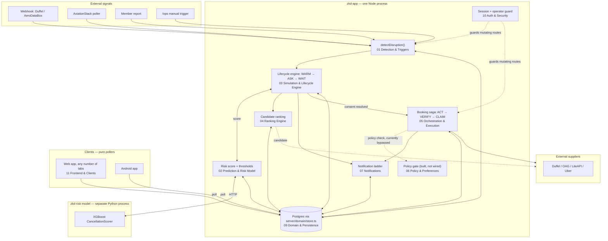

# System Overview — how the pieces fit together

**ZKD Concierge · Codestreet 2026 / American Express · Team ZKD, IIT Madras**

This folder documents the rebooking pipeline one component at a time. This file is the map: what
"distributed" actually means here, which process a piece of logic runs in, and how a disruption
moves end to end through the eleven components documented alongside it. Read this first; read a
component doc when you need to know how one piece actually works.

This describes the `demo` branch as it exists in this checkout. It is generated from the code, not
from the design docs in `documentation/design/` — where the two disagree, this folder follows the
code and says so.

---

## 1. What "distributed" means here

This is not a microservices system, and this doc does not pretend it is. It is **one Next.js
process holding almost all of the logic**, talking to a small number of genuinely separate things:

| Boundary | What's on the other side | Protocol | Owned by |
|---|---|---|---|
| The Node process itself | `zkd-app/` — API routes, the in-memory lifecycle engine, the ranker, the saga | — | [03](03-simulation-lifecycle-engine.md), [05](05-orchestration-and-execution.md), [04](04-ranking-engine.md) |
| A separate Python inference service | `zkd-risk-model/` — `serve.py` locally, or a deployed Lambda/ALB in AWS | HTTP, `RISK_MODEL_URL` | [02](02-prediction-and-risk-model.md) |
| A Postgres database | Durable state for bookings, tasks, ledgers, preferences | SQL, `server/domain/db.ts` | [09](09-domain-and-persistence.md) |
| A long list of external supplier/carrier/comms APIs | Duffel, OAG, LiteAPI, Uber, Twilio, Fast2SMS, Frankfurter, Gemini, NOAA/Open-Meteo, OpenSky, AviationStack | HTTPS, server-side only | [01](01-detection-and-triggers.md), [08](08-suppliers-and-integrations.md), [07](07-notifications.md) |
| Client devices | A web browser (one or more tabs) and the Android app | HTTP polling only, no business logic | [11](11-frontend-and-clients.md) |

The distribution that matters is **process boundaries and who can be down without taking the
others with them** — not a fleet of interchangeable services. Two facts follow from this, and both
are load-bearing:

1. **The backend is the only thing that decides anything.** The lifecycle engine
   (`server/engine/simulation.ts`, [03](03-simulation-lifecycle-engine.md)) runs on real
   `setTimeout`/`setInterval` chains inside the one Node process. It resolves on schedule whether or
   not any browser tab or phone is open to watch it. A client that reconnects mid-recovery sees
   wherever the state machine actually is — it is never asked to reconstruct or resume anything
   itself.
2. **This only behaves correctly as one continuous process.** There is no serverless redeploy story
   for the engine — restarting the process drops every in-flight `setTimeout`, which is why a
   reconciliation sweep exists (see [03](03-simulation-lifecycle-engine.md)) to re-arm anything that
   was mid-window when the process last died, rather than silently losing it.

## 2. The shape of one disruption, start to finish



Narrated:

1. **Detection** ([01](01-detection-and-triggers.md)) notices a flight is disrupted — a webhook, a
   budget-capped poll, a corroborated member report, or (for rehearsal) a manual `/ops` trigger —
   and calls one shared entry point, `detectDisruption()`.
2. **Prediction** ([02](02-prediction-and-risk-model.md)) runs continuously and independently of
   detection — it estimates cancellation probability *ahead of time*, out-of-process against the
   Python risk-model service, and is what drives the WARM-phase pre-caching before anything has
   actually happened.
3. **The lifecycle engine** ([03](03-simulation-lifecycle-engine.md)) is the state machine that
   owns everything from "a threshold was crossed" through "the member has been asked and either
   answered or the window lapsed." It is the one component every other component reports through.
4. **Ranking** ([04](04-ranking-engine.md)) is called by the lifecycle engine to turn a raw
   candidate set (fetched from suppliers) into an ordered, explained list.
5. Once consent resolves (explicit approval, or silence under the applicable consent tier),
   **orchestration and execution** ([05](05-orchestration-and-execution.md)) runs the actual booking
   saga against suppliers, with compensations registered before each step.
6. **Policy** ([06](06-policy-and-preferences.md)) is a real, tested, default-deny rule engine — but
   as of this checkout it has exactly one importer in the whole repo: its own test file. The diagram
   above shows that edge as bypassed on purpose, not as an oversight in this doc — see that
   component's page for what would need to be true before wiring it in safely.
7. **Notifications** ([07](07-notifications.md)) fire at each rung of a four-message ladder, and a
   message's confirmed delivery is a checked precondition before any unattended spend proceeds.
8. **Domain & persistence** ([09](09-domain-and-persistence.md)) is the shared substrate underneath
   nearly every arrow above — most components read and write through it rather than to each other
   directly, which is what keeps this a "shared state, many pollers" system instead of a tangle of
   direct component-to-component calls.
9. **Auth & security** ([10](10-auth-and-security.md)) sits in front of every mutating route,
   with a separate operator credential from the member session.
10. **Clients** ([11](11-frontend-and-clients.md)) — the web app and the Android app — never
    compute or time anything themselves. They poll the same backend state, which is what makes two
    independently signed-in sessions (see `lib/demoAccounts.ts`) converge on the same disruption
    without either driving the other. Note for anyone relying on older material about this app: a
    `?as=<passengerId>` query-param identity switcher existed at one point but is gone — identity
    now comes from a real signed-in session (`GET /api/auth/me`), not a URL parameter.

## 3. Component index

| # | Component | Doc | Runs in |
|---|---|---|---|
| 1 | Detection & Triggers | [01-detection-and-triggers.md](01-detection-and-triggers.md) | `zkd-app` |
| 2 | Prediction & Risk Model | [02-prediction-and-risk-model.md](02-prediction-and-risk-model.md) | `zkd-app` + `zkd-risk-model` (separate process) |
| 3 | Simulation & Lifecycle Engine | [03-simulation-lifecycle-engine.md](03-simulation-lifecycle-engine.md) | `zkd-app` |
| 4 | Ranking Engine | [04-ranking-engine.md](04-ranking-engine.md) | `zkd-app` |
| 5 | Orchestration & Execution | [05-orchestration-and-execution.md](05-orchestration-and-execution.md) | `zkd-app` |
| 6 | Policy & Preferences | [06-policy-and-preferences.md](06-policy-and-preferences.md) | `zkd-app` |
| 7 | Notifications | [07-notifications.md](07-notifications.md) | `zkd-app` + Twilio/Expo/Fast2SMS |
| 8 | Suppliers & External Integrations | [08-suppliers-and-integrations.md](08-suppliers-and-integrations.md) | `zkd-app` + third-party APIs |
| 9 | Domain & Persistence | [09-domain-and-persistence.md](09-domain-and-persistence.md) | `zkd-app` + Postgres |
| 10 | Auth & Security | [10-auth-and-security.md](10-auth-and-security.md) | `zkd-app` |
| 11 | Frontend & Client Apps | [11-frontend-and-clients.md](11-frontend-and-clients.md) | Browser + `zkd-android` |

Each doc follows the same shape: what it does, where it lives, how it works, its inbound/outbound
interfaces, the state it owns, an explicit real-vs-simulated-vs-mocked accounting, its failure modes,
and its test coverage. That last section is deliberately never skipped — every doc says plainly
where coverage is real and where it isn't, rather than implying completeness by omission.

## 4. Cross-cutting things that don't belong to one component

A few properties are true of the *system*, not of any single piece, and are easy to miss reading
one doc at a time:

- **Nothing is computed or timed on a client.** True for the web app and the Android app alike —
  see [11](11-frontend-and-clients.md). Every screen is a poller.
- **Evidence-tier honesty is enforced at multiple layers independently, not by one gatekeeper.**
  The risk model labels its own outputs (real / population-average / synthetic-market-estimate,
  [02](02-prediction-and-risk-model.md)); the refund calculator refuses to fabricate a ₹0 when it
  doesn't know a fare ([09](09-domain-and-persistence.md)); the ranking engine's fabricated-row
  guard exists specifically because a bad writer was deleted before its already-written rows were
  purged ([04](04-ranking-engine.md)). There is no single "truth" module — each component was fixed
  where it was found lying.
- **The security model is two separate credentials, not one with a role flag.** A member session
  and an operator session are deliberately distinct mechanisms — see
  [10](10-auth-and-security.md) — because a single session type with a permission bit is one bug away
  from a member accidentally holding operator power.
- **Money only ever moves on the member's own Amex card, in both directions**, and the mechanism
  enforcing that today is informed consent via the notification ladder
  ([07](07-notifications.md)), not a hard spend ceiling — a ₹25,000 per-transaction cap was
  deliberately removed (see that component's doc) because it produced worse outcomes than the risk
  it was guarding against.
- **This is a single-process demo by design, and the code is honest about what that means for
  scale.** `globalThis`-scoped counters (supplier-call budgets, poll budgets, device registries) are
  real gaps for a genuine multi-instance deployment and are called out as such in the components
  that have them, rather than hidden behind "production-ready" language.

## 5. Repository orientation

```
zkd-app/            The product. Next.js 16 / React 19. Everything in components 01–11 except
                     the Python risk-model service and the Android client lives here.
  app/               Pages (client-facing routes) and app/api/ (server routes).
  server/            All backend logic — organized by component, see the index above.
  lib/               Shared client-side helpers, types, and the theme-routing table.
zkd-risk-model/      The Python inference/training service documented in component 02.
zkd-android/         The Expo/React Native client documented in component 11.
documentation/
  components/        This folder — one file per component, generated from the code.
  design/            Intent and policy as designed (may lag the code; components/ follows code).
  architecture/       Higher-level system design and the Round 1 review.
  project/           Submission package, deployment, mentor-meeting record.
```

## 6. How to use this folder

- **Onboarding onto one piece?** Read that component's doc plus its immediate neighbors under "See
  also." You don't need the whole folder to make a correct change to one component.
- **Tracing a disruption end to end?** Follow §2's diagram in order — each numbered component doc
  picks up exactly where the previous one's "Outbound" section hands off.
- **Asking "is X real?"** Every doc has a "Real vs. simulated vs. mocked" section that answers for
  its own component specifically — no doc in this folder asserts realism for a piece it didn't
  itself verify by reading the code.
